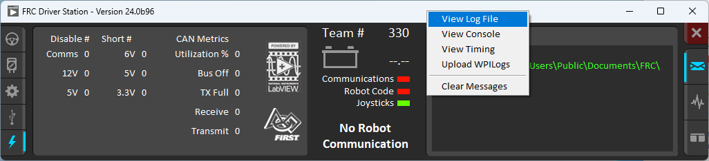
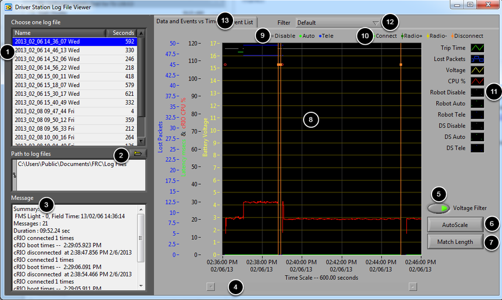
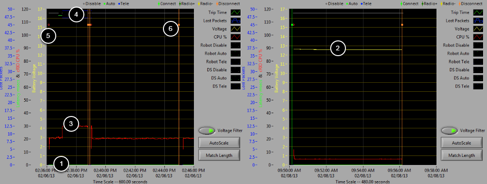
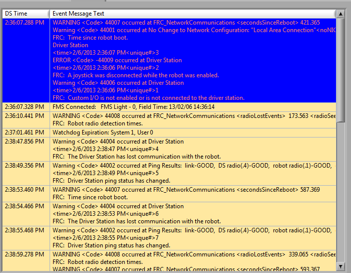
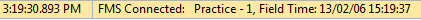
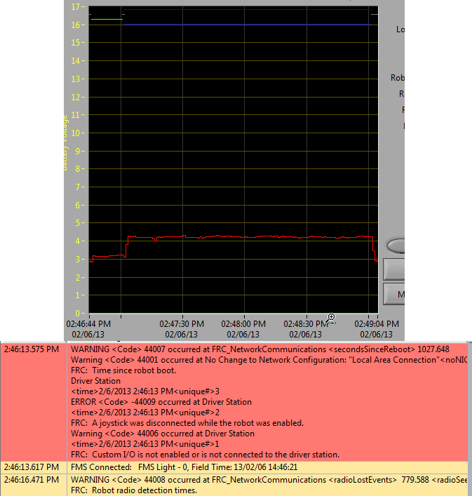
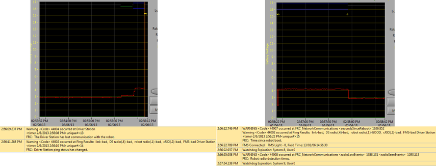
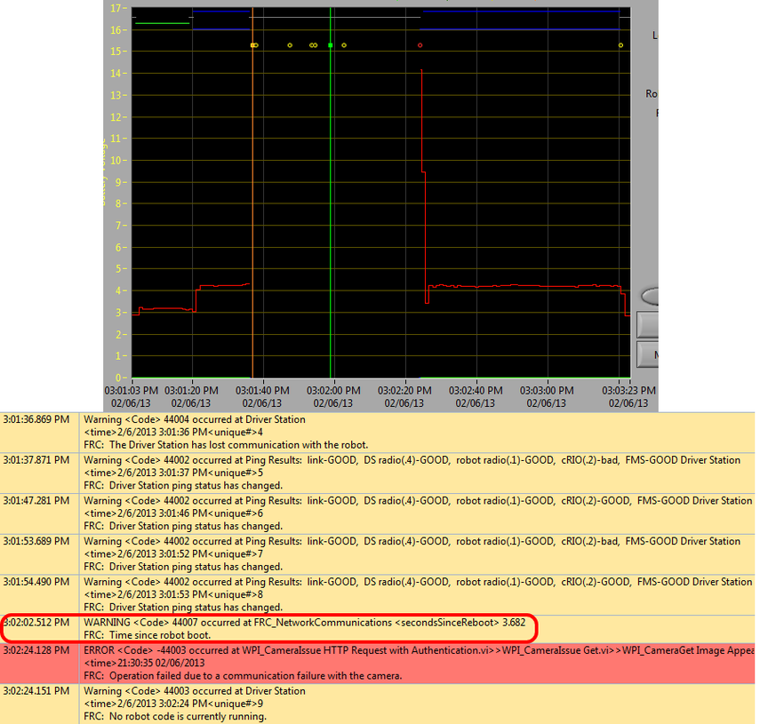
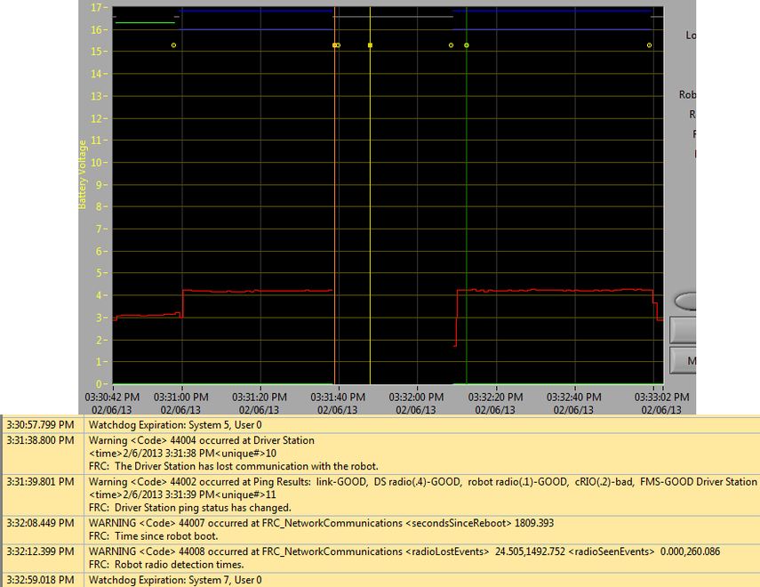
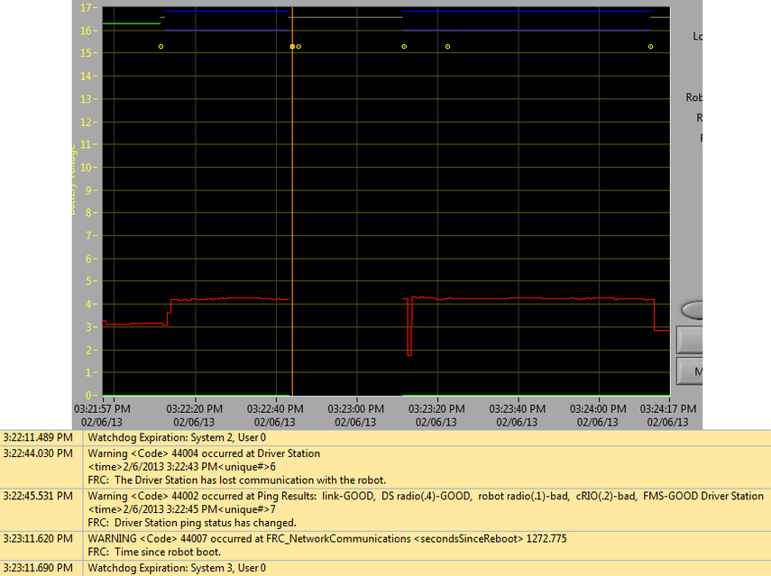

.. include:: <isonum.txt>

Driver Station Log File Viewer
==============================

In an effort to provide information to aid in debugging, the FRC\ |reg| Driver Station creates log files of important diagnostic data while running. These logs can be reviewed later using the FRC Driver Station Log Viewer. The Log Viewer can be found via the shortcut installed in the Start menu, in the FRC Driver Station folder in Program Files, or via the Gear icon in the Driver Station.

.. note:: Several alternative tools exist that provide similar functionality to the FRC Driver Station Log Viewer. :ref:`AdvantageScope <docs/software/dashboards/advantagescope:AdvantageScope>` is an option included in WPILib, and [DSLOG Reader](https://github.com/orangelight/DSLOG-Reader) is a third-party option. Note that WPILib offers no support for third-party projects.

Event Logs
----------

The  Driver Station logs all messages sent to the Messages box on the Diagnostics tab (not the User Messages box on the Operation tab) into a new Event Log file. When viewing Log Files with the Driver Station Log File Viewer, the Event Log and Driver Station Log files are overlaid in a single display.

Log files are stored in ``C:\Users\Public\Documents\FRC\Log Files``. Each log has date and timestamp in the file name and has two files with extension ``.dslog`` and ``.dsevents``.

Log Viewer UI
-------------

The Log Viewer contains a number of controls and displays to aid in the analysis of the Driver Station log files:

1.  File Selection Box - This window displays all available log files in the currently selected folder. Click on a log file in the list to select it.
2.  Path to Log Files - This box displays the current folder the viewer is looking in for log files. This defaults to the folder that the Driver Station stores log files in. Click the folder icon to browse to a different location.
3.  Message Box - This box displays a summary of all messages from the Event Log. When hovering over an event on the graph this box changes to display the information for that event.
4.  Scroll Bar - When the graph is zoomed in, this scroll bar allows for horizontal scrolling of the graph.
5.  Voltage Filter - This control turns the Voltage Filter on and off (defaults to on). The Voltage Filter filters out data such as CPU %, robot mode and trip time when no Battery Voltage is received (indicating that the DS is no in communication with the roboRIO).
6.  AutoScale - This button zooms the graph out to show all data in the log.
7.  Match Length - This button scales the graph to approximately the length of an FRC match (2 minutes and 30 seconds shown). It does not automatically locate the start of the match, you will have to scroll using the scroll bar to locate the beginning of the Autonomous mode.
8.  Graph - This display shows graph data from the DS Log file (voltage, trip time, roboRIO CPU%, Lost Packets, and robot mode) as well as overlaid event data (shown as dots on the graph with select events showing as vertical lines across the entire graph). Hovering over event markers on the graph displays information about the event in the Messages window in the bottom left of the screen.
9.  Robot Mode Key - Key for the Robot Mode displayed at the top of the screen
10. Major event key - Key for the major events, displayed as vertical lines on the graph
11. Graph key - Key for the graph data
12. Filter Control - Drop-down to select the filter mode (filter modes explained below)
13. Tab Control - Control to switch between the Graph (Data and Events vs. Time) and Event List displays.

Using the Graph Display
-----------------------

The Graph Display contains the following information:

1.  Graphs of Trip Time in ms (green line) and Lost Packets per second (displayed as blue vertical bars). In these example images Trip Time is a flat green line at the bottom of the graph and there are no lost packets
2.  Graph of Battery voltage displayed as a yellow line.
3.  Graph of roboRIO CPU % as a red line
4.  Graph of robot mode and DS mode. The top set of the display shows the mode commanded by the Driver Station. The bottom set shows the mode reported by the robot code. In this example the robot is not reporting it's mode during the disabled and autonomous modes, but is reported during Teleop.
5.  Event markers will be displayed on the graph indicating the time the event occurred. Errors will display in red; warnings will display in yellow. Hovering over an event marker will display information about the event in the Messages box at the bottom left of the screen.
6.  Major events are shown as vertical lines across the graph display.

To zoom in on a portion of the graph, click and drag around the desired viewing
area. You can only zoom the time axis, you cannot zoom vertically.

Event List
----------

The Event List tab displays a list of events (warnings and errors) recorded by the Driver Station. The events and detail displayed are determined by the currently active filter (images shows "All Events, All Info" filter active).

Filters
-------

Three filters are currently available in the Log Viewer:

1.  Default: This filter filters out many of the errors and warnings produced by the Driver Station. This filter is useful for identifying errors thrown by the code on the Robot.
2.  All Events and Time: This filter shows all events and the time they occurred
3.  All Events, All Info: This filter shows all events and all recorded info. At this time the primary difference between this filter and "All Events and Time" is that this option shows the "unique" designator for the first occurrence of a particular message.

Identifying Logs from Matches
-----------------------------

A common task when working with the Driver Station Logs is to identify which logs came from competition matches. Logs which were taken during a match can now be identified using the :term:`FMS` Connected event which will display the match type (Practice, Qualification or Elimination), match number, and the current time according to the FMS server. In this example, you can see that the FMS server time and the time of the Driver Station computer are fairly close, approximately 7 seconds apart.

Identifying Common Connection Failures with the Log Viewer
----------------------------------------------------------

When diagnosing robot issues, there is no substitute for thorough knowledge of the system and a methodical debugging approach. If you need assistance diagnosing a connection problem at your events it is strongly recommended to seek assistance from your :term:`FTA` and/or :term:`CSA`. The goal of this section is to familiarize teams with how some common failures can manifest themselves in the DS Log files. Please note that depending on a variety of conditions a particular failure show slightly differently in a log file.

.. note:: Note that all log files shown in this section have been scaled to match length using the Match Length button and then scrolling to the beginning of the autonomous mode. Also, many of the logs do not contain battery voltage information, the platform used for log capture was not properly wired for reporting the battery voltage.

.. tip:: Some error messages that are found in the Log Viewer are show below and more are detailed in the :doc:`driver-station-errors-warnings` article.

"Normal" Log
~~~~~~~~~~~~

This is an example of a normal match log. The errors and warnings contained in the first box are from when the DS first started and can be ignored. This is confirmed by observing that these events occurred prior to the "FMS Connected:" event. The last event shown can also be ignored, it is also from the robot first connecting to the DS (it occurs 3 seconds after connecting to FMS) and occurs roughly 30 seconds before the match started.

Disconnected from FMS
~~~~~~~~~~~~~~~~~~~~~

When the DS disconnects from FMS, and therefore the robot, during the match it may segment the log into pieces. The key indicators to this failure are the last event of the first log, indicating that the connection to FMS is now "bad" and the second event from the 2nd log which is a new FMS connected message followed by the DS immediately transitioning into Teleop Enabled. The most common cause of this type of failure is an ethernet cable with no latching tab or a damaged ethernet port on the DS computer.

roboRIO Reboot
~~~~~~~~~~~~~~

The "Time since robot boot" message is the primary indicator in a connection failure caused by the roboRIO rebooting. In this log the DS loses connection with the roboRIO at 3:01:36 as indicated by the first event. The second event indicates that the ping initiated after the connection failed was successful to all devices other than the roboRIO. At 3:01:47 the roboRIO begins responding to pings again, one additional ping fails at 3:01:52. At 3:02:02 the Driver Station connects to the roboRIO and the roboRIO reports that it has been up for 3.682 seconds. This is a clear indicator that the roboRIO has rebooted. The code continues to load and at 3:02:24 the code reports an error communicating with the camera. A warning is also reported indicating that no robot code is running right before the code finishes starting up.

Ethernet cable issue on robot
~~~~~~~~~~~~~~~~~~~~~~~~~~~~~

An issue with the ethernet cable on the robot is primarily indicated by the ping to the roboRIO going to bad and Radio Lost and Radio Seen events when the roboRIO reconnects. The "Time since robot boot" message when the roboRIO reconnects will also indicate that the roboRIO has not rebooted. In this example, the robot Ethernet cable was disconnected at 3:31:38. The ping status indicates that the radio is still connected. When the robot reconnects at 3:32:08 the "Tim since robot boot" is 1809 seconds indicating that the roboRIO clearly did not reboot. At 3:32:12 the robot indicates that it lost the radio 24.505 seconds ago and it returned 0.000 seconds ago. These points are plotted as vertical lines on the graph, yellow for radio lost and green for radio seen. Note that the times are slightly offset from the actual events as shown via the disconnection and connection, but help to provide additional information about what is occurring.

Radio reboot
~~~~~~~~~~~~

A reboot of the robot radio is typically characterized by a loss of connection to the radio for ~40-45 seconds. In this example, the radio briefly lost power at 3:22:44, causing it to start rebooting. The event at 3:22:45 indicates that the ping to the radio failed. At 3:23:11, the DS regains communication with the roboRIO and the roboRIO indicates it has been up for 1272.775 seconds, ruling out a roboRIO reboot. Note that the network switch on the radio comes back up very quickly so a momentary power loss may not result in a "radio lost"/"radio seen" event pair. A longer disturbance may result in radio events being logged by the DS. In that case, the distinguishing factor which points towards a radio reboot is the ping status of the radio from the DS. If the radio resets, the radio will be unreachable. If the issue is a cabling or connection issue on the robot, the radio ping should remain "GOOD".
