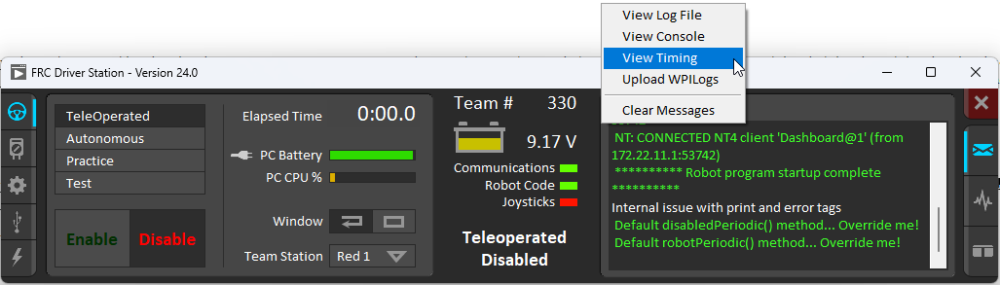
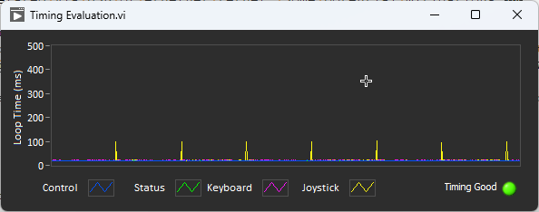
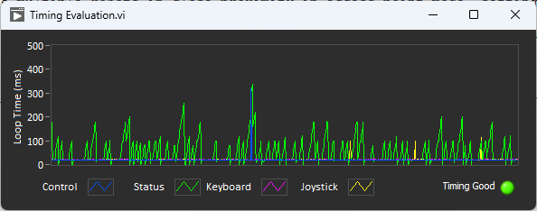

Driver Station Timing Viewer
============================

The 2024 Driver Station has a a new window to help diagnose robot control issues.

Opening the Timing Viewer
-------------------------

To start the Driver Station Timing Viewer, select the gear icon and then select :guilabel:`View Timing`.

Viewing Timing
--------------

The Timing viewer shows the timing of the driver station loops measuring the joysick, keyboard, and control and status network packets. When timing is good, all values should be close to 0 ms. This can help diagnose what is causing robot control issues.

The next image shows what it looks like when network congestion causes network packets to be delayed and combined. In this example, the communication was so bad that the robot wouldn't stay enabled or connected for more then a second.

