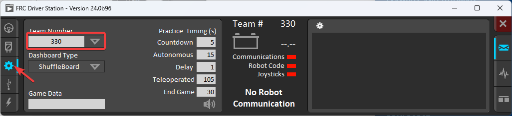
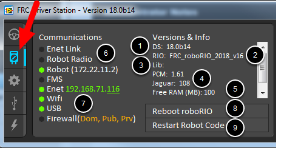
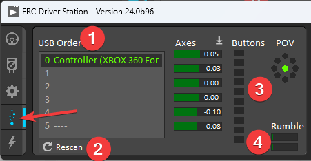

FRC Driver Station Powered by NI LabVIEW
========================================

This article describes the use and features of the FRC Driver Station Powered by NI LabVIEW.

For information on installing the Driver Station software see :ref:`this document <docs/getting-started/getting-started-frc-control-system/frc-game-tools:Installing the FRC Game Tools>`.

Starting the FRC Driver Station
-------------------------------

The FRC Driver Station can be launched by double-clicking the icon on the Desktop or by selecting Start->All Programs->FRC Driver Station.

Setting Up the Driver Station
-----------------------------

The DS must be set to your team number in order to connect to your robot. In order to do this click the Setup tab then enter your team number in the team number box. Press return or click outside the box for the setting to take effect.

PCs will typically have the correct network settings for the DS to connect to the robot already, but if not, make sure your Network adapter is set to DHCP.

Status Pane
-----------

The Status Pane of the Driver Station is located in the center of the display and is always visible regardless of the tab selected. It displays a selection of critical information about the state of the DS and robot:

1. Team # - The Team number the DS is currently configured for. This should match your FRC team number. To change the team number see the Setup Tab.
2. Battery Voltage - If the DS is connected and communicating with the roboRIO this displays current battery voltage as a number and with a small chart of voltage over time in the battery icon. The background of the numeric indicator will turn red when the roboRIO brownout is triggered. See :doc:`/docs/software/roborio-info/roborio-brownouts` for more information.
3. Major Status Indicators - These three indicators display major status items for the DS. The "Communications" indicates whether the DS is currently communicating with the FRC Network Communications Task on the roboRIO (it is split in half for the TCP and UDP communication). The "Robot Code" indicator shows whether the team Robot Code is currently running (determined by whether or not the Driver Station Task in the robot code is updating the battery voltage), The "Joysticks" indicator shows if at least one joystick is plugged in and recognized by the DS.
4. Status String - The Status String provides an overall status message indicating the state of the robot, some examples are "No Robot Communication", "No Robot Code", "Emergency Stopped", and "Teleoperated Enabled". When the roboRIO brownout is triggered this will display "Voltage Brownout".

Operation Tab
-------------

The Operations Tab is used to control the mode of the robot and provide additional key status indicators while the robot is running.

1. Robot Mode - This section controls the Robot Mode. Practice Mode causes the robot to cycle through the same transitions as an FRC match after the Enable button is pressed (timing for practice mode can be found on the setup tab).
2. Enable/Disable - These controls enable and disable the robot. You can also use the key combination ``[]\`` (the 3 keys above the enter key on most keyboards) to Enable the robot, and the ``Enter`` key to Disable the robot. The Spacebar will Emergency Stop the Robot
3. Elapsed Time - Indicates the amount of time the robot has been enabled
4. PC Battery - Indicates current state of DS PC battery and whether the PC is plugged in
5. PC CPU% - Indicates the CPU Utilization of the DS PC
6. Window Mode - When not on the Driver account on the Classmate allows the user to toggle between floating (arrow) and docked (rectangle)
7. Team Station - When not connected to FMS, sets the team station to transmit to the robot.

.. note:: When connected to the Field Management System the controls in sections 1, and 2 will be replaced by the words FMS Connected and the control in Section 7 will be greyed out.

Diagnostics Tab
---------------

The Diagnostics Tab contains additional status indicators that teams can use to diagnose issues with their robot:

1. DS Version - Indicates the Driver Station Version number
2. roboRIO Image Version - String indicating the version of the roboRIO Image
3. WPILib Version - String indicating the version of WPILib in use
4. CAN Device Versions - String indicating the firmware version of devices connected to the CAN bus. These items may not be present if the CTRE Phoenix framework has not been loaded
5. Memory Stats - This section shows stats about the roboRIO memory
6. Connection Indicators - The top half of these indicators show connection status to various components.

    - "Enet Link" indicates the computer has something connected to the ethernet port.
    - "Robot Radio" indicates the ping status to the robot wireless bridge at 10.XX.YY.1.
    - "Robot" indicates the ping status to the roboRIO using mDNS (with a fallback of a static 10.TE.AM.2 address).
    - "FMS" indicates if the DS is receiving packets from FMS (this is NOT a ping indicator).

7. Network Indicators - The second section of indicators indicates status of network adapters and firewalls. These are provided for informational purposes, communication may be established with one or more unlit indicators in this section

    - "Enet" indicates the IP address of the detected Ethernet adapter
    - "WiFi" indicates if a wireless adapter has been detected as enabled
    - "USB" indicates if a roboRIO USB connection has been detected
    - "Firewall" indicates if any firewalls are detected as enabled. Enabled firewalls will show in orange ( Dom = Domain, Pub = Public, Prv = Private)

8. Reboot roboRIO - This button attempts to perform a remote reboot of the roboRIO (after clicking through a confirmation dialog)
9. Restart Robot Code - This button attempts to restart the code running on the robot (but not restart the OS)

Setup Tab
---------

The Setup Tab contains a number of buttons teams can use to control the operation of the Driver Station:

1. Team Number - Should contain your FRC Team Number. This controls the mDNS name that the DS expects the robot to be at. Shift clicking on the dropdown arrow will show all roboRIO names detected on the network for troubleshooting purposes.
2. Dashboard Type - Controls what Dashboard is launched by the Driver Station. Default launches the file pointed to by the "FRC DS Data Storage.ini" file, by default this is Dashboard.exe in the Program Files\\FRC Dashboard folder. LabVIEW attempts to launch a dashboard at the default location for a custom built LabVIEW dashboard, but will fall back to the default if no dashboard is found. SmartDashboard and Shuffleboard launch the respective dashboards included with the C++ and Java WPILib installation.
3. Game Data - This box can be used for at home testing of the Game Data API. Text entered into this box will appear in the Game Data API on the Robot Side. When connected to FMS, this data will be populated by the field automatically.
4. Practice Mode Timing - These boxes control the timing of each portion of the practice mode sequence. When the robot is enabled in practice mode the DS automatically proceeds through the modes indicated from top to bottom.
5. Audio Control - This button controls whether audio tones are sounded when the Practice Mode is used.

USB Devices Tab
---------------

The USB Devices tab includes the information about the USB Devices connected to the DS

1. USB Setup List - This contains a list of all compatible USB devices connected to the DS. Pressing a button on a device will highlight the name in green and put 2 \*s before the device name
2. Rescan - This button will force a Rescan of the USB devices. While the robot is disabled, the DS will automatically scan for new devices and add them to the list. To force a complete re-scan or to re-scan while the robot is Enabled (such as when connected to FMS during a match) press F1 or use this button.
3. Device indicators - These indicators show the current status of the Axes, buttons and POV of the joystick.
4. Rumble - For XInput devices (such as X-Box controllers) the Rumble control will appear. This can be used to test the rumble functionality of the device. The top bar is "Right Rumble" and the bottom bar is "Left Rumble". Clicking and holding anywhere along the bar will activate the rumble proportionally (left is no rumble = 0, right is full rumble = 1). This is a control only and will not indicate the Rumble value set in robot code.

Re-Arranging and Locking Devices
^^^^^^^^^^^^^^^^^^^^^^^^^^^^^^^^

The Driver Station has the capability of "locking" a USB device into a specific slot. This is done automatically if the device is dragged to a new position and can also be triggered by double clicking on the device. "Locked" devices will show up with an underline under the device. A locked device will reserve it's slot even when the device is not connected to the computer (shown as grayed out and underlined). Devices can be unlocked (and unconnected devices removed) by double clicking on the entry.

.. note:: If you have two or more of the same device, they should maintain their position as long as all devices remain plugged into the computer in the same ports they were locked in. If you switch the ports of two identical devices the lock should follow the port, not the device. If you re-arrange the ports (take one device and plug it into a new port instead of swapping) the behavior is not determinate (the devices may swap slots). If you unplug one or more of the set of devices, the positions of the others may move, they should return to the proper locked slots when all devices are reconnected.

Example: The image above shows 4 devices:

- A Locked "Logitech Attack 3" joystick. This device will stay in this position unless dragged somewhere else or unlocked
- An unlocked "Logitech Extreme 3D" joystick
- An unlocked "Gamepad F310 (Controller)" which is a Logitech F310 gamepad
- A Locked, but disconnected "MadCatz GamePad (Controller)" which is a MadCatz Xbox 360 Controller

In this example, unplugging the Logitech Extreme 3D joystick will result in the F310 Gamepad moving up to slot 1. Plugging in the MadCatz Gamepad (even if the devices in Slots 1 and 2 are removed and those slots are empty) will result in it occupying Slot 3.
