Imaging your Classmate (Veteran Image Download)
===============================================

.. note:: Veteran teams are not required to re-image their classmate

This document describes the procedure for creating a bootable USB drive to restore the FRC image on a Classmate computer. If you do not wish to re-image your Classmate then you can start with the appropriate document for C++/Java, LabVIEW, or DS only.

Prerequisites
-------------

1. E09, E11, E12, or E14 Classmate computer or Acer ES1 computer
2. 16GB or larger USB drive
3. 7-Zip software installed (download `here <https://www.7-zip.org>`__). As of the writing of this document, the current released version is 19.00 (2019-02-21).
4. RMprepUSB software installed (download `here <https://www.rmprepusb.com/documents/release-2-0>`__). Scroll down the page and select the stable (Full) version download link. As of the writing of this document, the current stable version is 2.1.743e.

Download the Computer Image
---------------------------

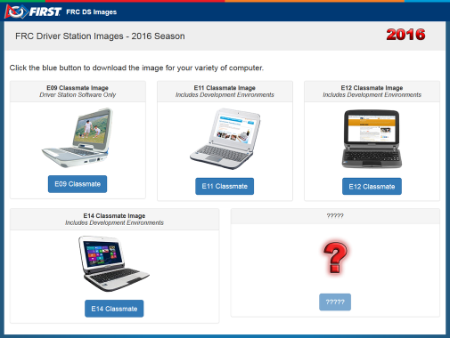

Download the image from the `FIRST FRC Driver Station System Image Portal <https://frc-events.firstinspires.org/services/DSImages/>`__. There are several computer images available, one for each model. On the download site, select the option that matches your computer by clicking the button below the image. Due to the limited size of the hard drive in the E09, it is supported with a DS/Utilities image only and does not have the IDEs for LabVIEW or C++/Java installed. All other images have the LabVIEW base installation already present.

.. note:: These images only install the prerequisite core FRC software, it is still necessary to install the FRC specific updates. See the Update Software step for more information.

.. warning:: Due to computer availability, the E14 image provided is the 2018 image. If using this image, teams may need to remove the old IDE (LabVIEW or Eclipse) and install the new IDE.

Preparation
-----------

1. Place the image file downloaded from the site to a folder on your root drive (e.g. ``C:\2016_Image``).
2. Connect 16GB or larger USB Flash drive to the PC to use as the new restoration drive.

RMPrep
------

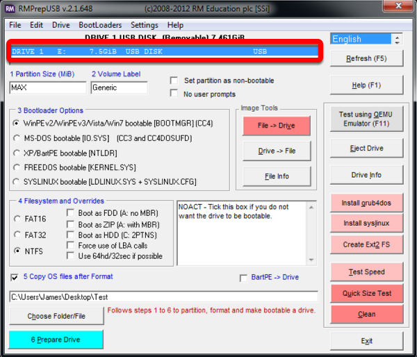

Start/Run RMprepUSB

Select USB Drive

Set Partition Size
^^^^^^^^^^^^^^^^^^

.. image:: images/imaging-your-classmate/set-partition-size.png

Set Partition Size to MAX

Set Volume Label
^^^^^^^^^^^^^^^^

.. image:: images/imaging-your-classmate/set-volume-label.png

Set Volume Label to Generic

Set Bootloader Option
^^^^^^^^^^^^^^^^^^^^^

.. image:: images/imaging-your-classmate/set-bootloader-option.png

Select Bootloader Option “WinPE v2/WinPE v3/Vista/Win7 bootable”

Select Filesystem
^^^^^^^^^^^^^^^^^

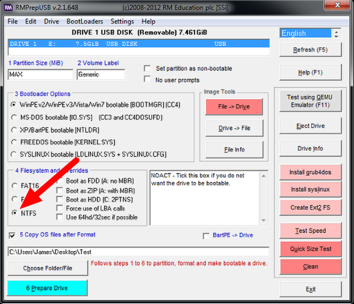

Select NTFS Filesystem

Copy OS Files Option
^^^^^^^^^^^^^^^^^^^^

.. image:: images/imaging-your-classmate/copy-os-files-option.png

Ensure the “Copy OS files after Format” box is checked

Locate Image
^^^^^^^^^^^^

.. image:: images/imaging-your-classmate/locate-image.png

Select the “Choose Folder/File” button

Copy Files Dialog
^^^^^^^^^^^^^^^^^

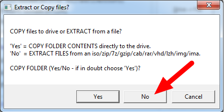

Choose “No” and select your .7z image

Prepare Drive
^^^^^^^^^^^^^

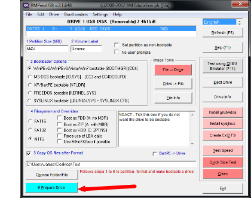

All configuration settings are now complete. Select “Prepare Drive” to begin the process

Confirmation Dialog 1
^^^^^^^^^^^^^^^^^^^^^

.. image:: images/imaging-your-classmate/confirmation-dialog-1.png

Click “OK” to execute the command on the selected USB Flash drive. A Command Prompt will open showing the progress

Confirmation Dialog 2
^^^^^^^^^^^^^^^^^^^^^

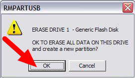

Click “OK” to format the USB drive

.. danger:: **ALL DATA ON THE DRIVE WILL BE ERASED!**

Decryption
^^^^^^^^^^

.. note:: If you are using an encrypted version of the image downloaded before kickoff you will
 be prompted to enter the decryption key found at the end of the Kickoff video.

Copy Complete
^^^^^^^^^^^^^

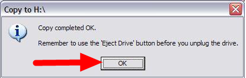

Once formatting is complete, the restoration files will be extracted and copied to the USB drive. This process should take ~15 minutes when connected to a USB 2.0 port.  When all files have been copied, this message will appear, press OK to continue.

Eject Drive
^^^^^^^^^^^

.. image:: images/imaging-your-classmate/eject-drive.png

Press the “Eject Drive” button to safely remove the USB drive. The USB drive is now ready to be used to restore the image onto the PC.

Hardware Setup
--------------

1. Make sure the computer is turned off, but plugged in.
2. Insert the USB Thumb Drive into a USB port on the Driver Station computer.

Boot to USB
^^^^^^^^^^^

.. image:: images/imaging-your-classmate/boot-to-usb.jpg

**Classmate:**

1. Power on the Classmate and tap the F11 key on the keyboard. Tapping the F11 key during boot will bring up the boot menu.
2. Use the up/down keys to select the **USB HDD:** entry on the menu, then press the right arrow to expand the listing
3. Use the up/down arrow keys on the keyboard to select the USB device (it will be called “Generic Flash Disk”). Press the ENTER key when the USB device is highlighted.

**Acer ES1:**

1. Power on the computer and tap the F12 key on the keyboard. Tapping the F12 key during boot will bring up the boot menu.
2. Use the up/down keys to select the **USB HDD: Generic** entry on the menu, then press the ENTER key when the USB device is highlighted.

**Acer ES1: If pressing F12 does not pull up the boot menu or if the USB device is not listed in the boot menu, see "Checking BIOS Settings" at the bottom of this article.**

Image the Classmate
^^^^^^^^^^^^^^^^^^^

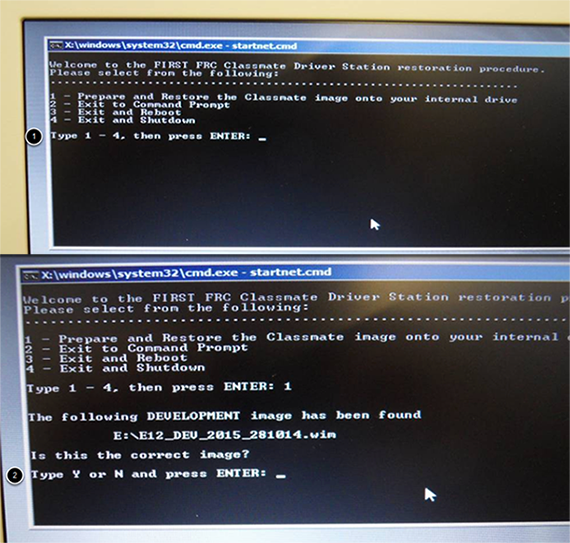

1. To confirm that you want to reimage the Classmate, type “1” and press ENTER.
2. Then, type “Y” and press ENTER. The Classmate will begin re-imaging. The installation will take 15-30 minutes.
3. When the installation is complete, remove the USB drive.
4. Restart the Classmate. The Classmate will boot into Windows.

Initial Driver Station Boot
---------------------------

The first time the Classmate is turned on, there are some unique steps, listed below, that you’ll need to take. The initial boot may take several minutes; make sure you do not cycle power during the process.

.. note:: These steps are only required during original startup.

Enter Setup
^^^^^^^^^^^

1. Log into the Developer account.
2. Click “Ask me later”.
3. Click “OK”. The computer now enters a Set Up that may take a few minutes.

Activate Windows
^^^^^^^^^^^^^^^^

1. Establish an Internet connection.
2. Once you have an Internet connection, click the Start menu, right click “Computer” and click “Properties”.
3. Scroll to the bottom section, “Windows activation”, and Click “Activate Windows now”
4. Click “Activate Windows online now”. The activation may take a few minutes.
5. When the activation is complete, close all of the windows.

Microsoft Security Essentials
^^^^^^^^^^^^^^^^^^^^^^^^^^^^^

Navigate through the Microsoft Security Essentials Setup Wizard. Once it is complete, close all of the windows.

Acer ES1: Fix Wireless Driver
~~~~~~~~~~~~~~~~~~~~~~~~~~~~~

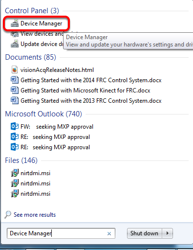

**Acer ES1 PC only!**

The default wireless driver in the image may have issues with intermittent communication with the robot radio. The correct driver is in the image, but could not be set to load by default. To load the correct driver, open the Device Manager by clicking start, typing "Device Manager" in the box and clicking Device Manager.

Open Wireless Device Properties
^^^^^^^^^^^^^^^^^^^^^^^^^^^^^^^

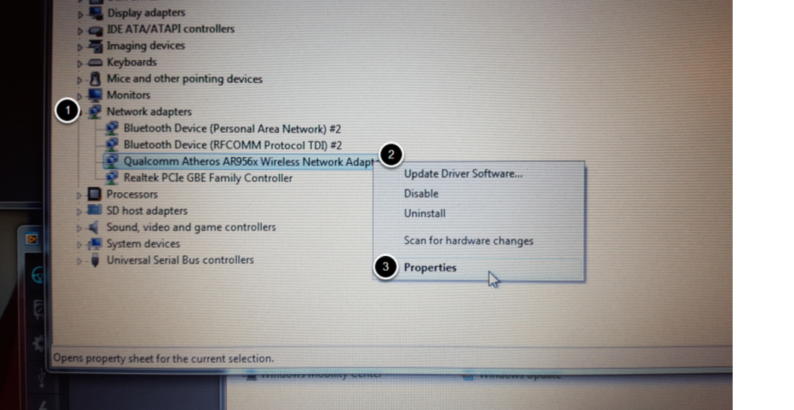

Click on the arrow next to Network Adapters to expand it and locate the Wireless Network Adapter. Right click the adapter and select Properties.

Uninstall-Driver
^^^^^^^^^^^^^^^^
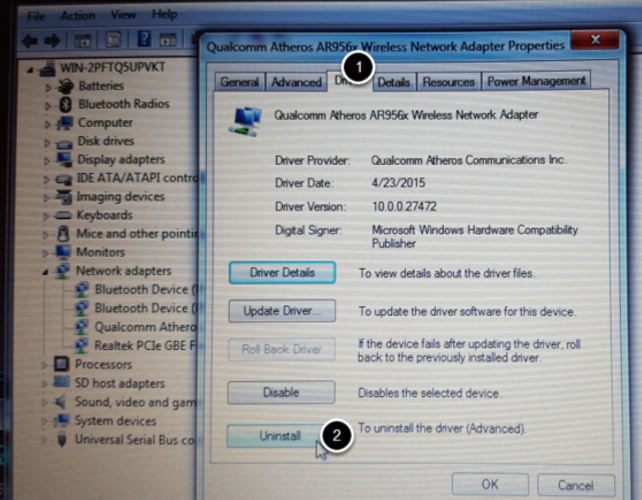

Click on the Driver tab, then click the Uninstall button. Click Yes at any prompts.

Scan for New Hardware
^^^^^^^^^^^^^^^^^^^^^
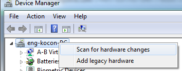

Right click on the top entry of the tree and click "Scan for hardware changes". The wireless adapter should automatically be re-detected and the correct driver should be installed.

Update Software
---------------
In order for the Classmate images to be prepared on time, they are created before the final versions of the software were ready. To use the software for FRC some additional components will need to be installed. LabVIEW teams should continue with Installing the FRC Game Tools (All Languages). C++ or Java teams should continue Installing C++ and Java Development Tools for FRC.

Errors during Imaging Process
-----------------------------
.. image::  images/imaging-your-classmate/errors-during-imaging-process.png

If an error is detected during the imaging process, the following screen will appear. Note that the screenshot below shows the error screen for the Driver Station-only image for the E09. The specific image filename shown will vary depending on the image being applied.

The typical reason for the appearance of this message is due to an error with the USB device on which the image is stored. Each option is listed below with further details as to the actions you can take in pursuing a solution. Pressing any key once this error message is shown will return the user to the menu screen shown in Image the Classmate.

Option 1
^^^^^^^^

Using same image on the existing USB Flash drive
   To try this option, press any key to return to the main menu and select #1. This will run the imaging process again.

Option 2
^^^^^^^^

Reload the same image onto the USB Flash drive using RMPrepUSB
   It’s possible the error message was displayed due to an error caused during the creation of the USB Flash drive (e.g. file copy error, data corruption, etc.) Press any key to return to the main menu and select #4 to safely shutdown the Classmate then follow the steps starting with RMPrep to create a new USB Restoration Key using the same USB Flash drive.

Option 3
^^^^^^^^

Reload the same image onto a new USB Flash drive using RMPrepUSB
   The error message displayed may also be caused by an error with the USB Flash drive itself. Press any key to return to the main menu and select #4 to safely shutdown the Classmate. Select a new USB Flash drive and follow the steps starting with RMPrep.

Option 4
^^^^^^^^

Download a new image
   An issue with the downloaded image may also cause an error when imaging. Press any key to return to the main menu and select #4 to safely shutdown the Classmate. Staring with Download the Classmate Image create a new copy of the imaging stick.

Checking BIOS Settings
^^^^^^^^^^^^^^^^^^^^^^

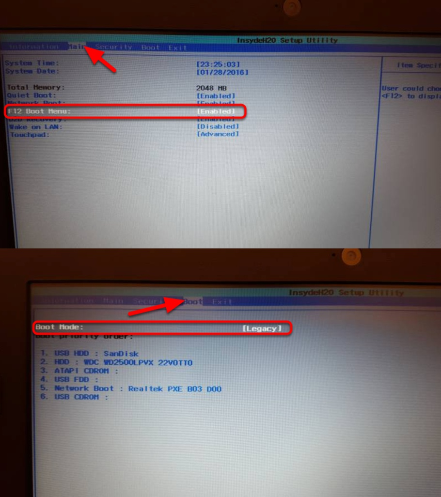

If you are having difficulty booting to USB, check the BIOS settings to insure they are correct. To do this:

- Repeatedly tap the **F2** key while the computer is booting to enter the BIOS settings
- Once the BIOS settings screen has loaded, use the right and left arrow keys to select the "Main" tab, then check if the line for "F12 Boot Menu" is set to "Enabled". If it is not, use the Up/Down keys to highlight it, press Enter, use Up/Down to select "Enabled" and press Enter again.
- Next, use the Left/Right keys to select the "Boot" tab. Make sure that the "Boot Mode" is set to "Legacy". If it is not, highlight it using Up\Down, press Enter, highlight "Legacy" and press Enter again. Press Enter to move through any pop-up dialogs you may see.
- Press F10 to save any changes and exit.
