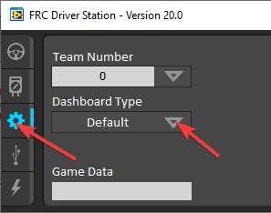
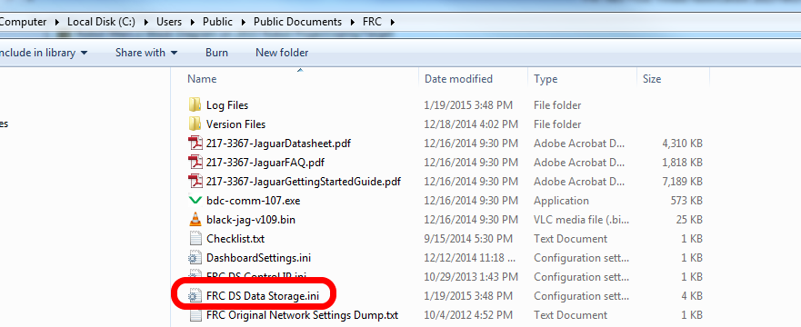

Manually Setting the Driver Station to Start Custom Dashboard
=============================================================

.. note:: If WPILib is not installed to the default location (such as when files are copied to a PC manually), the dashboard of choice may not launch properly. To have the DS start a custom dashboard when it starts up, you have to manually modify the settings for the default dashboard.

.. warning:: This is not needed for most installations, try using the appropriate :ref:`Dashboard Type setting <docs/software/driverstation/driver-station:Setup Tab>` for your language first.

Set Driver Station to Default
-----------------------------

Open the Driver Station software, click on the Setup tab and set the Dashboard setting to Default. **Then close the Driver Station!**

Open DS Data Storage file
-------------------------

Browse to ``C:\Users\Public\Documents\FRC`` and double click on ``FRC DS Data Storage`` to open it.

DashboardCmdLine
----------------

.. image:: images/manually-setting-the-driver-station-to-start-smartdashboard/dashboard-cmd-line.png
   :alt: Modify the "DashboardCmdLine" entry to control where it looks for the file that it will start.

Locate the line beginning with ``DashboardCmdLine``. Modify it to point to the dashboard to launch when the driver station starts

LabVIEW Custom Dashboard
^^^^^^^^^^^^^^^^^^^^^^^^

Replace the string after ``=`` with ``"C:\\PATH\\TO\\DASHBOARD.exe"`` where the path specified is the path to the dashboard ``exe`` file. Save the ``FRC DS Data Storage`` file.

Java Dashboard
^^^^^^^^^^^^^^

Replace the string after ``=`` with ``java -jar "C:\\PATH\\TO\\DASHBOARD.jar"`` where the path specified is the path to the dashboard ``jar`` file. Save the ``FRC DS Data Storage`` file.

.. tip:: Shuffleboard and Smartdashboard require Java 11.

Dashboard from WPILib installer
^^^^^^^^^^^^^^^^^^^^^^^^^^^^^^^

Replace the string after ``=`` with ``wscript "C:\\Users\\Public\\wpilib\\YYYY\\tools\\DASHBOARD.vbs"`` where ``YYYY`` is the year and ``DASHBOARD.vbs`` is either ``Shuffleboard.vbs`` or ``Smartdashboard.vbs``. Save the ``FRC DS Data Storage`` file.

Launch Driver Station
---------------------

The Driver Station should now launch the dashboard each time it is opened.
