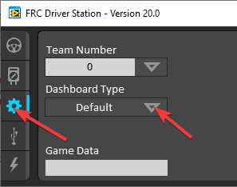
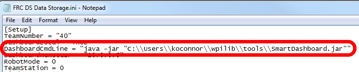

Manually Setting the Driver Station to Start SmartDashboard
===========================================================

.. note:: If WPILib is not installed to the default location (such as when files are copied to a PC manually), the "C++" or "Java" buttons may not properly launch the SmartDashboard. To have the DS start the SmartDashboard when it starts up you have to manually modify the settings for the Default Dashboard.

.. warning:: This is not needed for most installations, try using the appropriate :ref:`Dashboard Type setting <driver-station:Setup Tab>` for your language first.

Set Driver Station to Default
-----------------------------

Open the Driver Station software, click on the Setup tab and set the Dashboard setting to Default. **Then close the Driver Station!**

Locate SmartDashboard
---------------------

Find the location of the SmartDashboard jar file. It should be installed to C:\Users\USERNAME\wpilib\tools where USERNAME is the username of the user logged into the computer.

Open DS Data Storage file
-------------------------

.. image:: images/manually-setting-the-driver-station-to-start-smartdashboard/open-ds-data-storage-file.png

Browse to "C:\Users\Public\Documents\FRC" and double click on "FRC DS Data Storage" to open it.

DashboardCmdLine
----------------

Locate the line beginning with **DasboardCmdLine**. Replace the string after = with **"java -jar "C:\\Users\\USERNAME\\wpilib\\tools\\SmartDashboard.jar""** where Username is the username determined above. Save the file.

Launch Driver Station
---------------------

The Driver Station should now launch the SmartDashboard each time it is opened.
