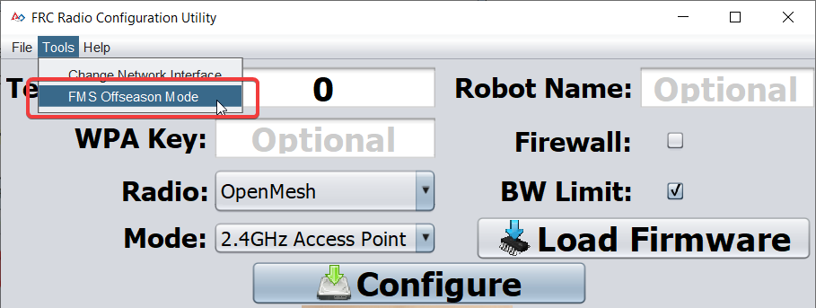
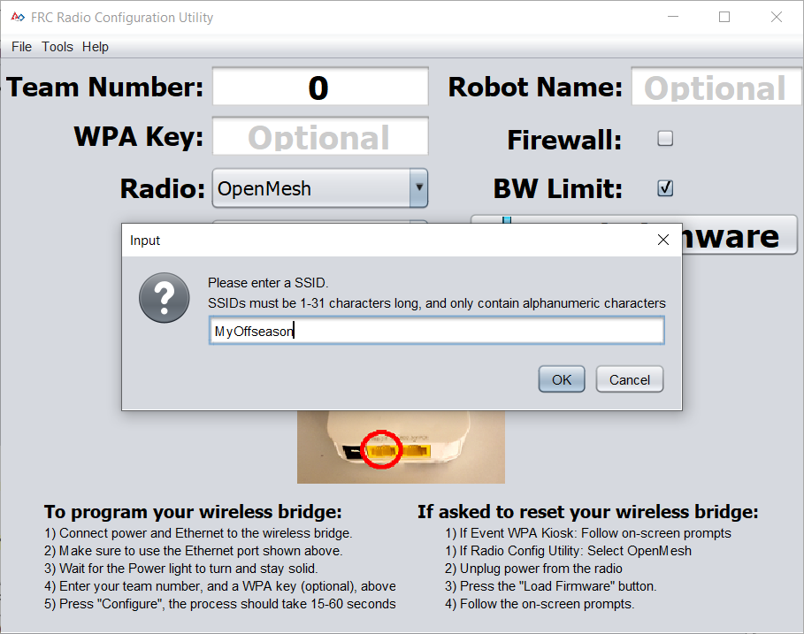
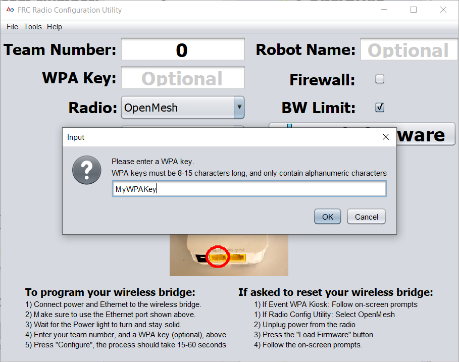
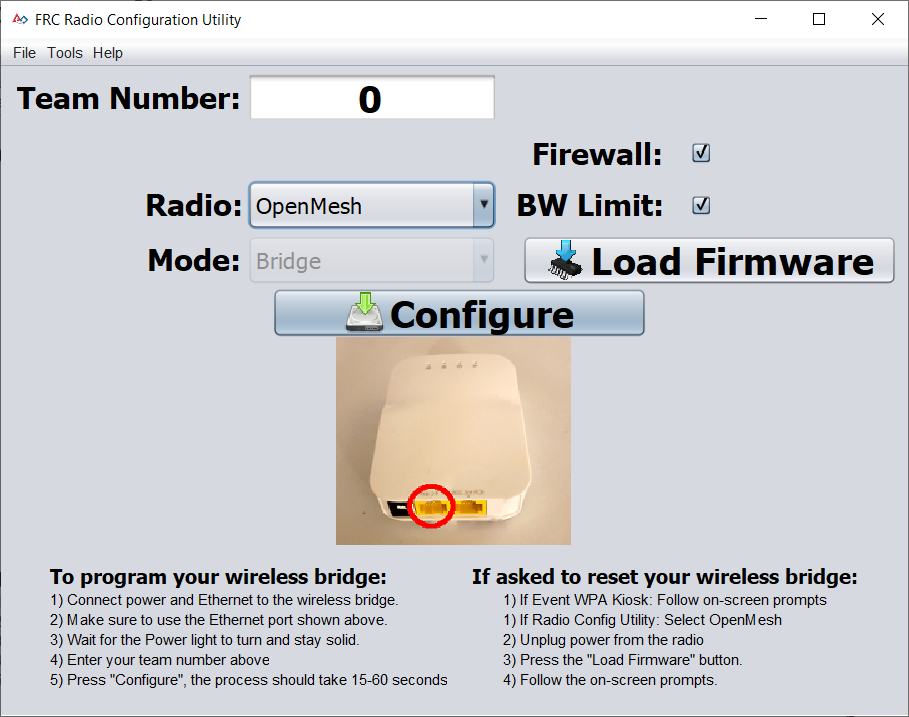

.. include:: <isonum.txt>

Programming Radios for FMS Offseason
====================================

When using the FMS Offseason software, the typical networking setup is to use a single access point with a single SSID and WPA key. This means that the radios should all be programmed to connect to this network, but with different IPs for each team. The Team version of the FRC\ |reg| Bridge Configuration Utility has an FMS Offseason mode that can be used to do this configuration.

Pre-Requisites
--------------

Install the FRC\ |reg| Radio Configuration Utility software per the instructions in :ref:`Programming your radio <docs/zero-to-robot/step-3/radio-programming:Prerequisites>`

Before you begin using the software:

#. Disable WiFi connections on your computer, as it may prevent the configuration utility from properly communicating with the bridge
#. Plug directly from your computer into the wireless bridge ethernet port closest to the power jack. Make sure no other devices are connected to your computer via ethernet. If powering the radio via PoE, plug an Ethernet cable from the PC into the socket side of the PoE adapter (where the roboRIO would plug in). If you experience issues configuring through the PoE adapter, you may try connecting the PC to the alternate port on the radio.

Programmed Configuration
^^^^^^^^^^^^^^^^^^^^^^^^

The Radio Configuration Utility programs a number of configuration settings into the radio when run. These settings apply to the radio in all modes (including at events). These include:

- Set a static IP of ``10.TE.AM.1``
- Set an alternate IP on the wired side of ``192.168.1.1`` for future programming
- Bridge the wired ports so they may be used interchangeably
- The LED configuration noted in the status light referenced below.
- 4Mb/s bandwidth limit on the outbound side of the wireless interface (may be disabled for home use)
- QoS rules for internal packet prioritization (affects internal buffer and which packets to discard if bandwidth limit is reached). These rules are:

  - Robot Control and Status (UDP ``1110``, ``1115``, ``1150``)
  - Robot TCP & :term:`NetworkTables` (TCP ``1735``, ``1740``)
  - Bulk (All other traffic). (disabled if BW limit is disabled)

- DHCP server enabled. Serves out:

  - ``10.TE.AM.11`` - ``10.TE.AM.111`` on the wired side
  - ``10.TE.AM.138`` - ``10.TE.AM.237`` on the wireless side
  - Subnet mask of ``255.255.255.0``
  - Broadcast address ``10.TE.AM.255``

- DNS server enabled. DNS server IP and domain suffix (``.lan``) are served as part of the DHCP.

.. tip:: See the :ref:`Status Light Reference <docs/hardware/hardware-basics/status-lights-ref:OpenMesh Radio>` for details on the behavior of the radio status lights when configured.

When programmed with the team version of the Radio Configuration - Utility, the user accounts will be left at (or set to) the firmware - defaults **for the DAPs only**:

- Username: root
- Password: root

.. note:: It is not recommended to modify the configuration manually

Launch the software
-------------------

.. image:: /docs/zero-to-robot/step-3/images/radio-programming/radio-launch.png
  :alt: The FRC Radio Configuration Utility in the start menu.

Use the Start menu or desktop shortcut to launch the program.

.. note:: If you need to locate the program, it is installed to ``C:\Program Files (x86)\FRC Radio Configuration Utility``. For 32-bit machines the path is ``C:\Program Files\FRC Radio Configuration Utility``

Allow the program to make changes, if prompted
----------------------------------------------

.. image:: /docs/zero-to-robot/step-3/images/radio-programming/allow-changes.png
  :alt: User Account Control dialog that pops up when running the config utility.

A prompt may appear about allowing the configuration utility to make changes to the computer. Click :guilabel:`Yes` if the prompt appears.

Enter FMS Offseason Mode
------------------------

Click ``Tools`` -> ``FMS-Lite Mode`` to enter FMS-Lite Mode.

Enter SSID
----------

Enter the SSID (name) of your wireless network in the box and click OK.

Enter WPA Key
-------------

Enter the WPA key for your network in the box and click OK. Leave the box blank if you are using an unsecured network.

Program Radios
--------------

The Kiosk is now ready to program any number of radios to connect to the network entered. To program each radio, connect the radio to the Kiosk, set the Team Number in the box, and click Configure.

The kiosk will program OpenMesh, D-Link Rev A or D-Link Rev B radios to work on an offseason FMS network by selecting the appropriate option from the "Radio" dropdown.

.. note:: Bandwidth limitations and QoS will not be configured on the D-Link radios in this mode.

Changing SSID or Key
--------------------

If you enter something incorrectly or need to change the SSID or WPA Key, go to the Tools menu and click FMS-Lite Mode to take the kiosk out of FMS-Lite Mode. When you click again to put the Kiosk back in FMS-Lite Mode, you will be re-prompted for the SSID and Key.

Troubleshooting
---------------

See the troubleshooting steps in :ref:`Programming your radio <docs/zero-to-robot/step-3/radio-programming:Troubleshooting>`
