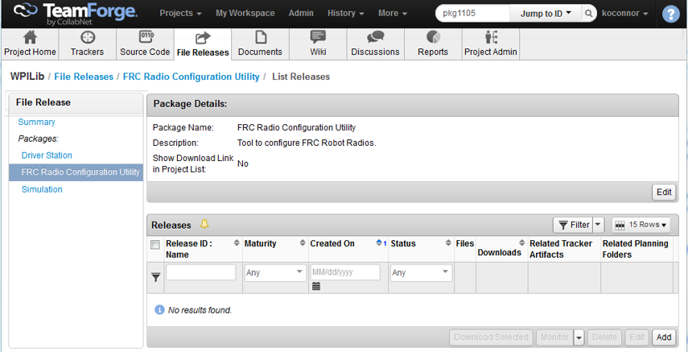
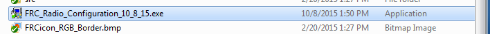
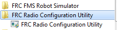
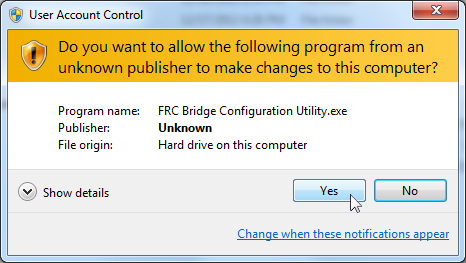
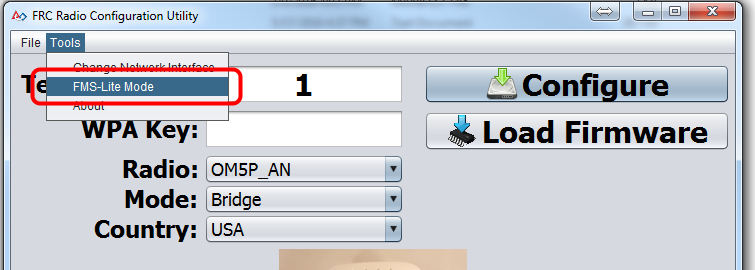

.. include:: <isonum.txt>

Programming Radios for FMS Offseason
====================================

When using the FMS Offseason software, the typical networking setup is to use a single access point with a single SSID and WPA key. This means that the radios should all be programmed to connect to this network, but with different IPs for each team. The Team version of the FRC\ |reg| Bridge Configuration Utility has an FMS-Lite mode that can be used to do this configuration.

Before you begin using the software:

#. Disable WiFi connections on your computer, as it may prevent the configuration utility from properly communicating with the bridge
#. Make sure no devices are connected to your computer via ethernet, other than the wireless bridge.

Pre-Requisites
--------------

.. note:: Even though WPILib uses Java 11, the FRC Radio Configuration Utility requires Java 8.

The FRC Radio Configuration Utility requires the Java Runtime Engine (JRE). If you do not have Java installed, you can download the JRE from `here <https://www.java.com/en/download/>`__.

The FRC Radio Configuration Utility requires Administrator privileges to configure the network settings on your machine. The program should request the necessary privileges automatically (may require a password if run from a non-Administrator account), but if you are having trouble try running it from an Administrator account.

Application Notes
-----------------

The Radio Kiosk will program the radio to enforce the 4 Mbps bandwidth limit on traffic exiting the radio over the wireless interface. In the home configuration (AP mode) this is a total, not a per client limit. This means that streaming video to multiple clients is not recommended.

The Kiosk has been tested on Windows 7, 8, and 10. It may work on other operating systems, but has not been tested.

Programmed Configuration
^^^^^^^^^^^^^^^^^^^^^^^^

The Radio Configuration Utility programs a number of configuration settings into the radio when run. These settings apply to the radio in all modes (including at events). These include:

- Set a static IP of 10.TE.AM.1
- Set an alternate IP on the wired side of 192.168.1.1 for future programming
- Bridge the wired ports so they may be used interchangeably
- The LED configuration noted in the graphic above
- 4Mb/s bandwidth limit on the outbound side of the wireless interface
- QoS rules for internal packet prioritization (affects internal buffer and which packets to discard if bandwidth limit is reached). These rules are Robot Control and Status (UDP 1110, 1115, 1150) >> Robot TCP & :term:`NetworkTables` (TCP 1735, 1740) >> Bulk (All other traffic).

.. tip:: See the :ref:`Status Light Reference <docs/hardware/hardware-basics/status-lights-ref:OpenMesh Radio>` for details on the behavior of the radio status lights when configured.

When programmed with the team version of the Radio Configuration - Utility, the user accounts will be left at (or set to) the firmware - defaults **for the DAPs only**:

- Username: root
- Password: root

.. note:: It is not recommended to modify the configuration manually

Download the software
---------------------

Download the latest FRC Radio Configuration Utility Installer from the `WPILib project File Releases <https://usfirst.collab.net/sf/frs/do/listReleases/projects.wpilib/frs.frc_radio_configuration_utility>`__.

Install the software
--------------------

Double click on FRC_Radio_Configuration_MM_DD_YY.exe to launch the installer. Follow the prompts to complete the installation.

Part of the installation prompts will include installing WinPCap if it is not already present. The WinPCap installer contains a checkbox (checked by default) to start the WinPCap driver on boot. You should leave this box checked.

Launch the software
-------------------

Use the Start menu or desktop shortcut to launch the program.

.. note:: If you need to locate the program it is installed to ``C:/Program Files (x86)/FRC Radio Configuration Utility``. For 32-bit machines the path is ``C:/Program Files/FRC Radio Configuration Utility/``

Allow the program to make changes, if prompted
----------------------------------------------

If the your computer is running Windows Vista or Windows 7, a prompt may appear about allowing the configuration utility to make changes to the computer.  Click "Yes" if the prompt appears.

Enter FMS-Lite Mode
-------------------

Click ``Tools`` -> ``FMS-Lite Mode`` to enter FMS-Lite Mode.

Enter SSID
----------

.. image:: images/programming-radios-for-fms-offseason/ssid.png
   :alt: Enter the network SSID in the dialog box.

Enter the SSID (name) of your wireless network in the box and click OK.

Enter WPA Key
-------------

.. image:: images/programming-radios-for-fms-offseason/wpa.png
   :alt: Enter the WPA Key (password) for this SSID.

Enter the WPA key for your network in the box and click OK. Leave the box blank if you are using an unsecured network.

Program Radios
--------------

.. image:: images/programming-radios-for-fms-offseason/program-radio.png
   :alt: Program the radio through the utility like normal for all of the radios at your event.

The Kiosk is now ready to program any number of radios to connect to the network entered. To program each radio, connect the radio to the Kiosk, set the Team Number in the box, and click Configure.

The kiosk will program OpenMesh, D-Link Rev A or D-Link Rev B radios to work on an offseason FMS network by selecting the appropriate option from the "Radio" dropdown.

.. note:: Bandwidth limitations and QoS will not be configured on the D-Link radios in this mode.

Changing SSID or Key
--------------------

If you enter something incorrectly or need to change the SSID or WPA Key, go to the Tools menu and click FMS-Lite Mode to take the kiosk out of FMS-Lite Mode. When you click again to put the Kiosk back in FMS-Lite Mode, you will be re-prompted for the SSID and Key.
