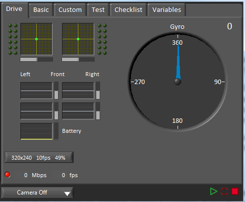
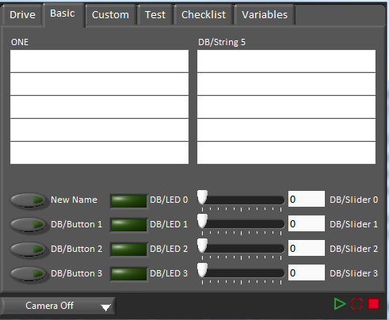
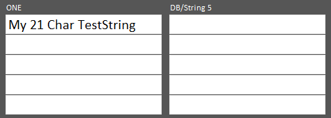
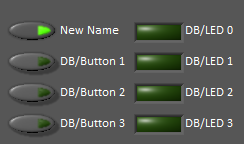
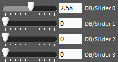

Using the LabVIEW Dashboard with C++\Java Code
==============================================

The default LabVIEW Dashboard utilizes Network Tables to pass values and is therefore compatible with C++ and Java robot programs. This article covers the keys and value ranges to use to work with the Dashboard.

Drive Tab
---------

Most of the indicators on the Drive tab utilize arrays. The c++ and Java SmartDashboard classes do not currently support sending arrays.

Basic Tab
---------

The Basic tab uses a number of keys in the a "DB" sub-table to send/recieve Dashboard data. The LED's are output only, the other fields are all bi-directional (send or recieve).

Labels
^^^^^^

The labels are currently sent as an array. C++ and Java SmartDashboard classes do not currently support sending arrays.

Strings
^^^^^^^

The strings are labeled top-to-bottom, left-to-right from "DB/String 0" to "DB/String 9". Each String field can display at least 21 characters (exact number depends on what characters). To write to these strings:

.. tabs::

    .. code-tab:: java

       SmartDashboard.putString("DB/String 0", "My 21 Char TestString");

    .. code-tab:: c++

       SmartDashboard::PutString("DB/String 0", "My 21 Char TestString");

To read string data entered on the Dashboard:

.. tabs::

    .. code-tab:: java

       String dashData = SmartDashboard.getString("DB/String 0", "myDefaultData");

    .. code-tab:: c++

       std::string dashData = SmartDashboard::GetString("DB/String 0", "myDefaultData");

Buttons and LEDs
^^^^^^^^^^^^^^^^

The Buttons and LEDs are boolean values and are labeled top-to-bottom from "DB/Button 0" to "DB/Button 3" and "DB/LED 0" to "DB/LED 3". The Buttons are bi-directional, the LEDs are only able to be written from the Robot and read on the Dashboard. To write to the Buttons or LEDs:

.. tabs::

    .. code-tab:: java

       SmartDashboard.putBoolean("DB/Button 0", true);

    .. code-tab:: c++

       SmartDashboard::PutBoolean("DB/Button 0", true);

To read from the Buttons: (default value is false)

.. tabs::

    .. code-tab:: java

       boolean buttonValue = SmartDashboard.getBoolean("DB/Button 0", false);

    .. code-tab:: c++

       bool buttonValue = SmartDashboard::GetBoolean("DB/Button 0", false);

Sliders
^^^^^^^

The Sliders are bi-directional analog (double) controls/indicators with a range from 0 to 5. To write to these indicators:

.. tabs::

    .. code-tab:: java

       SmartDashboard.putNumber("DB/Slider 0", 2.58);

    .. code-tab:: c++

       SmartDashboard::PutNumber("DB/Slider 0", 2.58);

To read values from the Dashboard into the robot program: (default value of 0.0)

.. tabs::

    .. code-tab:: java

       double dashData = SmartDashboard.getNumber("DB/Slider 0", 0.0);

    .. code-tab:: c++

       double dashData = SmartDashboard::GetNumber("DB/Slider 0", 0.0);
