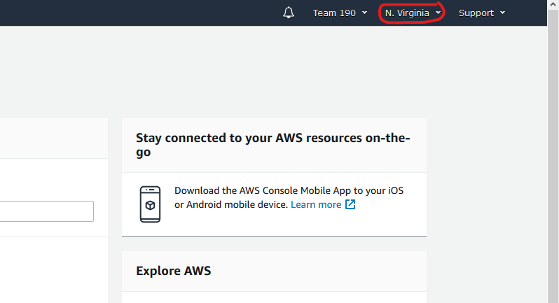
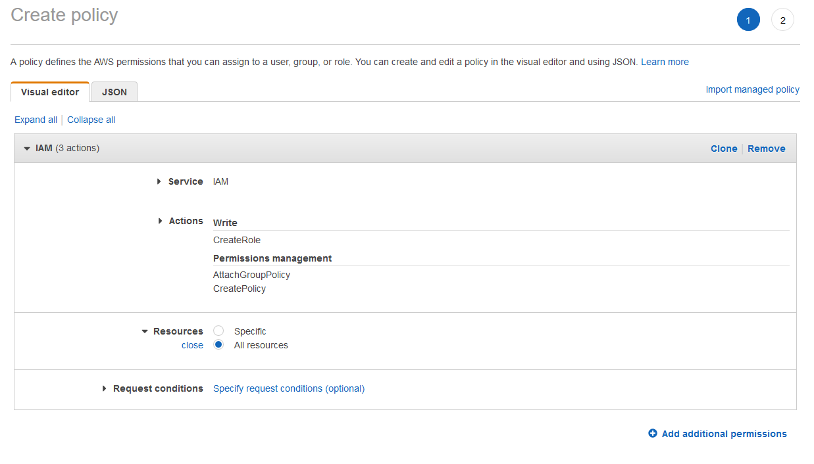

Setting Up An AWS Account
=========================

Please email wpilib.ml@gmail.com with an gmail account that has never been used as an AWS account. After you receive your email confirmation (may take a day or two), go to https://console.aws.amazon.com/console/home Put in your email, then do a forgot password. This will send you an email and allow you to setup your mentor account.

Once you have your mentor account setup you can add students to the account. Follow these steps to setup student accounts.

Setup Region
------------

- Make sure your region is set to N. Virginia, You can find the region in the upper right of the screen to the right of your user name, in this case your team number.

Setup Policy
------------

- Go to service IAM (click on "Services" on the upper left of the screen and search for IAM)
- On the left click on Policies
- Click on the blue "Create policy" button
- Click on Choose a service
- Search for IAM and click on IAM
- Click on the arrow to the left of "Write" Do not select all of "Write"
- Click the checkbox for "CreateRole"
- Click on the arrow to the left of "Permissions management"
- Click the checkbox for "AttachRolePolicy" and "CreatePolicy"
- Scroll down further an click on Resources
- Click the circle next to "All resources"

- Click on the blue "Review policy” button
- Give the policy a name. Something like "1SagemakerRole" I put a 1 first so that it shows at the top of the policies.
- Click the blue "Create policy" button

Setup Users
-----------

- Still on the IAM service
- On the left click on Users
- Click on blue button for Add user
- Enter one or more users (you can add more later if needed)
- check the box for "AWS Management Console access"
- Other options can be left as default
- click on blue button at bottom Next: Permissions
- click on create group if this is the first user you are adding, if additional user you can just add them to an existing group
- Give the group a name like "MyStudents"
- Select the following policies to add to the group:
    - 1SagemakerRole (or the name you used for this policy)
    - AmazonSageMakerFullAccess
    - AmazonS3FullAccess
    - CloudWatchFullAccess

.. image:: images/aws-iam-group-policies-png
   :alt: Proper group IAM policy

- Click on Create Group
- After Group is created and attached to user(s) click on the blue "Next: Tags" button at the bottom
- No tags are needed, click on the blue "Next: review" button at the bottom
- All should be set. Click on blue button at bottom "Create user"
- You should get a Success Box on the top of the screen.
- The URL in the box is the URL the students should use to log in.
- then you can get the password from the User list below, click on Show to get the password.
- Email the URL, User name you gave them, and password to the student so they can log in. All the users will be sharing the same view of services as your mentor account, but will not be able to create users
