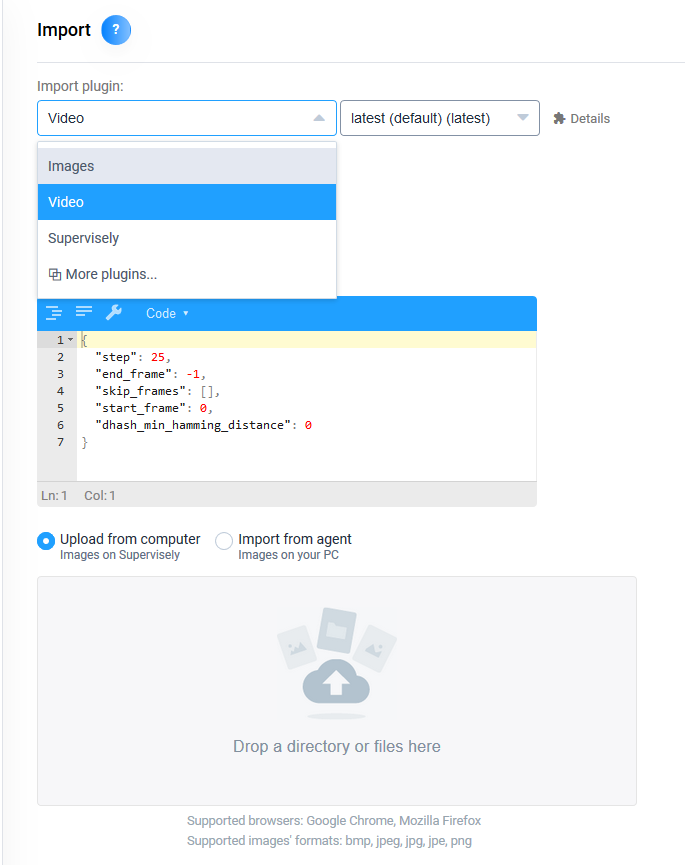
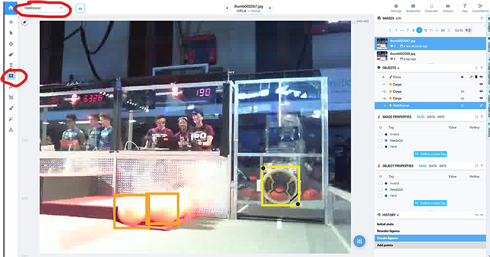

Adding More Data
================

These steps detail how to record a new video, upload it to Supervisely, and label the frames. You can skip this article if you want to use the WPILib dataset directly.

.. note:: If you cannot access Supervisely, you can use the WPILib dataset directly in later steps.

Why Add More Data
-----------------

Terminology
~~~~~~~~~~~

- Raw Data - These are all the images we have provided.
- Dataset - This is the subset of images we used to train the network. We created this subset by clicking on the 3 dots of the Raw Data workspace, then going to the menu item “Run Python Script” and selecting the script “Filter by tag”  We then filled in the tag “Valid”

Datasets are becoming increasingly important to companies. It has been said that Tesla now spends more time with datasets than it does with the software. It is hard to make driving decisions at 70 MPH without accurate object detection. Of interest, at this point in our legal system, you can not patent or copyright an image that is just a statement of fact, for instance a picture of the road or a ball. While Tesla may want to keep their dataset very proprietary, we are hoping that is not true with the FIRST community.

For INFINITE RECHARGE we have provided over 4500 raw images. These images were taken on an actual field with a combination of still images from a camera, and frames from video that was taken.

When you look at the set of images we have labeled and marked as valid it makes a dataset of just over 550 images. We have left a lot of room for teams to do more with this dataset.

Let me describe some of the decisions we made in creating our dataset. First of all we have a number of images that are marked as valid but don’t have any POWER CELLS in them. It is important to have images of the space that POWER CELLS will show up in, but don’t have any POWER CELLS. This helps eliminate false positives in the world of space that we expect to see.

Second we picked a methodology for labeling POWER CELLS. We only labeled POWER CELLS that were clear and with the entire cell visible. Is this the best way to go about this?  We don’t know for sure. We would have had to create a number of datasets and tried them many different ways in order to determine this. We felt what we created is has a good level of accuracy, but we do know we can find ways to make it see false positives.

We also only labeled a single class, POWER CELLS. Are there other elements or field features you might want to detect?

As you can tell from above there might be many reasons that you may want to modify our dataset or use more of the raw images.

Could you achieve higher accuracy, most likely. If you are already using the camera with ML, would it make sense to label other field shapes or symbols instead of using the retro reflective tape?  We imagine so.

To add another class, other than just POWER CELLS, click into the Raw Data workspace and at the top of the page there is a menu item for Classes. Also remember when labeling images to also Tag the image as Valid. Run the Valid filter again when you are ready to create your own dataset to train.

We wanted to provide you with a rich set of raw images and a good way to find power cells, but we also wanted to leave room for each team to be creative with their own solution.

We hope you enjoy this process and learn more about datasets, as we perceive datasets being very important to the future of machine learning.

Record a video to label
-----------------------

When creating your own dataset, it is often easier to take frames from a video rather than capture individual photos. This section describes how to extract frames from a video.

1. Prepare to record a video of objects you want your robot to detect. You will want to get multiple angles and locations of the objects.
2. Plug a USB Camera into your laptop, point the camera at your chosen object, and run `record_video.py <https://github.com/wpilibsuite/DetectCoral/blob/master/utils/record_video.py>`__, which records an MP4. This script records small (640x480) images.
3. Click on the workspace, then the WPILib project that you imported in the :ref:`Setting Up the Data <docs/software/examples-tutorials/machine-learning/setting-up-the-data:Getting Data>` article.
4. Upload your own video to your workspace. Click 'UPLOAD' when inside of your workspace, change your import plugin to video, drag in your video, give the project a name, and click import. The default configuration, seen in the picture below, is fine.

5. Click into your newly import Dataset. Use the ``rectangle tool`` to draw appropriate boxes around the objects which you wish to label. Make sure to choose the correct class while you are labelling. The class selector is in the top left of your screen.

