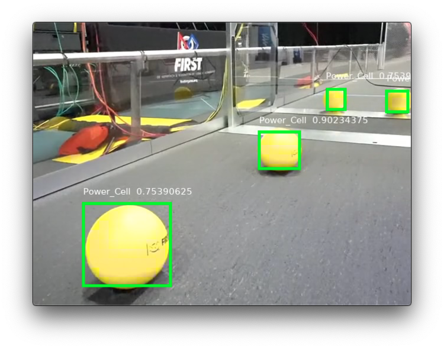

Machine Learning
================

This technology experiment is a way for teams to automatically detect game pieces and other interesting objects with machine learning. It uses Amazon Web Services to train and test, so teams do not need to own especially powerful computers.

This document describes the steps needed to use a provided set of labeled images and make a trained model to deploy on a RasberryPi with a Google Coral. The basic steps are: create and upload your data, train your model, test your model, run inference on a coprocessor, and use that data meaningfully.

Table of Contents
-----------------

.. toctree::
   :maxdepth: 1

   setting-up-the-data
   adding-more-data
   uploading-data-to-aws-s3
   training
   testing
   inference
   using-inference-output
   how-it-works
   understanding-precision

Hardware Requirement
--------------------

- Rasberry Pi 3 or newer
- `Google Coral USB Accelerator <https://www.amazon.com/dp/B07S214S5Y>`__
