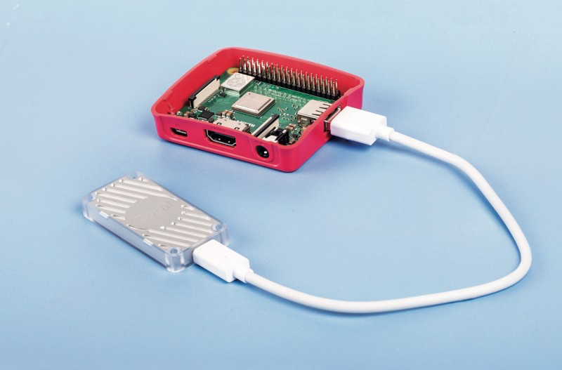
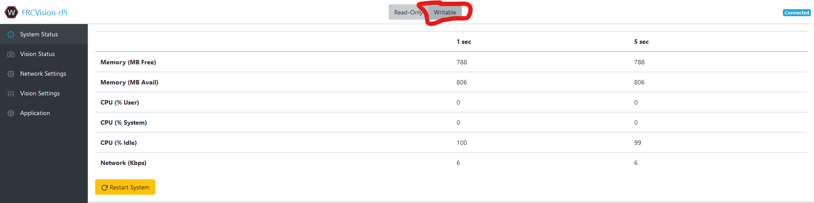
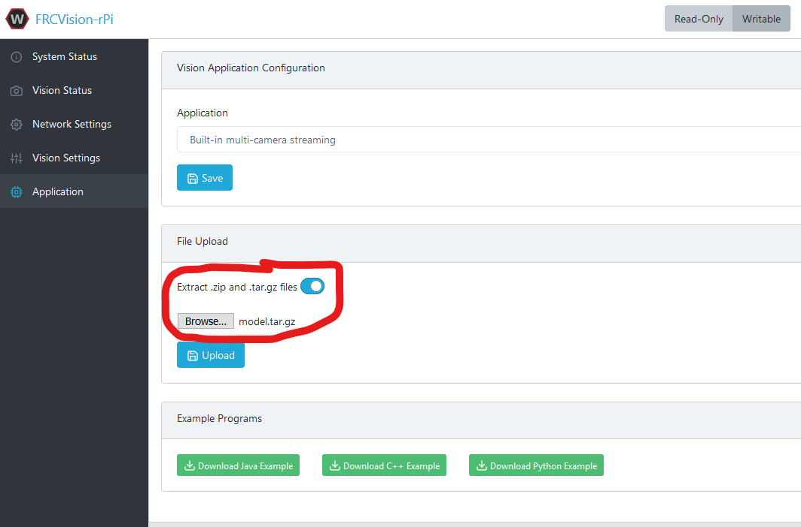
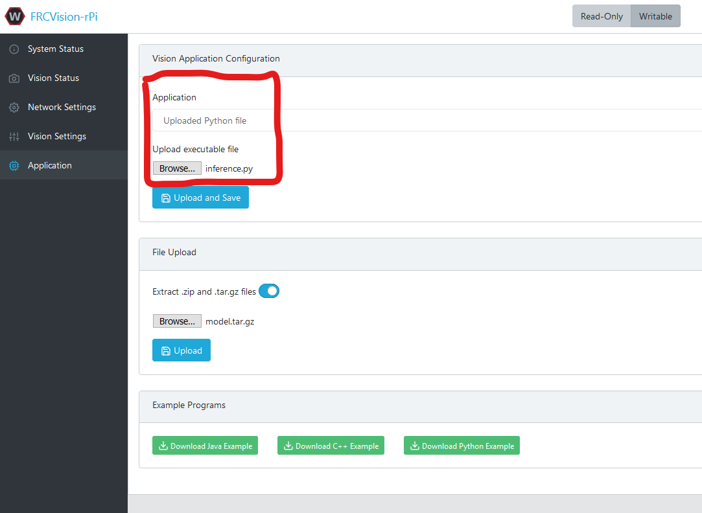

Inference
=========

Inference with the Google Coral

1. Acquire a Raspberry Pi 3 or newer, and a `Google Coral USB Accelerator <https://www.amazon.com/dp/B07S214S5Y>`__.

2. Go to the training job in SageMaker, scroll to the bottom, and find the output S3 location.
3. Download the the tar file in the bucket.
4. Setup your Raspberry Pi by :ref:`installing the FRCVision image to your MicroSD card <docs/software/vision-processing/raspberry-pi/installing-the-image-to-your-microsd-card:Installing the image to your MicroSD card>`. This will install an operating system and most of the WPILib software that you will use for machine learning.
5. Plug the Coral into the Pi, as shown in the picture above.
6. After successfully imaging your Pi, plug the Pi into your computer over ethernet. Open http://frcvision.local and change the file system to writeable.

7. Switch to the Application tab on the left.
8. Upload the previously downloaded ``model.tar.gz`` to the Pi by selecting the file in the File Upload box, and switching on ``Extract .zip and .tar.gz files``.

9. Click upload.
10. `Download the Python script which runs the model <https://raw.githubusercontent.com/wpilibsuite/DetectCoral/master/utils/inference.py>`__.
11. Switch the ``Vision Application Configuration`` to ``Uploaded Python File``, as shown below, and upload the downloaded script.

12. Real time labelling can be found on an MJPEG stream located at http://frcvision.local:1182
13. The information about the detected objects is put to NetworkTables.
