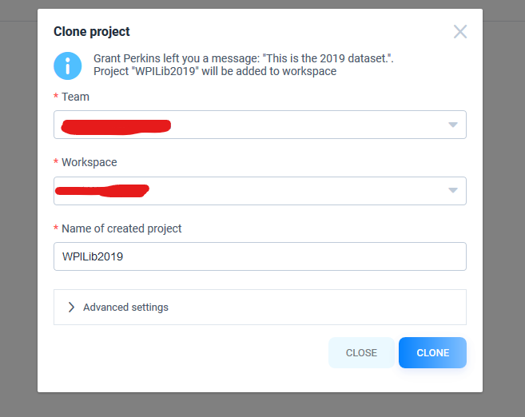

Setting Up the Data
====================

Machine learning works by "learning" the important features of objects by evaluating thousands of pictures. The pictures have boxes drawn around the important objects, such as a game piece. WPILib provides a pre-labeled dataset. You can also add additional images to the provided dataset, but you will need to label them.

Getting Data
------------

1. `Supervisely <https://supervise.ly/>`__ is the tool we use for labeling our data. Create a supervise.ly account to access our dataset. On the supervise.ly website, the Signup box is in the top right corner. Provide the necessary details, then click "CREATE AN ACCOUNT".
2. If you want to create a Workspace for your team, you can. In your workspace, by click 'Members' on the left and then 'INVITE' at the top. After typing in your teammates' details, they should be able to view the workspace.
3. To attain the WPILib dataset, `click this link <https://app.supervise.ly/share-links/KuzdKW78JN56zV0IIEiUml3yonjuyXQOSWgBDxgGdbaPBhLNiKaVG7fngWKFsuBD>`__. After choosing which workspace you want to use, click clone.

