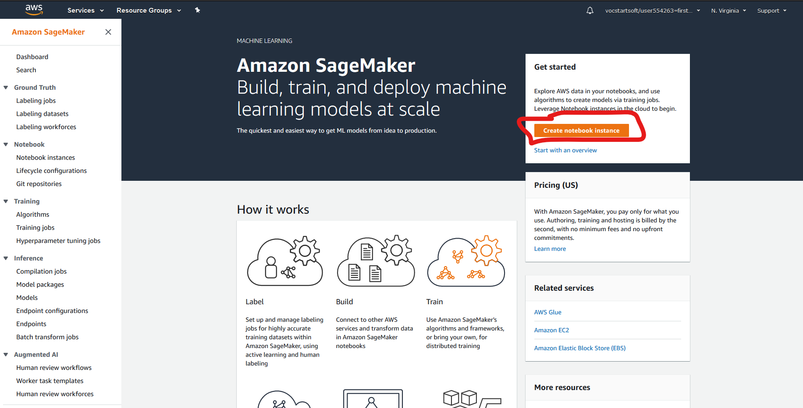
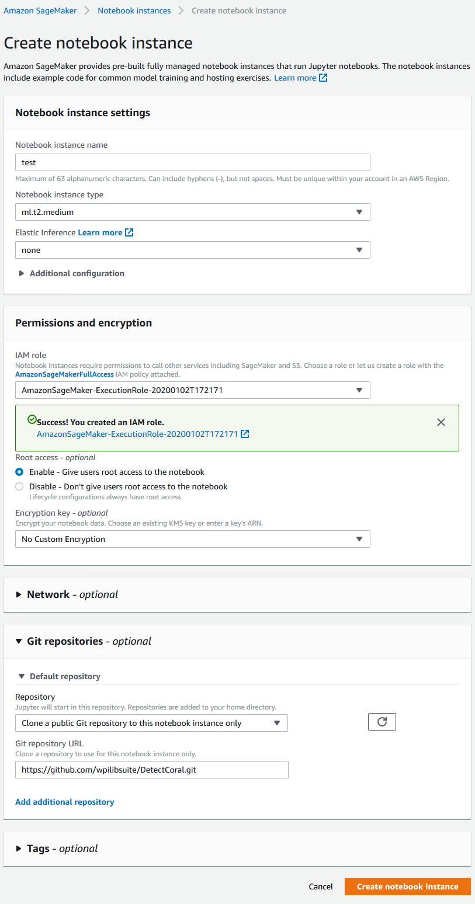
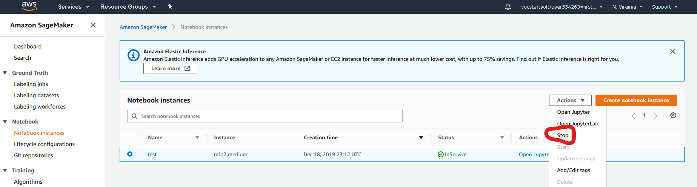

Training
========

Training on AWS with the provided dataset should take about 2 hours and cost roughly $1. If you add more images or add new labeling classes the cost and time will be higher.

Train with AWS
--------------

1. If you are not in the AWS Console main page, click the AWS logo in the top left if you're logged in, or go to the page through your `awseducate.com classroom <https://www.awseducate.com/>`__ if you are not logged in.
2. Search "SageMaker" in the "Find Services" field and create a new SageMaker notebook instance.

.. image:: images/aws-search-sagemaker.png
   :alt: Searching for SageMaker on the AWS Console

- Notebook instance name: Give your notebook a name
- IAM Role: Click Create a new role inside of the dropdown. Let it have access to Any S3 bucket.
- Git repositories: open the panel, then click on where it says None. Click Clone a public Git repository to this notebook instance only, then paste in this link: https://github.com/wpilibsuite/DetectCoral.git
- Create the instance

3. After several minutes, the notebook will be "In Service". Open the notebook using the JupyterLab option.

4. Open the ``DetectCoral`` folder, and then ``training.ipynb``, found on the left side of the screen. We've noticed that the first time a notebook is opened that it doesn't work correctly. To fix this, follow these steps:

  - Reload the tab. Dismiss the error. When prompted, select the kernel ``conda_amazonei_tensorflow_p36``.
  - If the tab does not finish reloading, close the tab, and open the notebook in JupyterLab once again. It will work this time.

5. Replace ``estimator.fit(s3://wpilib)`` with ``estimator.fit(s3://<<your-bucket-name>>)``. If you could not access Supervisely in earlier steps, do not replace the bucket's name.
6. Run the code block by clicking the play button at the top of your screen. This block could take up to two hours to train your model depending on the value of ``epochs`` in the ``hyperparameters`` dictionary.
7. Once the code block finishes running, the precision for each epoch is outputted. More information about what precision means can be found in :ref:`Understanding Precision <docs/software/examples-tutorials/machine-learning/understanding-precision:Understanding Precision>`.
8. Go back to SageMaker. Open ``Training jobs`` on the far left. Open the most recent training job.
9. Once the model is done training (the job says ``Completed``), scroll to the bottom inside the training job. Click on the link in the ``Output`` section, where it says ``S3 model artifact``.
10. Click on ``model.tar.gz``. Click on ``Download``.
11. Stop the notebook now that the training job is completed. Do this by going back to the SageMaker tab, clicking on ``Notebook instances`` on the far left, selecting the instance that is no longer needed, and selecting ``Actions -> Stop``.

