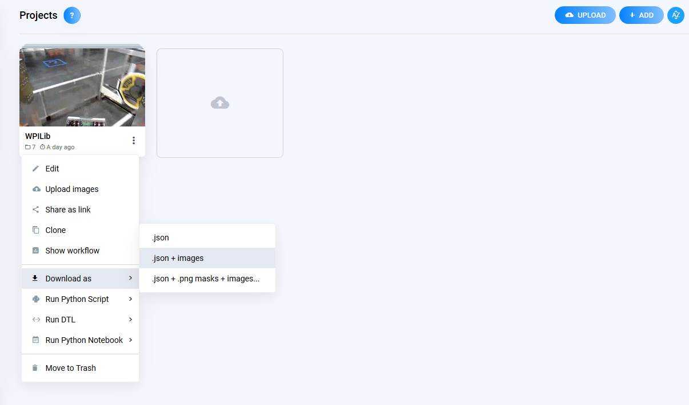
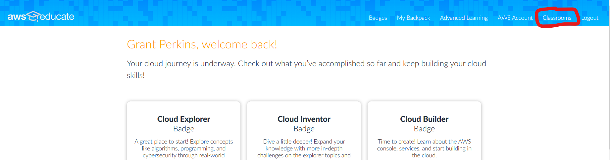
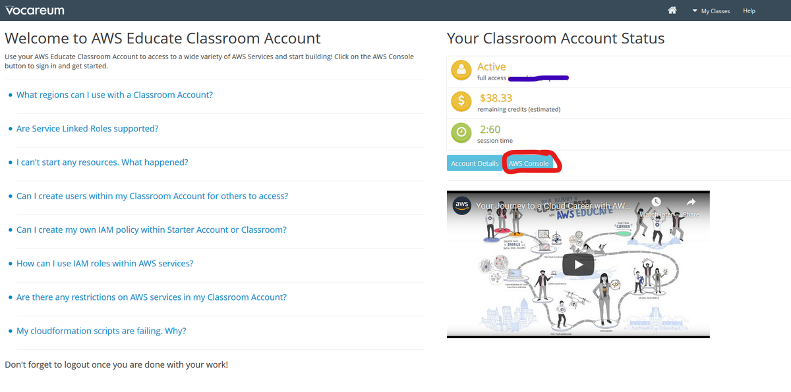
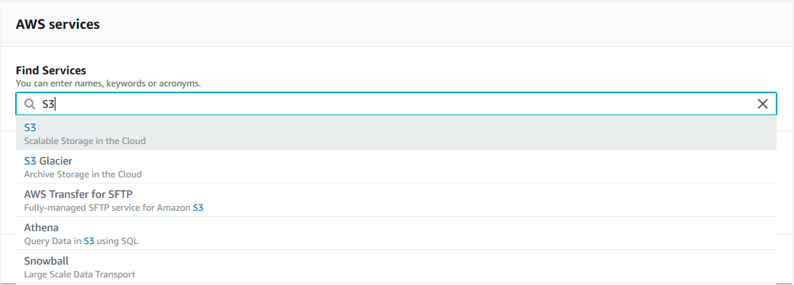
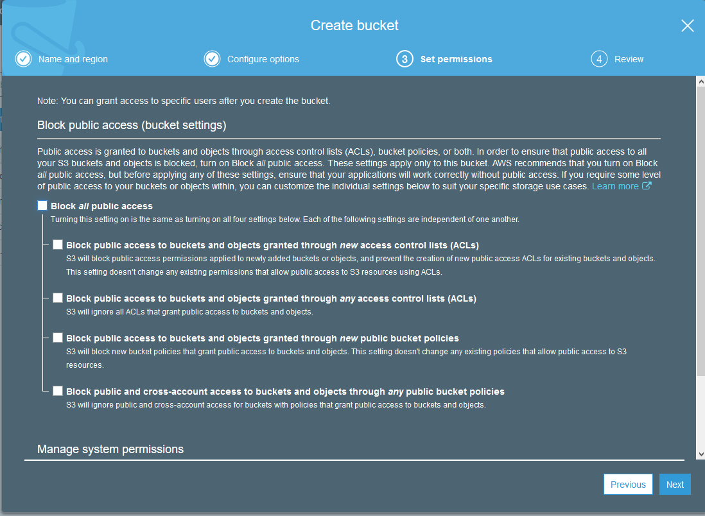
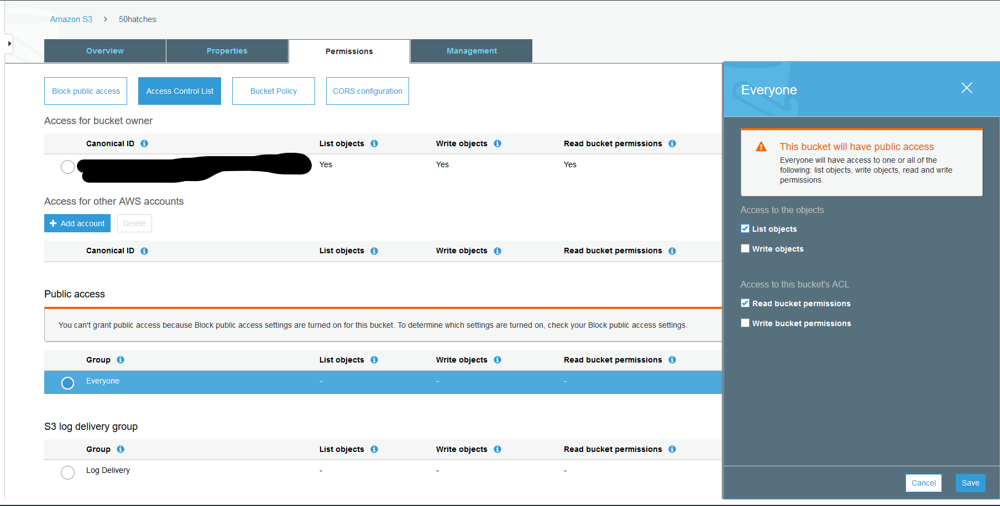
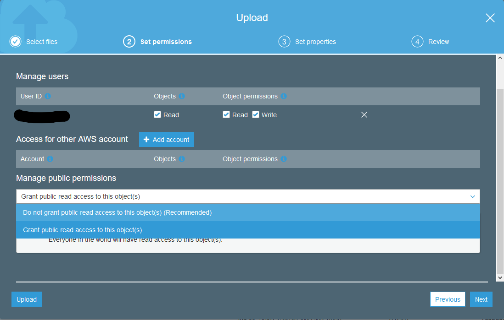

Uploading the Data to AWS S3
============================

Amazon Web Services (AWS) S3 is Amazon's cloud storage service. You must upload your dataset to S3 in order to use for training with Amazon servers.

.. note:: If you can not access Supervisely, you can skip all of these steps.

1. While on `Supervisely <https://supervise.ly/>`__, go to your project page in your workspace. Click on the vertical three dots on the dataset, then "Download as", then select the ``.json + images`` option.

2. If you do not have an AWS Educate account, have a mentor `follow these steps <https://www.firstinspires.org/sites/default/files/uploads/frc/AWSEducate_FIRST_MentorOnboarding.pdf>`__. Once a mentor has completed these steps, students should `follow these steps <https://www.firstinspires.org/sites/default/files/uploads/frc/AWSEducate_FIRST_StudentOnboarding.pdf>`__.
3. Open `AWS Educate <https://aws.amazon.com/education/awseducate/>`__. Log in to your account.
4. Open up your Classroom.

5. Accept the Terms and Conditions, if presented.
6. Go to your classroom, and click continue.

.. image:: images/aws-open-classroom.png
   :alt: How to open a classroom on AWS

7. Open the AWS Console.

8. Search for S3 in the "Find Services" field. Open S3.

9. You will now create an S3 bucket. A bucket is a folder in the cloud with specific permissions.
10. Create a new bucket by giving it a unique name. Hit next until you reach the ``Set permissions`` page. On the third page, make sure it has public read permissions if multiple accounts will be using this data.

11. Now that the bucket has been created, go into the bucket, then ``Permission`` -> ``Access Control List``. Then change the public access to allow ``List objects`` and ``Read bucket permissions``.

12. Upload the ``.tar`` file that you downloaded (or made with Supervise.ly) into the new S3 bucket. Click "Add files", then select the file, click "Next", then make sure it also has public read permissions if multiple accounts will be using this data. Keep the file properties "Standard", and then click "Upload".

13. Click the AWS logo in the top left to continue to the AWS Console main page.
