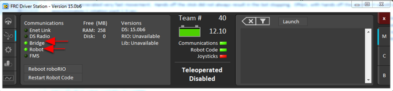

Running your Benchtop Test Program
==================================

Overview
--------

You should create and download a Benchtop Test Program as described for your programming language:

:ref:`C++/Java <creating_benchtop_test_cpp_java>`

:ref:`LabVIEW <creating_benchtop_test_labview>`

Tethered Operation
------------------

Running your benchtop testing program while tethered to the Driver Station via ethernet or USB cable will confirm the the program was successfully deployed and that the driver station and roboRIO are properly configured.

The roboRIO should be powered on and connected to the PC over Ethernet or USB. The Driver Station software should be configured with your team number as described in :ref:`this article <driver_station>`.

Wireless Operation
------------------

Before attempting wireless operation, tethered operation should have been confirmed as described in `Tethered Operation`_. Running your benchtop testing program while connected to the Driver Station via WiFi will confirm that the access point is properly configured.

Configuring the Access Point
^^^^^^^^^^^^^^^^^^^^^^^^^^^^

See the article :ref:`Programming your radio <radio-programming>` for details on configuring the robot radio for use as an access point.

After configuring the access point, connect the driver station wirelessly to the robot. The SSID will be your team number (as entered in the Bridge Configuration Utility). If you set a key when using the Bridge Configuration Utility you will need to enter it to conenct to the network. Make sure the computer network adapter is set to DHCP ("Obtain an IP address automatically").

Confirm Connectivity
--------------------

.. figure:: images/run-benchtop-test/confirm-connectivity-tethered.png
    
    Tethered

    
    Wireless

Using the Driver Station software, click Diagnostics and confirm that the Enet Link (or Robot Radio led, if operating wirelessly) and Robot leds are green.

Operate the Robot
-----------------

.. image:: images/run-benchtop-test/run-robot.png

Click the Operation Tab

1. Confirm that battery voltage is displayed
2. Communications, Robot Code, and Joysticks indicators are green.
3. Put the robot in Teleop Mode
4. Click Enable. Move the joysticks and observe how the robot responds.
5. Click Disable
