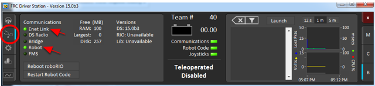
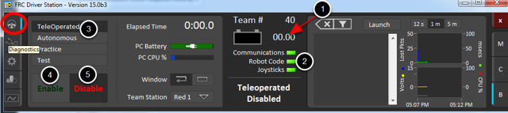

Running your Benchtop Test Program - Tethered
=============================================

Overview
--------

You should create and download a Benchtop Test Program as described for your programming language:

:ref:`C++/Java <creating_benchtop_test_cpp_java>`

:ref:`LabVIEW <creating_benchtop_test_labview>`

The roboRIO should be powered on and connected to the PC over Ethernet or USB. The Driver Station software should be configured with your team number as described in :ref:`this article <driver_station>`.

Confirm Connectivity
--------------------

Using the Driver Station software, click Diagnostics and confirm that the Enet Link and Robot leds are green.

Tethered Operation
------------------

Click the Operation Tab

1. Confirm that battery voltage is displayed
2. Communications, Robot Code, and Joysticks indicators are green.
3. Put the robot in Teleop Mode
4. Click Enable. Move the joysticks and observe how the robot responds.
5. Click Disable
