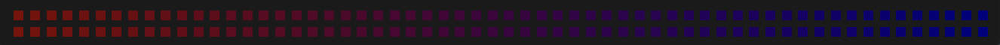

# Addressable LEDs

LED strips have been commonly used by teams for several years for a variety of reasons. They allow teams to debug robot functionality from the audience, provide a visual marker for their robot, and can simply add some visual appeal. WPILib has an API for controlling WS2812, WS2812B, and WS2815 LEDs with their data pin connected via :term:`PWM`.

.. note:: LEDs can be controlled through this API while the robot is disabled.

## Instantiating the AddressableLED Object

You first create an ``AddressableLED`` object that takes the PWM port as an argument. It *must* be a PWM header on the roboRIO. Then you set the number of LEDs located on your LED strip, which can be done with the ``setLength()`` function.

.. warning:: It is important to note that setting the length of the LED header is an expensive task and it's **not** recommended to run this periodically.

After the length of the strip has been set, you'll have to create an ``AddressableLEDBuffer`` object that takes the number of LEDs as an input. You'll then call ``myAddressableLed.setData(myAddressableLEDBuffer)`` to set the led output data. Finally, you can call ``myAddressableLed.start()`` to write the output continuously. Below is a full example of the initialization process.

.. note:: C++ does not have an AddressableLEDBuffer, and instead uses an Array.

.. tab-set::

   .. tab-item:: Java
      :sync: Java

      .. remoteliteralinclude:: https://raw.githubusercontent.com/wpilibsuite/allwpilib/v2027.0.0-alpha-1/wpilibjExamples/src/main/java/edu/wpi/first/wpilibj/examples/addressableled/Robot.java
         :language: java
         :lines: 32-47
         :lineno-match:

   .. tab-item:: C++
      :sync: C++

      .. remoteliteralinclude:: https://raw.githubusercontent.com/wpilibsuite/allwpilib/v2027.0.0-alpha-1/wpilibcExamples/src/main/cpp/examples/AddressableLED/include/Robot.h
         :language: c++
         :lines: 12-12, 18-27
         :linenos:
         :lineno-start: 12

      .. remoteliteralinclude:: https://raw.githubusercontent.com/wpilibsuite/allwpilib/v2027.0.0-alpha-1/wpilibcExamples/src/main/cpp/examples/AddressableLED/cpp/Robot.cpp
         :language: c++
         :lines: 7-13
         :lineno-match:

## Controlling Sections of an LED Strip

The roboRIO can only control a single addressable LED output at a time, but there are often multiple physical LED strips daisy-chained around a robot, or a single flexible LED strip wrapped around structures on a robot. Individual sections can be accessed in Java using ``AddressableLEDBufferView``. Buffer views behave like subsections of the larger buffer, and can be accessed using indices in the typical [0, length) range. They can also be reversed, to allow for parallel serpentine sections to be animated in the same physical orientation (i.e. both sections would animate "forward" in the same direction, even if the strips are physically tip-to-tail).

.. tab-set::

   .. tab-item:: Java
      :sync: Java

      ```Java
      // Create the buffer
      AddressableLEDBuffer m_buffer = new AddressableLEDBuffer(120);

      // Create the view for the section of the strip on the left side of the robot.
      // This section spans LEDs from index 0 through index 59, inclusive.
      AddressableLEDBufferView m_left = m_buffer.createView(0, 59);

      // The section of the strip on the right side of the robot.
      // This section spans LEDs from index 60 through index 119, inclusive.
      // This view is reversed to cancel out the serpentine arrangement of the
      // physical LED strip on the robot.
      AddressableLEDBufferView m_right = m_buffer.createView(60, 119).reversed();
      ```

   .. tab-item:: C++
      :sync: C++

      ```C++
      // Create the buffer
      std::array<frc::AddressableLED::LEDData, 120> m_buffer;

      // Create the view for the section of the strip on the left side of the robot.
      // This section spans LEDs from index 0 through index 59, inclusive.
      std::view<frc::AddressableLED::LEDData> m_left =
         std::ranges::take_view(m_buffer, 60);

      // The section of the strip on the right side of the robot.
      // This section spans LEDs from index 60 through index 119, inclusive.
      // This view is reversed to cancel out the serpentine arrangement of the
      // physical LED strip on the robot.
      std::view<frc::AddressableLED::LEDData> m_right =
         std::ranges::reverse_view(
            std::ranges::drop_view(m_buffer, 60));
      ```

## LED Patterns

The ``LEDPattern`` API simplifies setting LED data. Rather than needing to manually loop over every LED index, you can apply a pattern object to the data buffer directly. LED patterns are stateless, and can safely be applied to multiple buffers or views.

.. tab-set::

   .. tab-item:: Java
      :sync: Java

      ```Java
      // Create an LED pattern that sets the entire strip to solid red
      LEDPattern red = LEDPattern.solid(Color.kRed);

      // Apply the LED pattern to the data buffer
      red.applyTo(m_ledBuffer);

      // Write the data to the LED strip
      m_led.setData(m_ledBuffer);
      ```

   .. tab-item:: C++
      :sync: C++

      ```C++
      // Create an LED pattern that sets the entire strip to solid red
      LEDPattern red = LEDPattern.Solid(Color::kRed);

      // Apply the LED pattern to the data buffer
      red.ApplyTo(m_ledBuffer);

      // Write the data to the LED strip
      m_led.SetData(m_ledBuffer);
      ```

### Creating a Rainbow Effect

Using the built in ``LEDPattern.rainbow`` method, we can create a pattern that displays a full rainbow across an entire LED strip. Then, by calling ``scrollAtAbsoluteSpeed`` we can make it animate and cycle around the strip. ``rainbow`` accepts two arguments - one for the saturation and one for the value, expressed as a number from 0 to 255.

.. note:: Animating effects like scrolling use the :ref:`Java units library <docs/software/basic-programming/java-units:The Java Units Library>` and the :ref:`C++ units library <docs/software/basic-programming/cpp-units:The C++ Units Library>` for speeds and durations.

The base rainbow pattern will look like this:


.. tab-set::

   .. tab-item:: Java
      :sync: Java

      .. remoteliteralinclude:: https://raw.githubusercontent.com/wpilibsuite/allwpilib/v2027.0.0-alpha-1/wpilibjExamples/src/main/java/edu/wpi/first/wpilibj/examples/addressableled/Robot.java
         :language: java
         :lines: 21-31
         :lineno-match:

   .. tab-item:: C++
      :sync: C++

      .. remoteliteralinclude:: https://raw.githubusercontent.com/wpilibsuite/allwpilib/v2027.0.0-alpha-1/wpilibcExamples/src/main/cpp/examples/AddressableLED/include/Robot.h
         :language: c++
         :lines: 27-37
         :lineno-match:

Now that the rainbow pattern is defined, we only need to apply it.

.. tab-set::

   .. tab-item:: Java
      :sync: Java

      .. remoteliteralinclude:: https://raw.githubusercontent.com/wpilibsuite/allwpilib/v2027.0.0-alpha-1/wpilibjExamples/src/main/java/edu/wpi/first/wpilibj/examples/addressableled/Robot.java
         :language: java
         :lines: 50-56
         :lineno-match:

   .. tab-item:: C++
      :sync: C++

      .. remoteliteralinclude:: https://raw.githubusercontent.com/wpilibsuite/allwpilib/v2027.0.0-alpha-1/wpilibcExamples/src/main/cpp/examples/AddressableLED/cpp/Robot.cpp
         :language: c++
         :lines: 15-20
         :lineno-match:

.. only:: html

   .. video:: images/scrolling-rainbow.mp4
      :loop:
      :nocontrols:
      :muted:
      :autoplay:
      :playsinline:
      :width: 900

.. only:: not html

   .. image:: images/discontinuous-gradient.png
      :width: 900

### Controlling when patterns are applied

Use commands. The command framework is specifically built for managing when actions run and stop, and prevents multiple actions from running simultaneously.

.. tab-set::

   .. tab-item:: Java
      :sync: Java

      ```Java
      public class LEDSubsystem extends SubsystemBase {
        private static final int kPort = 9;
        private static final int kLength = 120;

        private final AddressableLED m_led;
        private final AddressableLEDBuffer m_buffer;

        public LEDSubsystem() {
          m_led = new AddressableLED(kPort);
          m_buffer = new AddressableLEDBuffer(kLength);
          m_led.setLength(kLength);
          m_led.start();

          // Set the default command to turn the strip off, otherwise the last colors written by
          // the last command to run will continue to be displayed.
          // Note: Other default patterns could be used instead!
          setDefaultCommand(runPattern(LEDPattern.solid(Color.kBlack)).withName("Off"));
        }

        @Override
        public void periodic() {
          // Periodically send the latest LED color data to the LED strip for it to display
          m_led.setData(m_buffer);
        }

        /**
         * Creates a command that runs a pattern on the entire LED strip.
         *
         * @param pattern the LED pattern to run
         */
        public Command runPattern(LEDPattern pattern) {
          return run(() -> pattern.applyTo(m_buffer));
        }
      }
      ```

   .. tab-item:: C++
      :sync: C++

      Header:

      ```C++
      class LEDSubsystem : public SubsystemBase {
       public:
        LEDSubsystem();
        void Periodic() override;

        frc::CommandPtr RunPattern(frc::LEDPattern pattern);

       private:
        static constexpr int kPort = 9;
        static constexpr int kLength = 120;
        frc::AddressableLED m_led{kPort};
        std::array<frc::AddressableLED::LEDData, kLength> m_ledBuffer;
      }
      ```

      ```C++
      LEDSubsystem::LEDSubsystem() {
        m_led.SetLength(kLength);
        m_led.Start();

        // Set the default command to turn the strip off, otherwise the last colors written by
        // the last command to run will continue to be displayed.
        // Note: Other default patterns could be used instead!
        SetDefaultCommand(RunPattern(frc::LEDPattern::Solid(frc::Color::kBlack)).WithName("Off"));
      }

      LEDSubsystem::Periodic() {
        // Periodically send the latest LED color data to the LED strip for it to display
        m_led.SetData(m_ledBuffer);
      }

      frc::CommandPtr LEDSubsystem::RunPattern(frc::LEDPattern pattern) {
        // std::move is necessary for inline pattern declarations to work
        // Otherwise we could have a use-after-free!
        return Run([this, pattern = std::move(pattern)] { pattern.ApplyTo(m_buffer); });
      }
      ```


### Basic effects

The basic effects can all be created from the factory methods declared in the ``LEDPattern`` class

#### Solid color


The solid color pattern sets the target LED buffer to a single solid color.

.. tab-set::

   .. tab-item:: Java
      :sync: Java

      ```Java
      // Create an LED pattern that sets the entire strip to solid red
      LEDPattern red = LEDPattern.solid(Color.kRed);

      // Apply the LED pattern to the data buffer
      red.applyTo(m_ledBuffer);

      // Write the data to the LED strip
      m_led.setData(m_ledBuffer);
      ```

   .. tab-item:: C++
      :sync: C++

      ```C++
      // Create an LED pattern that sets the entire strip to solid red
      LEDPattern red = LEDPattern.Solid(Color::kRed);

      // Apply the LED pattern to the data buffer
      red.ApplyTo(m_ledBuffer);

      // Write the data to the LED strip
      m_led.SetData(m_ledBuffer);
      ```

#### Continuous Gradient

The gradient pattern sets the target buffer to display a smooth gradient between the specified colors. The gradient wraps around so scrolling effects can be seamless.


.. tab-set::

   .. tab-item:: Java
      :sync: Java

      ```Java
      // Create an LED pattern that displays a red-to-blue gradient.
      // The LED strip will be red at both ends and blue in the center,
      // with smooth gradients between
      LEDPattern gradient = LEDPattern.gradient(LEDPattern.GradientType.kContinuous, Color.kRed, Color.kBlue);

      // Apply the LED pattern to the data buffer
      gradient.applyTo(m_ledBuffer);

      // Write the data to the LED strip
      m_led.setData(m_ledBuffer);
      ```

   .. tab-item:: C++
      :sync: C++

      ```C++
      // Create an LED pattern that displays a red-to-blue gradient.
      // The LED strip will be red at both ends and blue in the center,
      // with smooth gradients between
      std::array<Color, 2> colors{Color::kRed, Color::kBlue};
      LEDPattern gradient = LEDPattern.Gradient(LEDPattern::GradientType::kContinuous, colors);

      // Apply the LED pattern to the data buffer
      gradient.ApplyTo(m_ledBuffer);

      // Write the data to the LED strip
      m_led.SetData(m_ledBuffer);
      ```

#### Discontinuous Gradient

The gradient pattern sets the target buffer to display a smooth gradient between the specified colors. The gradient does not wrap around so it can be used for non-scrolling patterns that don't care about continuity.


.. tab-set::

   .. tab-item:: Java
      :sync: Java

      ```Java
      // Create an LED pattern that displays a red-to-blue gradient.
      // The LED strip will be red at one end and blue at the other.
      LEDPattern gradient = LEDPattern.gradient(LEDPattern.GradientType.kDiscontinuous, Color.kRed, Color.kBlue);

      // Apply the LED pattern to the data buffer
      gradient.applyTo(m_ledBuffer);

      // Write the data to the LED strip
      m_led.setData(m_ledBuffer);
      ```

   .. tab-item:: C++
      :sync: C++

      ```C++
      // Create an LED pattern that displays a red-to-blue gradient.
      // The LED strip will be red at one end and blue at the other.
      std::array<Color, 2> colors{Color::kRed, Color::kBlue};
      LEDPattern gradient = LEDPattern.Gradient(LEDPattern::GradientType::kDiscontinuous, colors);

      // Apply the LED pattern to the data buffer
      gradient.ApplyTo(m_ledBuffer);

      // Write the data to the LED strip
      m_led.SetData(m_ledBuffer);
      ```

#### Steps


Displays segments of solid colors along the target buffer. This combines well with mask and overlay combination effects.

Steps are specified as a combination of the *starting position* of that color, as a number between 0 (start of the buffer) and 1 (end of the buffer).

.. note:: If the first step does not start at zero, every LED before that step starts will be set to black - effectively, as if there is a default step of ``(0, Color.kBlack)`` that can be overwritten.

.. tab-set::

   .. tab-item:: Java
      :sync: Java

      ```Java
      // Create an LED pattern that displays the first half of a strip as solid red,
      // and the second half of the strip as solid blue.
      LEDPattern steps = LEDPattern.steps(Map.of(0, Color.kRed, 0.5, Color.kBlue));

      // Apply the LED pattern to the data buffer
      steps.applyTo(m_ledBuffer);

      // Write the data to the LED strip
      m_led.setData(m_ledBuffer);
      ```

   .. tab-item:: C++
      :sync: C++

      ```C++
      // Create an LED pattern that displays the first half of a strip as solid red,
      // and the second half of the strip as solid blue.
      std::array<std::pair<double, Color>, 2> colorSteps{std::pair{0.0, Color::kRed},
                                                         std::pair{0.5, Color::kBlue}};
      LEDPattern steps = LEDPattern.Steps(colorSteps);

      // Apply the LED pattern to the data buffer
      gradient.ApplyTo(m_ledBuffer);

      // Write the data to the LED strip
      m_led.SetData(m_ledBuffer);
      ```

#### Progress mask

.. only:: html

   .. video:: images/progress-mask.mp4
      :loop:
      :nocontrols:
      :muted:
      :autoplay:
      :playsinline:
      :width: 900

.. only:: not html

   .. image:: images/discontinuous-gradient.png
      :width: 900

Slightly different from the basic color patterns, the progress mask pattern generates a white-and-black pattern where the white portion is a varying length depending on the value of the value function. This can be combined with another pattern using a :ref:`mask <docs/software/hardware-apis/misc/addressable-leds:Mask>` to display a portion of another base pattern depending on the progress of some process - such as the position of a mechanism in its range of motion (eg an elevator's height) or the progress of a PID controller towards its goal.

.. tab-set::

   .. tab-item:: Java
      :sync: Java

      ```Java
      // Create an LED pattern that displays a black-and-white mask that displays the current height of an elevator
      // mechanism. This can be combined with other patterns to change the displayed color to something other than white.
      LEDPattern pattern = LEDPattern.progressMaskLayer(() -> m_elevator.getHeight() / m_elevator.getMaxHeight());

      // Apply the LED pattern to the data buffer
      pattern.applyTo(m_ledBuffer);

      // Write the data to the LED strip
      m_led.setData(m_ledBuffer);
      ```

   .. tab-item:: C++
      :sync: C++

      ```C++
      // Create an LED pattern that displays a black-and-white mask that displays the current height of an elevator
      // mechanism. This can be combined with other patterns to change the displayed color to something other than white.
      LEDPattern pattern = LEDPattern::ProgressMaskLayer([&]() { return m_elevator.GetHeight() / m_elevator.GetMaxHeight(); });

      // Apply the LED pattern to the data buffer
      pattern.ApplyTo(m_ledBuffer);

      // Write the data to the LED strip
      m_led.SetData(m_ledBuffer);
      ```

### Modifying effects

Basic LED patterns can be combined with modifier effects to create new patterns with a combination of effects. Multiple modifiers can be used together to create complex patterns.

.. note:: The built in animating effects like blinking and scrolling are based on the time returned by ``WPIUtilJNI.now()`` - in effect, they will play as if they started when the robot booted. Because all built in animation patterns are periodic, this means that the *first* period of a pattern may be truncated at any arbitrary point between 0% and 100%, and every period after that will play normally.

#### Offset


Offsets can be used to bias patterns forward of backward by a certain number of pixels. Offset patterns will wrap around the end of an LED strip; offset values can be positive (biasing *away* from the start of the strip) or negative (biasing *towards* the start of the strip).

.. tab-set::

   .. tab-item:: Java
      :sync: Java

      ```Java
      // Create an LED pattern that displays a red-to-blue gradient, offset 40 pixels forward.
      LEDPattern base = LEDPattern.discontinuousGradient(Color.kRed, Color.kBlue);
      LEDPattern pattern = base.offsetBy(40);
      LEDPattern negative = base.offsetBy(-20); // Equivalent to the above when applied to a 60-LED buffer

      // Apply the LED pattern to the data buffer
      pattern.applyTo(m_ledBuffer);

      // Write the data to the LED strip
      m_led.setData(m_ledBuffer);
      ```

   .. tab-item:: C++
      :sync: C++

      ```C++
      // Create an LED pattern that displays a red-to-blue gradient, offset 40 pixels forward.
      std::array<Color, 2> colors{Color::kRed, Color::kBlue};
      LEDPattern base = LEDPattern::DiscontinuousGradient(colors);
      LEDPattern pattern = base.OffsetBy(40);
      LEDPattern negative = base.OffsetBy(-20); // Equivalent to the above when applied to a 60-LED buffer

      // Apply the LED pattern to the data buffer
      heightDisplay.ApplyTo(m_ledBuffer);

      // Write the data to the LED strip
      m_led.SetData(m_ledBuffer);
      ```

#### Reverse

.. image:: images/reverse.png
   :alt: A discontinuous gradient running from blue-to-red instead of red-to-blue
   :width: 900

Patterns and animations can be reversed to flip the direction that patterns are applied in; instead of starting from the lowest-indexed pixel in a buffer or view, a reversed pattern will start from the highest-indexed pixel and move toward the lowest-index pixel. A reversed :ref:`scrolling pattern <docs/software/hardware-apis/misc/addressable-leds:Scroll>` will scroll in reverse, as if its velocity's sign was flipped.

.. tab-set::

   .. tab-item:: Java
      :sync: Java

      ```Java
      // Create an LED pattern that displays a red-to-blue gradient, then reverse it so it displays blue-to-red.
      LEDPattern base = LEDPattern.discontinuousGradient(Color.kRed, Color.kBlue);
      LEDPattern pattern = base.reversed();

      // Apply the LED pattern to the data buffer
      pattern.applyTo(m_ledBuffer);

      // Write the data to the LED strip
      m_led.setData(m_ledBuffer);
      ```

   .. tab-item:: C++
      :sync: C++

      ```C++
      // Create an LED pattern that displays a red-to-blue gradient, then reverse it so it displays blue-to-red.
      std::array<Color, 2> colors{Color::kRed, Color::kBlue};
      LEDPattern base = LEDPattern::DiscontinuousGradient(colors);
      LEDPattern pattern = base.Reversed();

      // Apply the LED pattern to the data buffer
      heightDisplay.ApplyTo(m_ledBuffer);

      // Write the data to the LED strip
      m_led.SetData(m_ledBuffer);
      ```

#### Scroll

.. only:: html

   .. video:: images/scroll-relative.mp4
      :loop:
      :nocontrols:
      :muted:
      :autoplay:
      :playsinline:
      :width: 900

   .. video:: images/scroll-absolute.mp4
      :loop:
      :nocontrols:
      :muted:
      :autoplay:
      :width: 900

.. only:: not html

   .. image:: images/discontinuous-gradient.png
      :width: 900

   .. image:: images/discontinuous-gradient.png
      :width: 900

Scrolling can be controlled in two different ways: either at a speed as a function of the length of the buffer or view to which it is applied (i.e., the scrolling speed is in terms of percentage per second, or a similar unit), or as a function of the density of the physical LED strips (i.e. scrolling speed is in meters per second, or a similar unit). Relative velocities are particularly useful when a scrolling pattern is applied to different LED strips with different LED spacing (such as one strip with 120 LEDs per meter daisy chained to a second strip with 60 or 144 LEDs per meter), when prototyping before having a particular LED strip in mind (where the density isn't yet known), or when LED strips are quickly changed out. Scrolling at a fixed real-world speed (eg ``InchesPerSecond.of(2)``) may be more understandable to readers, but will move faster or slower when applied to an LED strip with a lower or higher pixel density, respectively.

.. tab-set::

   .. tab-item:: Java
      :sync: Java

      ```Java
      // Create an LED pattern that displays a red-to-blue gradient, then scroll at one quarter of the LED strip's length per second.
      // For a half-meter length of a 120 LED-per-meter strip, this is equivalent to scrolling at 12.5 centimeters per second.
      Distance ledSpacing = Meters.of(1 / 120.0);
      LEDPattern base = LEDPattern.discontinuousGradient(Color.kRed, Color.kBlue);
      LEDPattern pattern = base.scrollAtRelativeSpeed(Percent.per(Second).of(25));
      LEDPattern absolute = base.scrollAtAbsoluteSpeed(Centimeters.per(Second).of(12.5), ledSpacing);

      // Apply the LED pattern to the data buffer
      pattern.applyTo(m_ledBuffer);

      // Write the data to the LED strip
      m_led.setData(m_ledBuffer);
      ```

   .. tab-item:: C++
      :sync: C++

      ```C++
      // Create an LED pattern that displays a red-to-blue gradient, then scroll at one quarter of the LED strip's length per second.
      // For a half-meter length of a 120 LED-per-meter strip, this is equivalent to scrolling at 12.5 centimeters per second.
      std::array<Color, 2> colors{Color::kRed, Color::kBlue};
      LEDPattern base = LEDPattern::DiscontinuousGradient(colors);
      LEDPattern pattern = base.ScrollAtRelativeSpeed(units::hertz_t{0.25});
      LEDPattern absolute = base.ScrollAtAbsoluteSpeed(0.125_mps, units::meter_t{1/120.0});

      // Apply the LED pattern to the data buffer
      heightDisplay.ApplyTo(m_ledBuffer);

      // Write the data to the LED strip
      m_led.SetData(m_ledBuffer);
      ```

#### Breathe

.. only:: html

   .. video:: images/breathe.mp4
      :loop:
      :nocontrols:
      :muted:
      :autoplay:
      :playsinline:
      :width: 900

.. only:: not html

   .. image:: images/discontinuous-gradient.png
      :width: 900

A breathing modifier will make the base pattern brighten and dim in a sinusoidal pattern over the given period of time. Brightness is relative to the original brightness of the base pattern - breathing will only make it dimmer, never brighter than the original.

.. tab-set::

   .. tab-item:: Java
      :sync: Java

      ```Java
      // Create an LED pattern that displays a red-to-blue gradient, breathing at a 2 second period (0.5 Hz)
      LEDPattern base = LEDPattern.discontinuousGradient(Color.kRed, Color.kBlue);
      LEDPattern pattern = base.breathe(Seconds.of(2));

      // Apply the LED pattern to the data buffer
      pattern.applyTo(m_ledBuffer);

      // Write the data to the LED strip
      m_led.setData(m_ledBuffer);
      ```

   .. tab-item:: C++
      :sync: C++

      ```C++
      // Create an LED pattern that displays a red-to-blue gradient, breathing at a 2 second period (0.5 Hz)
      std::array<Color, 2> colors{Color::kRed, Color::kBlue};
      LEDPattern base = LEDPattern::DiscontinuousGradient(colors);
      LEDPattern pattern = base.Breathe(2_s);

      // Apply the LED pattern to the data buffer
      heightDisplay.ApplyTo(m_ledBuffer);

      // Write the data to the LED strip
      m_led.SetData(m_ledBuffer);
      ```

#### Blink

.. only:: html

   .. video:: images/blink-symmetric.mp4
      :loop:
      :nocontrols:
      :muted:
      :autoplay:
      :playsinline:
      :width: 900

   .. video:: images/blink-asymmetric.mp4
      :loop:
      :nocontrols:
      :muted:
      :autoplay:
      :playsinline:
      :width: 900

.. only:: not html

   .. image:: images/discontinuous-gradient.png
      :width: 900

   .. image:: images/discontinuous-gradient.png
      :width: 900

Blinking can be done in one of three ways:

1. Symmetrically, where an equal amount of time is spent in the "on" and "off" states per cycle
2. Asymetrically, where the time spent "on" can be configured independently from the time spent "off"
3. Synchronously, where the time spent on and off is synchronized with an external source (for example, the state of the RSL)

.. tab-set::

   .. tab-item:: Java
      :sync: Java

      ```Java
      // Create an LED pattern that displays a red-to-blue gradient, blinking at various rates.
      LEDPattern base = LEDPattern.discontinuousGradient(Color.kRed, Color.kBlue);

      // 1.5 seconds on, 1.5 seconds off, for a total period of 3 seconds
      LEDPattern pattern = base.blink(Seconds.of(1.5));

      // 2 seconds on, 1 second off, for a total period of 3 seconds
      LEDPattern asymmetric = base.blink(Seconds.of(2), Seconds.of(1));

      // Turn the base pattern on when the RSL is on, and off when the RSL is off
      LEDPattern sycned = base.synchronizedBlink(RobotController::getRSLState);

      // Apply the LED pattern to the data buffer
      pattern.applyTo(m_ledBuffer);

      // Write the data to the LED strip
      m_led.setData(m_ledBuffer);
      ```

   .. tab-item:: C++
      :sync: C++

      ```C++
      // Create an LED pattern that displays a red-to-blue gradient, blinking at various rates.
      std::array<Color, 2> colors{Color::kRed, Color::kBlue};
      LEDPattern base = LEDPattern::DiscontinuousGradient(colors);

      // 1.5 seconds on, 1.5 seconds off, for a total period of 3 seconds
      LEDPattern pattern = base.Blink(1.5_s);

      // 2 seconds on, 1 second off, for a total period of 3 seconds
      LEDPattern asymmetric = base.Blink(2_s, 1_s));

      // Turn the base pattern on when the RSL is on, and off when the RSL is off
      LEDPattern sycned = base.SynchronizedBlink([]() { return RobotController.GetRSLState(); });

      // Apply the LED pattern to the data buffer
      pattern.ApplyTo(m_ledBuffer);

      // Write the data to the LED strip
      m_led.SetData(m_ledBuffer);
      ```

#### Brightness



Patterns can be brightened and dimmed relative to their original brightness; a brightness value of 100% is identical to the original pattern, a value of 200% is twice as bright, and a value of 0% is completely turned off. This can be useful in a pinch to tone down patterns that are too bright (apologies to the 2024 NE Greater Boston district event staff, who were subjected to a maximimum brightness white flashing pattern with a precursor version of this library before the brightness modifier was added).

.. note:: For speed, brightness calculations are done naively in the RGB color space instead of HSL/HSV/Lab. This sacrifices accuracy, so large changes in brightness may look undersaturated.

.. tab-set::

   .. tab-item:: Java
      :sync: Java

      ```Java
      // Create an LED pattern that displays a red-to-blue gradient at half brightness
      LEDPattern base = LEDPattern.discontinuousGradient(Color.kRed, Color.kBlue);
      LEDPattern pattern = base.atBrightness(Percent.of(50));

      // Apply the LED pattern to the data buffer
      pattern.applyTo(m_ledBuffer);

      // Write the data to the LED strip
      m_led.setData(m_ledBuffer);
      ```

   .. tab-item:: C++
      :sync: C++

      ```C++
      // Create an LED pattern that displays a red-to-blue gradient at half brightness
      std::array<Color, 2> colors{Color::kRed, Color::kBlue};
      LEDPattern base = LEDPattern::DiscontinuousGradient(colors);
      LEDPattern pattern = base.AtBrightness(0.5);

      // Apply the LED pattern to the data buffer
      pattern.ApplyTo(m_ledBuffer);

      // Write the data to the LED strip
      m_led.SetData(m_ledBuffer);
      ```

### Combinatory effects

Complex LED patterns are built up from combining simple base patterns (such as solid colors or gradients) with animating effects (such as scrolling or breathing) and combinatory effects (like masks and overlays). Multiple effects can be combined at once, like in the scrolling rainbow effect above that takes a basic base effect - a static rainbow - and then adds a scrolling effect to it.

#### Mask

.. only:: html

   .. video:: images/mask.mp4
      :loop:
      :nocontrols:
      :muted:
      :autoplay:
      :playsinline:
      :width: 900

.. only:: not html

   .. image:: images/rainbow.png
      :width: 900

Masks work by combining the RGB values of two patterns and keeping only the values that are shared by both. The combination works on the individual bits of each color using a bitwise AND operation - for example, if a pixel's red channel were set to 255 by one pattern (represented as 11111111 in binary), then the output red color would be identical to the red channel of the second pattern. If the first pattern sets it to zero (00000000 in binary), then the output red color would also be zero, regardless of whatever the second pattern sets. For this reason, black (all zeroes) and white (all ones) masks are very useful for selectively enabling and disabling parts of another pattern. Other mask colors can be used as well: masking with solid red would keep only the red channel of the original pattern, while discarding all green and blue values.

.. tab-set::

   .. tab-item:: Java
      :sync: Java

      ```Java
      // Create an LED pattern that displays a red-to-blue gradient at a variable length
      // depending on the relative position of the elevator. The blue end of the gradient
      // will only be shown when the elevator gets close to its maximum height; otherwise,
      // that end will be solid black when the elevator is at lower heights.
      LEDPattern base = LEDPattern.discontinuousGradient(Color.kRed, Color.kBlue);
      LEDPattern mask = LEDPattern.progressMaskLayer(() -> m_elevator.getHeight() / m_elevator.getMaxHeight());
      LEDPattern heightDisplay = base.mask(mask);

      // Apply the LED pattern to the data buffer
      heightDisplay.applyTo(m_ledBuffer);

      // Write the data to the LED strip
      m_led.setData(m_ledBuffer);
      ```

   .. tab-item:: C++
      :sync: C++

      ```C++
      // Create an LED pattern that displays a red-to-blue gradient at a variable length
      // depending on the relative position of the elevator. The blue end of the gradient
      // will only be shown when the elevator gets close to its maximum height; otherwise,
      // that end will be solid black when the elevator is at lower heights.
      std::array<Color, 2> colors{Color::kRed, Color::kBlue};
      LEDPattern base = LEDPattern::DiscontinuousGradient(colors);
      LEDPattern mask = LEDPattern::ProgressMaskLayer([&]() { m_elevator.GetHeight() / m_elevator.GetMaxHeight() });
      LEDPattern heightDisplay = base.Mask(mask);

      // Apply the LED pattern to the data buffer
      heightDisplay.ApplyTo(m_ledBuffer);

      // Write the data to the LED strip
      m_led.SetData(m_ledBuffer);
      ```


.. only:: html

   .. video:: images/rainbow-with-scrolling-mask.mp4
      :loop:
      :nocontrols:
      :muted:
      :autoplay:
      :playsinline:
      :width: 900

.. only:: not html

   .. image:: images/rainbow.png
      :width: 900

Masks can also be animated (see :ref:`progressMask <docs/software/hardware-apis/misc/addressable-leds:Progress mask>`). Masking a base pattern with a scrolling pattern will result in a panning effect. The animation above was generated by masking a rainbow pattern with a scrolling white/black pattern

.. tab-set::

   .. tab-item:: Java
      :sync: Java

      ```Java
      Map<Double, Color> maskSteps = Map.of(0, Color.kWhite, 0.5, Color.kBlack);
      LEDPattern base = LEDPattern.rainbow(255, 255);
      LEDPattern mask =
         LEDPattern.steps(maskSteps).scrollAtRelativeSpeed(Percent.per(Second).of(0.25));

      LEDPattern pattern = base.mask(mask);

      // Apply the LED pattern to the data buffer
      pattern.applyTo(m_ledBuffer);

      // Write the data to the LED strip
      m_led.setData(m_ledBuffer);
      ```

   .. tab-item:: C++
      :sync: C++

      ```C++
      std::array<std::pair<double, Color>, 2> maskSteps{std::pair{0.0, Color::kWhite},
                                                        std::pair{0.5, Color::kBlack}};
      LEDPattern base = LEDPattern::Rainbow(255, 255);
      LEDPattern mask =
         LEDPattern::Steps(maskSteps).ScrollAtRelativeSpeed(units::hertz_t{0.25});

      LEDPattern pattern = base.Mask(mask);

      // Apply the LED pattern to the data buffer
      pattern.ApplyTo(m_ledBuffer);

      // Write the data to the LED strip
      m_led.SetData(m_ledBuffer);
      ```

#### Overlay

Overlays can be used to "stack" patterns atop each other, where black pixels (set to ``Color.kBlack``, RGB value #000000) are treated as transparent and allow a lower layer to be displayed. Upper layers are typically combined with :ref:`masks <docs/software/hardware-apis/misc/addressable-leds:Mask>` to set transparent sections; recall that masking a pixel with ``Color.kBlack`` will *set* that pixel to black, which will then be treated by the overlay as transparent.

#### Blend

Blends will combine the output colors of patterns together, by averaging out the individual RGB colors for every pixel. Like the :ref:`brightness modifier <docs/software/hardware-apis/misc/addressable-leds:Brightness>`, this tends to output colors that are more desaturated than its inputs.

## Low Level Access

``LEDPattern`` is an easy and convenient way of controlling LEDs, but direct access to the LED colors is sometimes needed for custom patterns and animations.

Color can be set to an individual led on the strip using two methods: ``setRGB()``, which takes RGB values as an input, and ``setHSV()``, which takes HSV values as an input. Low-level access is typically done with an indexed for-loop that iterates over each LED index of the section to control. This method can be used for both ``AddressableLEDBuffer`` and ``AddressableLEDBufferView`` objects in Java, and for ``std::span`` for C++.

.. note:: RGB stands for Red, Green, and Blue. This is a fairly common color model as it's quite easy to understand, and it corresponds with a typical LED configuration that's comprised of one red, one green, and one blue sub-LED. LEDs can be set with the ``setRGB`` method that takes 4 arguments: index of the LED, amount of red, amount of green, amount of blue. The amount of red, green, and blue are integer values between 0-255.

.. note:: HSV stands for Hue, Saturation, and Value. Hue describes the color or tint, saturation being the amount of gray, and value being the brightness. In WPILib, Hue is an integer from 0 - 180. Saturation and Value are integers from 0 - 255. If you look at a color picker like [Google's](https://www.google.com/search?q=color+picker), Hue will be 0 - 360 and Saturation and Value are from 0% to 100%. This is the same way that OpenCV handles HSV colors. Make sure the HSV values entered to WPILib are correct, or the color produced might not be the same as was expected.

These examples demonstrate setting an entire LED strip to solid red using the RGB and HSV methods:

.. tab-set::

   .. tab-item:: Java (RGB)
      :sync: Java

      ```Java
      for (var i = 0; i < m_ledBuffer.getLength(); i++) {
         // Sets the specified LED to the RGB values for red
         m_ledBuffer.setRGB(i, 255, 0, 0);
      }
      m_led.setData(m_ledBuffer);
      ```

   .. tab-item:: C++ (RGB)
      :sync: C++

      ```C++
      for (int i = 0; i < kLength; i++) {
         m_ledBuffer[i].SetRGB(255, 0, 0);
      }
      m_led.SetData(m_ledBuffer);
      ```

   .. tab-item:: Java (HSV)

      ```Java
      for (var i = 0; i < m_ledBuffer.getLength(); i++) {
         // Sets the specified LED to the HSV values for red
         m_ledBuffer.setHSV(i, 0, 100, 100);
      }
      m_led.setData(m_ledBuffer);
      ```

   .. tab-item:: C++ (HSV)

      ```C++
      for (int i = 0; i < kLength; i++) {
         m_ledBuffer[i].SetHSV(0, 100, 100);
      }
      m_led.SetData(m_ledBuffer);
      ```


### Using HSV Values

.. image:: images/hsv-models.png
   :alt: HSV models picture
   :width: 900


.. only:: html

   .. raw:: html

      <script type="text/javascript">
        // Set a jQuery listener to allow users to click the videos to toggle play/pause
        // We can't easily use the standard video controls because they overlap and obscure the video contents
        $(document).ready(() => {
          $('video').off('click').on('click', (event) => {
            const videoPlayer = event.target;
            if (videoPlayer.paused === true) {
              videoPlayer.play();
            } else {
              videoPlayer.pause();
            }
          })
        });
      </script>
