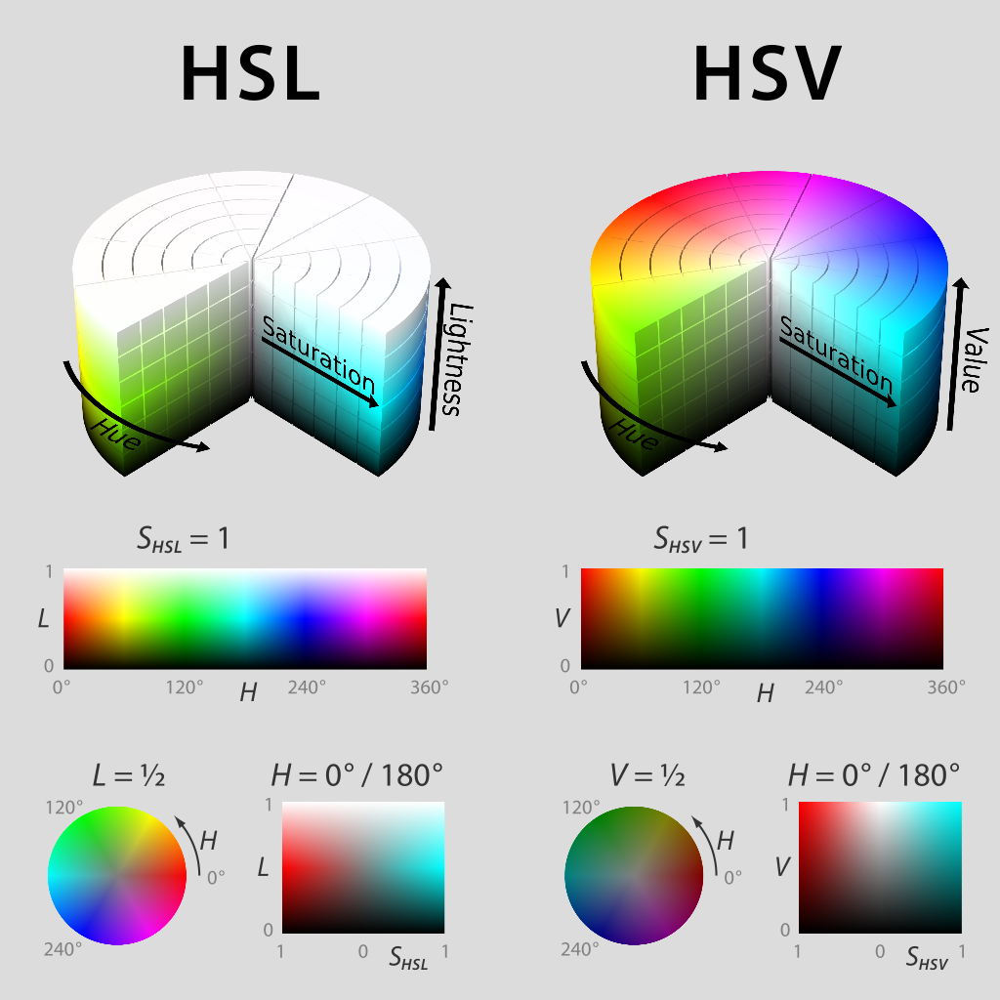

Addressable LEDs
================

LED strips have been commonly used by teams for several years for a variety of reasons. They allow teams to debug robot functionality from the audience, provide a visual marker for their robot, and can simply add some visual appeal. WPILib has an API for controlling WS2812 LEDs with their data pin connected via PWM.

Instantiating the AddressableLED Object
---------------------------------------

You first create an ``AddressableLED`` object that takes the PWM port as an argument. It *must* be a PWM header on the roboRIO. Then you set the number of LEDs located on your LED strip, with can be done with the ``setLength()`` function.

.. important:: It is important to note that setting the length of the LED header is an expensive task and it's **not** recommended to run this periodically.

After the length of the strip has been set, you'll have to create an ``AddressableLEDBuffer`` object that takes the number of LEDs as an input. You'll then call ``myAddressableLed.setData(myAddressableLEDBuffer)`` to set the led output data. Finally, you can call ``myAddressableLed.start()`` to write the output continuously. Below is a full example of the initialization process.

.. note:: C++ does not have an AddressableLEDBuffer, and instead uses an Array.

.. tabs::

   .. group-tab:: Java

      .. remoteliteralinclude:: https://raw.githubusercontent.com/wpilibsuite/allwpilib/v2023.1.1-beta-1/wpilibjExamples/src/main/java/edu/wpi/first/wpilibj/examples/addressableled/Robot.java
         :language: java
         :lines: 17-32
         :linenos:
         :lineno-start: 17

   .. group-tab:: C++

      .. remoteliteralinclude:: https://raw.githubusercontent.com/wpilibsuite/allwpilib/v2023.1.1-beta-1/wpilibcExamples/src/main/cpp/examples/AddressableLED/cpp/Robot.cpp
         :language: cpp
         :lines: 11-20
         :linenos:
         :lineno-start: 11

      .. remoteliteralinclude:: https://raw.githubusercontent.com/wpilibsuite/allwpilib/v2023.1.1-beta-1/wpilibcExamples/src/main/cpp/examples/AddressableLED/cpp/Robot.cpp
         :language: cpp
         :lines: 38-44
         :linenos:
         :lineno-start: 38

Setting the Entire Strip to One Color
-------------------------------------

Color can be set to an individual led on the strip using two methods. ``setRGB()`` which takes RGB values as an input and ``setHSV()`` which takes HSV values as an input.

Using RGB Values
^^^^^^^^^^^^^^^^

RGB stands for Red, Green, and Blue. This is a fairly common color model as it's quite easy to understand. LEDs can be set with the ``setRGB`` method that takes 4 arguments: index of the LED, amount of red, amount of green, amount of blue. The amount of Red, Green, and Blue are integer values between 0-255.

.. tabs::

   .. group-tab:: Java

      .. code-block:: Java

         for (var i = 0; i < m_ledBuffer.getLength(); i++) {
            // Sets the specified LED to the RGB values for red
            m_ledBuffer.setRGB(i, 255, 0, 0);
         }

         m_led.setData(m_ledBuffer);

   .. group-tab:: C++

      .. code-block:: C++

         for (int i = 0; i < kLength; i++) {
            m_ledBuffer[i].SetRGB(255, 0, 0);
         }

         m_led.SetData(m_ledBuffer);

Using HSV Values
^^^^^^^^^^^^^^^^

HSV stands for Hue, Saturation, and Value. Hue describes the color or tint, saturation being the amount of gray, and value being the brightness. In WPILib, Hue is an integer from 0 - 180. Saturation and Value are integers from 0 - 255. If you look at a color picker like `Google's <https://www.google.com/search?q=color+picker>`_, Hue will be 0 - 360 and Saturation and Value are from 0% to 100%. This is the same way that OpenCV handles HSV colors. Make sure the HSV values entered to WPILib are correct, or the color produced might not be the same as was expected.

LEDs can be set with the ``setHSV`` method that takes 4 arguments: index of the LED, hue, saturation, and value. An example is shown below for setting the color of an LED strip to red (hue of 0).

.. tabs::

   .. group-tab:: Java

      .. code-block:: Java

         for (var i = 0; i < m_ledBuffer.getLength(); i++) {
            // Sets the specified LED to the HSV values for red
            m_ledBuffer.setHSV(i, 0, 100, 100);
         }

         m_led.setData(m_ledBuffer);

   .. group-tab:: C++

      .. code-block:: C++

         for (int i = 0; i < kLength; i++) {
            m_ledBuffer[i].SetHSV(0, 100, 100);
         }

         m_led.SetData(m_ledBuffer);

Creating a Rainbow Effect
-------------------------

The below method does a couple of important things. Inside of the *for* loop, it equally distributes the hue over the entire length of the strand and stores the individual LED hue to a variable called ``hue``. Then the for loop sets the HSV value of that specified pixel using the ``hue`` value.

Moving outside of the for loop, the ``m_rainbowFirstPixelHue`` then iterates the pixel that contains the "initial" hue creating the rainbow effect. ``m_rainbowFirstPixelHue`` then checks to make sure that the hue is inside the hue boundaries of 180. This is because HSV hue is a value from 0-180.

.. note:: It's good robot practice to keep the ``robotPeriodic()`` method as clean as possible, so we'll create a method for handling setting our LED data. We'll call this method ``rainbow()`` and call it from ``robotPeriodic()``.

.. tabs::

   .. group-tab:: Java

      .. remoteliteralinclude:: https://raw.githubusercontent.com/wpilibsuite/allwpilib/v2023.1.1-beta-1/wpilibjExamples/src/main/java/edu/wpi/first/wpilibj/examples/addressableled/Robot.java
         :language: java
         :lines: 42-55
         :linenos:
         :lineno-start: 42

   .. group-tab:: C++

      .. remoteliteralinclude:: https://raw.githubusercontent.com/wpilibsuite/allwpilib/v2023.1.1-beta-1/wpilibcExamples/src/main/cpp/examples/AddressableLED/cpp/Robot.cpp
         :language: cpp
         :lines: 23-36
         :linenos:
         :lineno-start: 23

Now that we have our ``rainbow`` method created, we have to actually call the method and set the data of the LED.

.. tabs::

   .. group-tab:: Java

      .. remoteliteralinclude:: https://raw.githubusercontent.com/wpilibsuite/allwpilib/v2023.1.1-beta-1/wpilibjExamples/src/main/java/edu/wpi/first/wpilibj/examples/addressableled/Robot.java
         :language: java
         :lines: 34-40
         :linenos:
         :lineno-start: 34

   .. group-tab:: C++

      .. remoteliteralinclude:: https://raw.githubusercontent.com/wpilibsuite/allwpilib/v2023.1.1-beta-1/wpilibcExamples/src/main/cpp/examples/AddressableLED/cpp/Robot.cpp
         :language: cpp
         :lines: 46-52
         :linenos:
         :lineno-start: 46
