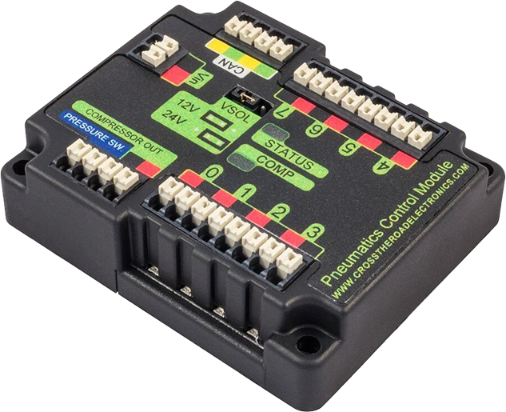

.. include:: <isonum.txt>

Operating pneumatic cylinders
=============================

Using the FRC Control System to control Pneumatics
--------------------------------------------------

.. note:: The Pneumatics Control Module (PCM) is a CAN-based device that provides complete control over the compressor and up to 8 solenoids per module. The PCM is integrated into WPILib through a series of classes that make it simple to use. The closed loop control of the Compressor and Pressure switch is handled by the PCM hardware and the Solenoids are handled by the upgraded Solenoid class that now controls the solenoid channels on the PCM. An additional PCM module can be used where the modules corresponding solenoids are differentiated by the module number in the constructors of the Solenoid and Compressor classes.

The Pneumatics Control Module from CTR Electronics is responsible for regulating the robot's pressure using a pressure switch and a compressor and switching solenoids on and off. The PCM communicates with the roboRIO over CAN. For more information, see `FRC Control System Hardware Overview`

PCM Module Numbers
------------------

PCM Modules are identified by their Node ID. The default Node ID for PCMs is 0. If using a single PCM on the bus it is recommended to leave it at the default Node ID.

Generating and Storing Pressure
-------------------------------

In FRC\ |reg|, pressure is created using a pneumatic compressor and stored in pneumatic tanks. The compressor doesn't necessarily have to be on the robot, but must be powered by the robot's PCM(s). The "Closed Loop" mode on the Compressor is enabled by default, and it is *not* recommended that teams change this setting. When closed loop control is enabled the PCM will automatically turn the compressor on when the pressure switch is closed (below the pressure threshold) and turn it off when the pressure switch is open (~120PSI). When closed loop control is disabled the compressor will not be turned on. Using a Compressor, users can query the status of the compressor. The state (currently on or off), pressure switch state, and compressor current can all be queried from the Compressor object.

.. note:: The Pneumatics Control Module from Cross the Road Electronics allows for integrated closed loop control of a compressor. Creating any instance of a Solenoid or Double Solenoid object will enable the Compressor control on the corresponding PCM. The Compressor object is only needed if you want the ability to turn off the compressor or query compressor status.

.. tabs::

    .. code-tab:: java

        Compressor c = new Compressor(0, PneumaticsModuleType.CTREPCM);

        c.setClosedLoopControl(true);
        c.setClosedLoopControl(false);

        boolean enabled = c.enabled();
        boolean pressureSwitch = c.getPressureSwitchValue();
        double current = c.getCompressorCurrent();

    .. code-tab:: c++

        frc::Compressor c{0, frc::PneumaticsModuleType::CTREPCM};

        c.SetClosedLoopControl(true);
        c.SetClosedLoopControl(false);

        bool enabled = c.Enabled();
        bool pressureSwitch = c.GetPressureSwitchValue();
        double current = c.GetCompressorCurrent();

Solenoid control
----------------

FRC teams use solenoids to perform a variety of tasks, from shifting gearboxes to operating robot mechanisms. A solenoid is a valve used to electronically switch a pressurized air line "on" or "off". For more information on solenoids, see `this wikipedia article <https://en.wikipedia.org/wiki/Solenoid_valve>`__. Solenoids are controlled by a robot's Pneumatics Control Module, or PCM, which is in turn connected to the robot's roboRIO via CAN. The easiest way to see a solenoid's state is via the small red LED (which indicates if the valve is "on" or not), and solenoids can be manually actuated when un-powered with the small button adjacent to the LED.

Single acting solenoids apply or vent pressure from a single output port. They are typically used either when an external force will provide the return action of the cylinder (spring, gravity, separate mechanism) or in pairs to act as a double solenoid. A double solenoid switches air flow between two output ports (many also have a center position where neither output is vented or connected to the input). Double solenoid valves are commonly used when you wish to control both the extend and retract actions of a cylinder using air pressure. Double solenoid valves have two electrical inputs which connect back to two separate channels on the solenoid breakout.

PCM Modules are identified by their CAN Device ID. The default CAN ID for PCMs is 0. If using a single PCM on the bus it is recommended to leave it at the default CAN ID. This ID can be changed with the Phoenix Tuner application, in addition to other debug information. Instructions to download Phoenix Tuner can be found `here <https://github.com/CrossTheRoadElec/Phoenix-Releases/blob/master/README.md>`__ and the installer files can be found `here <https://github.com/CrossTheRoadElec/Phoenix-Releases/releases/latest>`__. For more information about setting PCM CAN ID see this important :ref:`notice <docs/zero-to-robot/step-2/index:Step 2: Installing Software>`.

Single Solenoids in WPILib
--------------------------

Single solenoids in WPILib are controlled using the Solenoid class. To construct a Solenoid object, simply pass the desired port number (assumes CAN ID 0) and pneumatics module type or CAN ID, pneumatics module type, and port number to the constructor. To set the value of the solenoid call set(true) to enable or set(false) to disable the solenoid output.

.. tabs::

    .. code-tab:: java

        Solenoid exampleSolenoid = new Solenoid(PneumaticsModuleType.CTREPCM, 1);

        exampleSolenoid.set(true);
        exampleSolenoid.set(false);

    .. code-tab:: c++

        frc::Solenoid exampleSolenoid{frc::PneumaticsModuleType::CTREPCM, 1};

        exampleSolenoid.Set(true);
        exampleSolenoid.Set(false);

Double Solenoids in WPILib
--------------------------

Double solenoids are controlled by the DoubleSolenoid class in WPILib. These are constructed similarly to the single solenoid but there are now two port numbers to pass to the constructor, a forward channel (first) and a reverse channel (second). The state of the valve can then be set to kOff (neither output activated), kForward (forward channel enabled) or kReverse (reverse channel enabled). Additionally, the PCM CAN ID can be passed to the DoubleSolenoid if teams have a non-standard PCM CAN ID.

.. tabs::

   .. code-tab:: java

        // Using "import static an.enum.or.constants.inner.class.*;" helps reduce verbosity
        // this replaces "DoubleSolenoid.Value.kForward" with just kForward
        // further reading is available at https://www.geeksforgeeks.org/static-import-java/
        import static edu.wpi.first.wpilibj.DoubleSolenoid.Value.*;

        DoubleSolenoid exampleDouble = new DoubleSolenoid(PneumaticsModuleType.CTREPCM, 1, 2);
        DoubleSolenoid anotherDoubleSolenoid = new DoubleSolenoid(/* The PCM CAN ID */ 9, PneumaticsModuleType.CTREPCM, 4, 5);

        exampleDouble.set(kOff);
        exampleDouble.set(kForward);
        exampleDouble.set(kReverse);

   .. code-tab:: c++

        frc::DoubleSolenoid exampleDouble{frc::PneumaticsModuleType::CTREPCM, 1, 2};
        frc::DoubleSolenoid anotherDoubleSolenoid{/* The PCM CAN ID */ 9, frc::PneumaticsModuleType::CTREPCM, 4, 5};

        exampleDouble.Set(frc::DoubleSolenoid::Value::kOff);
        exampleDouble.Set(frc::DoubleSolenoid::Value::kForward);
        exampleDouble.Set(frc::DoubleSolenoid::Value::kReverse);

Toggling Solenoids
------------------

Solenoids can be switched from one output to the other (known as toggling) by using the `.toggle()` method.

.. note::
   Since a DoubleSolenoid defaults to off, you will have to set it before it can be toggled.

.. tabs::

   .. code-tab:: java

      Solenoid exampleSingle = new Solenoid(PneumaticsModuleType.CTREPCM, 0);
      DoubleSolenoid exampleDouble = new DoubleSolenoid(PneumaticsModuleType.CTREPCM, 1, 2);

      // Initialize the DoubleSolenoid so it knows where to start.  Not required for single solenoids.
      exampleDouble.set(kReverse);

      if (m_controller.getYButtonPressed()) {
         exampleSingle.toggle();
         exampleDouble.toggle();
      }

   .. code-tab:: c++

      frc::Solenoid exampleSingle{frc::PneumaticsModuleType::CTREPCM, 0};
      frc::DoubleSolenoid exampleDouble{frc::PneumaticsModuleType::CTREPCM, 1, 2};

      // Initialize the DoubleSolenoid so it knows where to start.  Not required for single solenoids.
      exampleDouble.Set(frc::DoubleSolenoid::Value::kReverse);

      if (m_controller.GetYButtonPressed()) {
         exampleSingle.Toggle();
         exampleDouble.Toggle();
      }

Pressure Transducers
--------------------

One can connect a pressure transducer to measure the pressure stored in a pneumatic system. These transducers connect to the Analog Input ports on the roboRIO, and can be read by the AnalogInput or AnalogPotentiometer classes in WPILib.

.. tabs::

    .. code-tab:: java

        import edu.wpi.first.wpilibj.AnalogInput;
        import edu.wpi.first.wpilibj.AnalogPotentiometer;

        // product-specific voltage->pressure conversion, see product manual
        // in this case, 250(V/5)-25
        // the scale parameter in the AnalogPotentiometer constructor is scaled from 1 instead of 5,
        // so if r is the raw AnalogPotentiometer output, the pressure is 250r-25
        double scale = 250, offset = -25;
        AnalogPotentiometer pressureTransducer = new AnalogPotentiometer(/* the AnalogIn port*/ 2, scale, offset);

        // scaled values in psi units
        double psi = pressureTransducer.get();

    .. code-tab:: c++

        // product-specific voltage->pressure conversion, see product manual
        // in this case, 250(V/5)-25
        // the scale parameter in the AnalogPotentiometer constructor is scaled from 1 instead of 5,
        // so if r is the raw AnalogPotentiometer output, the pressure is 250r-25
        double scale = 250, offset = -25;
        frc::AnalogPotentiometer pressureTransducer{/* the AnalogIn port*/ 2, scale, offset};

        // scaled values in psi units
        double psi = pressureTransducer.Get();
