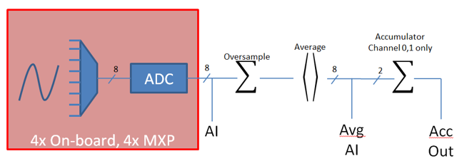

Analog Inputs - Software
========================

.. note:: This section covers analog inputs in software.  For a hardware guide to analog inputs, see :ref:`docs/hardware/sensors/analog-inputs-hardware:Analog Inputs - Hardware`.

The roboRIO's FPGA supports up to 8 analog input channels that can be used to read the value of an analog voltage from a sensor.  Analog inputs may be used for any sensor that outputs a simple voltage.

Analog inputs from the FPGA by default return a 12-bit integer proportional to the voltage, from 0 to 5 volts.

The AnalogInput class
---------------------

.. note:: It is often more convenient to use the :doc:`Analog Potentiometers <analog-potentiometers-software>` wrapper class than to use :code:`AnalogInput` directly, as it supports scaling to meaningful units.

Support for reading the voltages on the FPGA analog inputs is provided through the :code:`AnalogInput` class (`Java <https://first.wpi.edu/wpilib/allwpilib/docs/beta/java/edu/wpi/first/wpilibj/AnalogInput.html>`__, `C++ <https://first.wpi.edu/wpilib/allwpilib/docs/beta/cpp/classfrc_1_1_analog_input.html>`__).

Initializing an AnalogInput
^^^^^^^^^^^^^^^^^^^^^^^^^^^

An :code:`AnalogInput` may be initialized as follows:

.. tabs::

    .. code-tab:: java

        // Initializes an AnalogInput on port 0
        AnalogInput analog = new AnalogInput(0);

    .. code-tab:: c++

        // Initializes an AnalogInput on port 0
        frc::AnalogInput analog{0};

Oversampling and Averaging
^^^^^^^^^^^^^^^^^^^^^^^^^^

The FPGA's analog input modules supports both oversampling and averaging.  These behaviors are highly similar, but differ in a few important ways.  Both may be used at the same time.

Oversampling
~~~~~~~~~~~~

When oversampling is enabled, the FPGA will add multiple consecutive samples together, and return the accumulated value.  Users may specify the number of *bits* of oversampling - for :math:`n` bits of oversampling, the number of samples added together is :math:`2^{n}`:

.. tabs::

    .. code-tab:: java

        // Sets the AnalogInput to 4-bit oversampling.  16 samples will be added together.
        // Thus, the reported values will increase by about a factor of 16, and the update
        // rate will decrease by a similar amount.
        analog.setOversampleBits(4);

    .. code-tab:: c++

        // Sets the AnalogInput to 4-bit oversampling.  16 samples will be added together.
        // Thus, the reported values will increase by about a factor of 16, and the update
        // rate will decrease by a similar amount.
        analog.SetOversampleBits(4);

Averaging
~~~~~~~~~

Averaging behaves much like oversampling, except the accumulated values are divided by the number of samples so that the scaling of the returned values does not change.  This is often more-convenient, but occasionally the additional roundoff error introduced by the rounding is undesirable.

.. tabs::

    .. code-tab:: java

        // Sets the AnalogInput to 4-bit averaging.  16 samples will be averaged together.
        // The update rate will decrease by a factor of 16.
        analog.setAverageBits(4);

    .. code-tab:: c++

        // Sets the AnalogInput to 4-bit averaging.  16 samples will be averaged together.
        // The update rate will decrease by a factor of 16.
        analog.SetAverageBits(4);

.. note:: When oversampling and averaging are used at the same time, the oversampling is applied *first,* and then the oversampled values are averaged.  Thus, 2-bit oversampling and 2-bit averaging used at the same time will increase the scale of the returned values by approximately a factor of 2, and decrease the update rate by approximately a factor of 4.

Reading values from an AnalogInput
^^^^^^^^^^^^^^^^^^^^^^^^^^^^^^^^^^

Values can be read from an AnalogInput with one of four different methods:

getValue
~~~~~~~~

The :code:`getValue` method returns the raw instantaneous measured value from the analog input, without applying any calibration and ignoring oversampling and averaging settings.  The returned value is an integer.

.. tabs::

    .. code-tab:: java

        analog.getValue();

    .. code-tab:: c++

        analog.GetValue();

getVoltage
~~~~~~~~~~

The :code:`getVoltage` method returns the instantaneous measured voltage from the analog input.  Oversampling and averaging settings are ignored, but the value is rescaled to represent a voltage.  The returned value is a double.

.. tabs::

    .. code-tab:: java

        analog.getVoltage();

    .. code-tab:: c++

        analog.GetVoltage();

getAverageValue
~~~~~~~~~~~~~~~

The :code:`getAverageValue` method returns the averaged value from the analog input.  The value is not rescaled, but oversampling and averaging are both applied.  The returned value is an integer.

.. tabs::

    .. code-tab:: java

        analog.getAverageValue();

    .. code-tab:: c++

        analog.GetAverageValue();

getAverageVoltage
~~~~~~~~~~~~~~~~~

The :code:`getAverageVoltage` method returns the averaged voltage from the analog input.  Rescaling, oversampling, and averaging are all applied.  The returned value is a double.

.. tabs::

    .. code-tab:: java

        analog.getAverageVoltage();

    .. code-tab:: c++

        analog.GetAverageVoltage();

Accumulator
^^^^^^^^^^^

.. note:: The accumulator methods do not currently support returning a value in units of volts - the returned value will always be an integer (specifically, a :code:`long`).

Analog input channels 0 and 1 additionally support an accumulator, which integrates (adds up) the signal indefinitely, so that the returned value is the sum of all past measured values.  Oversampling and averaging are applied prior to accumulation.

.. tabs::

    .. code-tab:: java

        // Sets the initial value of the accumulator to 0
        // This is the "starting point" from which the value will change over time
        analog.setAccumulatorInitialValue(0);

        // Sets the "center" of the accumulator to 0.  This value is subtracted from
        // all measured values prior to accumulation.
        analog.setAccumulatorCenter(0);

        // Returns the number of accumulated samples since the accumulator was last started/reset
        analog.getAccumulatorCount();

        // Returns the value of the accumulator.  Return type is long.
        analog.getAccumulatorValue();

        // Resets the accumulator to the initial value
        analog.resetAccumulator();

    .. code-tab:: c++

        // Sets the initial value of the accumulator to 0
        // This is the "starting point" from which the value will change over time
        analog.SetAccumulatorInitialValue(0);

        // Sets the "center" of the accumulator to 0.  This value is subtracted from
        // all measured values prior to accumulation.
        analog.SetAccumulatorCenter(0);

        // Returns the number of accumulated samples since the accumulator was last started/reset
        analog.GetAccumulatorCount();

        // Returns the value of the accumulator.  Return type is long.
        analog.GetAccumulatorValue();

        // Resets the accumulator to the initial value
        analog.ResetAccumulator();

Obtaining synchronized count and value
~~~~~~~~~~~~~~~~~~~~~~~~~~~~~~~~~~~~~~

Sometimes, it is necessarily to obtain matched measurements of the count and the value.  This can be done using the :code:`getAccumulatorOutput` method:

.. tabs::

    .. code-tab:: java

        // Instantiate an AccumulatorResult object to hold the matched measurements
        AccumulatorResult result = new AccumulatorResult();

        // Fill the AccumulatorResult with the matched measurements
        analog.getAccumulatorOutput(result);

        // Read the values from the AccumulatorResult
        long count = result.count;
        long value = result.value;

    .. code-tab:: c++

        // The count and value variables to fill
        int_64t count;
        int_64t value;

        // Fill the count and value variables with the matched measurements
        analog.GetAccumulatorOutput(count, value);

Using analog inputs in code
---------------------------

The :code:`AnalogInput` class can be used to write code for a wide variety of sensors (including potentiometers, accelerometers, gyroscopes, ultrasonics, and more) that return their data as an analog voltage.  However, if possible it is almost always more convenient to use one of the other existing WPILib classes that handles the lower-level code (reading the analog voltages and converting them to meaningful units) for you.  Users should only directly use :code:`AnalogInput` as a "last resort."

Accordingly, for examples of how to effectively use analog sensors in code, users should refer to the other pages of this chapter that deal with more-specific classes.
