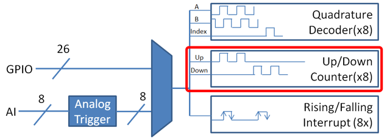

Counters
========

The :code:`Counter` class (`Java <https://first.wpi.edu/wpilib/allwpilib/docs/beta/java/edu/wpi/first/wpilibj/Counter.html>`__, `C++ <https://first.wpi.edu/wpilib/allwpilib/docs/beta/cpp/classfrc_1_1_counter.html>`__) is a versatile class that allows the counting of pulse edges on a digital input.  :code:`Counter` is used as a component in several more-complicated WPILib classes (such as :ref:`Encoder <docs/software/hardware-apis/sensors/encoders-software:Encoders - Software>` and :ref:`Ultrasonic <docs/software/hardware-apis/sensors/ultrasonics-software:Ultrasonics - Software>`), but is also quite useful on its own.

.. note:: There are a total of 8 counter units in the roboRIO FPGA, meaning no more than 8 :code:`Counter` objects may be instantiated at any one time, including those contained as resources in other WPILib objects.  For detailed information on when a :code:`Counter` may be used by another object, refer to the official API documentation.

Configuring a counter
---------------------

The :code:`Counter` class can be configured in a number of ways to provide differing functionalities.

Counter Modes
^^^^^^^^^^^^^

The :code:`Counter` object may be configured to operate in one of four different modes:

1. `Two-pulse mode`_: Counts up and down based on the edges of two different channels.
2. `Semi-period mode`_: Measures the duration of a pulse on a single channel.
3. `Pulse-length mode`_: Counts up and down based on the edges of one channel, with the direction determined by the duration of the pulse on that channel.
4. `External direction mode`_: Counts up and down based on the edges of one channel, with a separate channel specifying the direction.

.. note:: In all modes except semi-period mode, the counter can be configured to increment either once per edge (2X decoding), or once per pulse (1X decoding).  By default, counters are set to two-pulse mode, though if only one channel is specified the counter will only count up.

Two-pulse mode
~~~~~~~~~~~~~~

In two-pulse mode, the :code:`Counter` will count up for every edge/pulse on the specified "up channel," and down for every edge/pulse on the specified "down channel."  A counter can be initialized in two-pulse with the following code:

.. tabs::

    .. code-tab:: java

        // Create a new Counter object in two-pulse mode
        Counter counter = new Counter(Counter.Mode.k2Pulse);

        @Override
        public void robotInit() {
            // Set up the input channels for the counter
            counter.setUpSource(1);
            counter.setDownSource(2);

            // Set the decoding type to 2X
            counter.setUpSourceEdge(true, true);
            counter.setDownSourceEdge(true, true);
        }

    .. code-tab:: c++

        // Create a new Counter object in two-pulse mode
        frc::Counter counter{frc::Counter::Mode::k2Pulse};

        void Robot::RobotInit() {
            // Set up the input channels for the counter
            counter.SetUpSource(1);
            counter.SetDownSource(2);

            // Set the decoding type to 2X
            counter.SetUpSourceEdge(true, true);
            counter.SetDownSourceEdge(true, true);

Semi-period mode
~~~~~~~~~~~~~~~~

In semi-period mode, the :code:`Counter` will count the duration of the pulses on a channel, either from a rising edge to the next falling edge, or from a falling edge to the next rising edge.  A counter can be initialized in semi-period mode with the following code:

.. tabs::

    .. code-tab:: java

        // Create a new Counter object in two-pulse mode
        Counter counter = new Counter(Counter.Mode.kSemiperiod);

        @Override
        public void robotInit() {
            // Set up the input channel for the counter
            counter.setUpSource(1);

            // Set the encoder to count pulse duration from rising edge to falling edge
            counter.setSemiPeriodMode(true);
        }

    .. code-tab:: c++

        // Create a new Counter object in two-pulse mode
        frc::Counter counter{frc::Counter::Mode::kSemiperiod};

        void Robot() {
            // Set up the input channel for the counter
            counter.SetUpSource(1);

            // Set the encoder to count pulse duration from rising edge to falling edge
            counter.SetSemiPeriodMode(true);

To get the pulse width, call the :code:`getPeriod()` method:

.. tabs::

    .. code-tab:: java

        // Return the measured pulse width in seconds
        counter.getPeriod();

    .. code-tab:: c++

        // Return the measured pulse width in seconds
        counter.GetPeriod();

Pulse-length mode
~~~~~~~~~~~~~~~~~

In pulse-length mode, the counter will count either up or down depending on the length of the pulse. A pulse below the specified threshold time will be interpreted as a forward count and a pulse above the threshold is a reverse count. This is useful for some gear tooth sensors which encode direction in this manner.  A counter can be initialized in this mode as follows:

.. tabs::

    .. code-tab:: java

        // Create a new Counter object in two-pulse mode
        Counter counter = new Counter(Counter.Mode.kPulseLength);

        @Override
        public void robotInit() {
            // Set up the input channel for the counter
            counter.setUpSource(1);

            // Set the decoding type to 2X
            counter.setUpSourceEdge(true, true);

            // Set the counter to count down if the pulses are longer than .05 seconds
            counter.setPulseLengthMode(.05)
        }

    .. code-tab:: c++

        // Create a new Counter object in two-pulse mode
        frc::Counter counter{frc::Counter::Mode::kPulseLength};

        void Robot::RobotInit() {
            // Set up the input channel for the counter
            counter.SetUpSource(1);

            // Set the decoding type to 2X
            counter.SetUpSourceEdge(true, true);

            // Set the counter to count down if the pulses are longer than .05 seconds
            counter.SetPulseLengthMode(.05)

External direction mode
~~~~~~~~~~~~~~~~~~~~~~~

In external direction mode, the counter counts either up or down depending on the level on the second channel. If the direction source is low, the counter will increase; if the direction source is high, the counter will decrease (to reverse this, see the next section). A counter can be initialized in this mode as follows:

.. tabs::

    .. code-tab:: java

        // Create a new Counter object in two-pulse mode
        Counter counter = new Counter(Counter.Mode.kExternalDirection);

        @Override
        public void robotInit() {
            // Set up the input channels for the counter
            counter.setUpSource(1);
            counter.setDownSource(2);

            // Set the decoding type to 2X
            counter.setUpSourceEdge(true, true);
        }

    .. code-tab:: c++

        // Create a new Counter object in two-pulse mode
        frc::Counter counter{frc::Counter::Mode::kExternalDirection};

        void RobotInit() {
            // Set up the input channels for the counter
            counter.SetUpSource(1);
            counter.SetDownSource(2);

            // Set the decoding type to 2X
            counter.SetUpSourceEdge(true, true);

Configuring counter parameters
^^^^^^^^^^^^^^^^^^^^^^^^^^^^^^

.. note:: The :code:`Counter` class does not make any assumptions about units of distance; it will return values in whatever units were used to calculate the distance-per-pulse value.  Users thus have complete control over the distance units used.  However, units of time are *always* in seconds.

.. note:: The number of pulses used in the distance-per-pulse calculation does *not* depend on the decoding type - each "pulse" should always be considered to be a full cycle (rising and falling).

Apart from the mode-specific configurations, the :code:`Counter` class offers a number of additional configuration methods:

.. tabs::

    .. code-tab:: java

        // Configures the counter to return a distance of 4 for every 256 pulses
        // Also changes the units of getRate
        counter.setDistancePerPulse(4./256.);

        // Configures the counter to consider itself stopped after .1 seconds
        counter.setMaxPeriod(.1);

        // Configures the counter to consider itself stopped when its rate is below 10
        counter.setMinRate(10);

        // Reverses the direction of the counter
        counter.setReverseDirection(true);

        // Configures an counter to average its period measurement over 5 samples
        // Can be between 1 and 127 samples
        counter.setSamplesToAverage(5);

    .. code-tab:: c++

        // Configures the counter to return a distance of 4 for every 256 pulses
        // Also changes the units of getRate
        counter.SetDistancePerPulse(4./256.);

        // Configures the counter to consider itself stopped after .1 seconds
        counter.SetMaxPeriod(.1);

        // Configures the counter to consider itself stopped when its rate is below 10
        counter.SetMinRate(10);

        // Reverses the direction of the counter
        counter.SetReverseDirection(true);

        // Configures an counter to average its period measurement over 5 samples
        // Can be between 1 and 127 samples
        counter.SetSamplesToAverage(5);

Reading information from counters
---------------------------------

Regardless of mode, there is some information that the :code:`Counter` class always exposes to users:

Count
^^^^^

Users can obtain the current count with the :code:`get()` method:

.. tabs::

    .. code-tab:: java

        // returns the current count
        counter.get();

    .. code-tab:: c++

        // returns the current count
        counter.Get();

Distance
^^^^^^^^

.. note:: Counters measure *relative* distance, not absolute; the distance value returned will depend on the position of the encoder when the robot was turned on or the encoder value was last :ref:`reset <docs/software/hardware-apis/sensors/counters:Resetting a Counter>`.

If the :ref:`distance per pulse <docs/software/hardware-apis/sensors/counters:Configuring counter parameters>` has been configured, users can obtain the total distance traveled by the counted sensor with the :code:`getDistance()` method:

.. tabs::

    .. code-tab:: java

        // returns the current distance
        counter.getDistance();

    .. code-tab:: c++

        // returns the current distance
        counter.GetDistance();

Rate
~~~~

.. note:: Units of time for the :code:`Counter` class are *always* in seconds.

Users can obtain the current rate of change of the counter with the :code:`getRate()` method:

.. tabs::

    .. code-tab:: java

        // Gets the current rate of the counter
        counter.getRate();

    .. code-tab:: c++

        // Gets the current rate of the counter
        counter.GetRate();

Stopped
^^^^^^^

Users can obtain whether the counter is stationary with the :code:`getStopped()` method:

.. tabs::

    .. code-tab:: java

        // Gets whether the counter is stopped
        counter.getStopped();

    .. code-tab:: c++

        // Gets whether the counter is stopped
        counter.GetStopped();

Direction
~~~~~~~~~

Users can obtain the direction in which the counter last moved with the :code:`getDirection()` method:

.. tabs::

    .. code-tab:: java

        // Gets the last direction in which the counter moved
        counter.getDirection();

    .. code-tab:: c++

        // Gets the last direction in which the counter moved
        counter.GetDirection();

Period
^^^^^^

.. note:: In :ref:`semi-period mode <docs/software/hardware-apis/sensors/counters:Semi-period mode>`, this method returns the duration of the pulse, not of the period.

Users can obtain the duration (in seconds) of the most-recent period with the :code:`getPeriod()` method:

.. tabs::

    .. code-tab:: java

        // returns the current period in seconds
        counter.getPeriod();

    .. code-tab:: c++

        // returns the current period in seconds
        counter.GetPeriod();

Resetting a counter
-------------------

To reset a counter to a distance reading of zero, call the :code:`reset()` method.  This is useful for ensuring that the measured distance corresponds to the actual desired physical measurement.

.. tabs::

    .. code-tab:: java

        // Resets the encoder to read a distance of zero
        counter.reset();

    .. code-tab:: c++

        // Resets the encoder to read a distance of zero
        counter.Reset();

Using counters in code
----------------------

Counters are useful for a wide variety of robot applications - but since the :code:`Counter` class is so varied, it is difficult to provide a good summary of them here.  Many of these applications overlap with the :code:`Encoder` class - a simple counter is often a cheaper alternative to a quadrature encoder.  For a summary of potential uses for encoders in code, see :ref:`docs/software/hardware-apis/sensors/encoders-software:Encoders - Software`.
