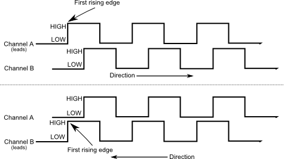
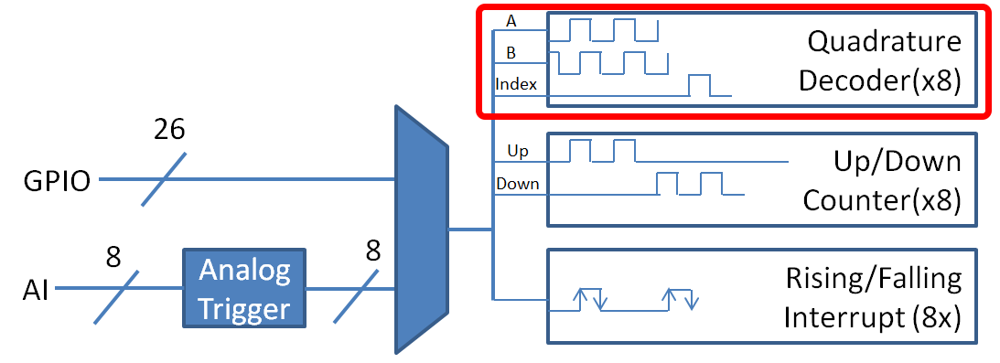

.. include:: <isonum.txt>

Encoders - Software
===================

.. note:: This section covers encoders in software.  For a hardware guide to encoders, see :ref:`docs/hardware/sensors/encoders-hardware:Encoders - Hardware`.

Encoders are devices used to measure motion (usually, the rotation of a shaft).  The encoders used in FRC\ |reg| are known as "quadrature encoders."  These encoders produce square-wave signals on two channels that are a quarter-period out-of-phase (hence the term, "quadrature").  The pulses are used to measure the rotation, and the direction of motion can be determined from which channel "leads" the other.

The FPGA handles encoders either through a counter module or an encoder module, depending on the :ref:`decoding type <docs/software/hardware-apis/sensors/encoders-software:Decoding type>` - the choice is handled automatically by WPILib.  The FPGA contains 8 encoder modules.

The Encoder class
-----------------

WPILib provides support for encoders through the :code:`Encoder` class (`Java <https://first.wpi.edu/wpilib/allwpilib/docs/beta/java/edu/wpi/first/wpilibj/Encoder.html>`__, `C++ <https://first.wpi.edu/wpilib/allwpilib/docs/beta/cpp/classfrc_1_1_encoder.html>`__).  This class provides a simple API for configuring and reading data from encoders.

.. important:: The ``Encoder`` class is only used for encoders that are plugged directly into the roboRIO! Please reference the appropriate vendors' documentation for using encoders plugged into motor controllers.

Initializing an encoder
^^^^^^^^^^^^^^^^^^^^^^^

An encoder can be instantiated as follows:

.. tabs::

    .. code-tab:: java

        // Initializes an encoder on DIO pins 0 and 1
        // Defaults to 4X decoding and non-inverted
        Encoder encoder = new Encoder(0, 1);

    .. code-tab:: c++

        // Initializes an encoder on DIO pins 0 and 1
        // Defaults to 4X decoding and non-inverted
        frc::Encoder encoder{0, 1};

Decoding type
~~~~~~~~~~~~~

The WPILib :code:`Encoder` class can decode encoder signals in three different modes:

- **1X Decoding**: Increments the distance for every complete period of the encoder signal (once per four edges).
- **2X Decoding**: Increments the distance for every half-period of the encoder signal (once per two edges).
- **4X Decoding**: Increments the distance for every edge of the encoder signal (four times per period).

4X decoding offers the greatest precision, but at the potential cost of increased "jitter" in rate measurements.  To use a different decoding type, use the following constructor:

.. tabs::

    .. code-tab:: java

        // Initializes an encoder on DIO pins 0 and 1
        // 2X encoding and non-inverted
        Encoder encoder = new Encoder(0, 1, false, Encoder.EncodingType.k2X);

    .. code-tab:: c++

        // Initializes an encoder on DIO pins 0 and 1
        // 2X encoding and non-inverted
        frc::Encoder encoder{0, 1, false, frc::Encoder::EncodingType::k2X};

Configuring encoder parameters
^^^^^^^^^^^^^^^^^^^^^^^^^^^^^^

.. note:: The :code:`Encoder` class does not make any assumptions about units of distance; it will return values in whatever units were used to calculate the distance-per-pulse value.  Users thus have complete control over the distance units used.  However, units of time are *always* in seconds.

.. note:: The number of pulses used in the distance-per-pulse calculation does *not* depend on the :ref:`decoding type <docs/software/hardware-apis/sensors/encoders-software:Decoding type>` - each "pulse" should always be considered to be a full cycle (four edges).

The :code:`Encoder` class offers a number of configuration methods:

.. tabs::

    .. code-tab:: java

        // Configures the encoder to return a distance of 4 for every 256 pulses
        // Also changes the units of getRate
        encoder.setDistancePerPulse(4./256.);

        // Configures the encoder to consider itself stopped after .1 seconds
        encoder.setMaxPeriod(.1);

        // Configures the encoder to consider itself stopped when its rate is below 10
        encoder.setMinRate(10);

        // Reverses the direction of the encoder
        encoder.setReverseDirection(true);

        // Configures an encoder to average its period measurement over 5 samples
        // Can be between 1 and 127 samples
        encoder.setSamplesToAverage(5);

    .. code-tab:: c++

        // Configures the encoder to return a distance of 4 for every 256 pulses
        // Also changes the units of getRate
        encoder.SetDistancePerPulse(4./256.);

        // Configures the encoder to consider itself stopped after .1 seconds
        encoder.SetMaxPeriod(.1);

        // Configures the encoder to consider itself stopped when its rate is below 10
        encoder.SetMinRate(10);

        // Reverses the direction of the encoder
        encoder.SetReverseDirection(true);

        // Configures an encoder to average its period measurement over 5 samples
        // Can be between 1 and 127 samples
        encoder.SetSamplesToAverage(5);

Reading information from encoders
^^^^^^^^^^^^^^^^^^^^^^^^^^^^^^^^^

The :code:`Encoder` class provides a wealth of information to the user about the motion of the encoder.

Distance
~~~~~~~~

.. note:: Quadrature encoders measure *relative* distance, not absolute; the distance value returned will depend on the position of the encoder when the robot was turned on or the encoder value was last :ref:`reset <docs/software/hardware-apis/sensors/encoders-software:Resetting an encoder>`.

Users can obtain the total distance traveled by the encoder with the :code:`getDistance()` method:

.. tabs::

    .. code-tab:: java

        // Gets the distance traveled
        encoder.getDistance();

    .. code-tab:: c++

        // Gets the distance traveled
        encoder.GetDistance();

Rate
~~~~

.. note:: Units of time for the :code:`Encoder` class are *always* in seconds.

Users can obtain the current rate of change of the encoder with the :code:`getRate()` method:

.. tabs::

    .. code-tab:: java

        // Gets the current rate of the encoder
        encoder.getRate();

    .. code-tab:: c++

        // Gets the current rate of the encoder
        encoder.GetRate();

Stopped
~~~~~~~

Users can obtain whether the encoder is stationary with the :code:`getStopped()` method:

.. tabs::

    .. code-tab:: java

        // Gets whether the encoder is stopped
        encoder.getStopped();

    .. code-tab:: c++

        // Gets whether the encoder is stopped
        encoder.GetStopped();

Direction
~~~~~~~~~

Users can obtain the direction in which the encoder last moved with the :code:`getDirection()` method:

.. tabs::

    .. code-tab:: java

        // Gets the last direction in which the encoder moved
        encoder.getDirection();

    .. code-tab:: c++

        // Gets the last direction in which the encoder moved
        encoder.GetDirection();

Period
~~~~~~

Users can obtain the period of the encoder pulses (in seconds) with the :code:`getPeriod()` method:

.. tabs::

    .. code-tab:: java

        // Gets the current period of the encoder
        encoder.getPeriod();

    .. code-tab:: c++

        // Gets the current period of the encoder
        encoder.GetPeriod();

Resetting an encoder
^^^^^^^^^^^^^^^^^^^^

To reset an encoder to a distance reading of zero, call the :code:`reset()` method.  This is useful for ensuring that the measured distance corresponds to the actual desired physical measurement, and is often called during a :ref:`homing <docs/software/hardware-apis/sensors/encoders-software:Homing a mechanism>` routine:

.. tabs::

    .. code-tab:: java

        // Resets the encoder to read a distance of zero
        encoder.reset();

    .. code-tab:: c++

        // Resets the encoder to read a distance of zero
        encoder.Reset();

Using encoders in code
----------------------

Encoders are some of the most useful sensors in FRC; they are very nearly a requirement to make a robot capable of nontrivially-automated actuations and movement.  The potential applications of encoders in robot code are too numerous to summarize fully here, but a few basic examples are provided below:

Driving to a distance
^^^^^^^^^^^^^^^^^^^^^

Encoders can be used on a robot drive to create a simple "drive to distance" routine.  This is very useful for robot autonomy:

.. tabs::

    .. code-tab:: java

        // Creates an encoder on DIO ports 0 and 1
        Encoder encoder = new Encoder(0, 1);

        // Initialize motor controllers and drive
        Spark left1 = new Spark(0);
        Spark left2 = new Spark(1);

        Spark right1 = new Spark(2);
        Spark right2 = new Spark(3);

        MotorControllerGroup leftMotors = new MotorControllerGroup(left1, left2);
        MotorControllerGroup rightMotors = new MotorControllerGroup(right1, right2);

        DifferentialDrive drive = new DifferentialDrive(leftMotors, rightMotors);

        @Override
        public void robotInit() {
            // Configures the encoder's distance-per-pulse
            // The robot moves forward 1 foot per encoder rotation
            // There are 256 pulses per encoder rotation
            encoder.setDistancePerPulse(1./256.);
        }

        @Override
        public void autonomousPeriodic() {
            // Drives forward at half speed until the robot has moved 5 feet, then stops:
            if(encoder.getDistance() < 5) {
                drive.tankDrive(.5, .5);
            } else {
                drive.tankDrive(0, 0);
            }
        }

    .. code-tab:: c++

        // Creates an encoder on DIO ports 0 and 1.
        frc::Encoder encoder{0, 1};

        // Initialize motor controllers and drive
        frc::Spark left1{0};
        frc::Spark left2{1};

        frc::Spark right1{2};
        frc::Spark right2{3};

        frc::MotorControllerGroup leftMotors{left1, left2};
        frc::MotorControllerGroup rightMotors{right1, right2};

        frc::DifferentialDrive drive{leftMotors, rightMotors};

        void Robot::RobotInit() {
            // Configures the encoder's distance-per-pulse
            // The robot moves forward 1 foot per encoder rotation
            // There are 256 pulses per encoder rotation
            encoder.SetDistancePerPulse(1./256.);
        }

        void Robot:AutonomousPeriodic() {
            // Drives forward at half speed until the robot has moved 5 feet, then stops:
            if(encoder.GetDistance() < 5) {
                drive.TankDrive(.5, .5);
            } else {
                drive.TankDrive(0, 0);
            }
        }

Stabilizing heading
^^^^^^^^^^^^^^^^^^^

.. warning:: Like with all control loops, users should be careful to ensure that the sensor direction and the turning direction are consistent.  If they are not, the loop will be unstable and the robot will turn wildly.

Encoders can be used to ensure that a robot drives straight in a manner quite similar to :ref:`how it is done with a gyroscope <docs/software/hardware-apis/sensors/gyros-software:Stabilizing heading while driving>`.  A simple implementation with a P loop is given below:

.. tabs::

    .. code-tab:: java

        // The encoders for the drive
        Encoder leftEncoder = new Encoder(0,1);
        Encoder rightEncoder = new Encoder(2,3);

        // The gain for a simple P loop
        double kP = 1;

        // Initialize motor controllers and drive
        Spark left1 = new Spark(0);
        Spark left2 = new Spark(1);

        Spark right1 = new Spark(2);
        Spark right2 = new Spark(3);

        MotorControllerGroup leftMotors = new MotorControllerGroup(left1, left2);
        MotorControllerGroup rightMotors = new MotorControllerGroup(right1, right2);

        DifferentialDrive drive = new DifferentialDrive(leftMotors, rightMotors);

        @Override
        public void autonomousInit() {
            // Configures the encoders' distance-per-pulse
            // The robot moves forward 1 foot per encoder rotation
            // There are 256 pulses per encoder rotation
            leftEncoder.setDistancePerPulse(1./256.);
            rightEncoder.setDistancePerPulse(1./256.);
        }

        @Override
        public void autonomousPeriodic() {
            // Assuming no wheel slip, the difference in encoder distances is proportional to the heading error
            double error = leftEncoder.getDistance() - rightEncoder.getDistance();

            // Drives forward continuously at half speed, using the encoders to stabilize the heading
            drive.tankDrive(.5 + kP * error, .5 - kP * error);
        }

    .. code-tab:: c++

        // The encoders for the drive
        frc::Encoder leftEncoder{0,1};
        frc::Encoder rightEncoder{2,3};

        // The gain for a simple P loop
        double kP = 1;

        // Initialize motor controllers and drive
        frc::Spark left1{0};
        frc::Spark left2{1};
        frc::Spark right1{2};
        frc::Spark right2{3};

        frc::MotorControllerGroup leftMotors{left1, left2};
        frc::MotorControllerGroup rightMotors{right1, right2};

        frc::DifferentialDrive drive{leftMotors, rightMotors};

        void Robot::AutonomousInit() {
            // Configures the encoders' distance-per-pulse
            // The robot moves forward 1 foot per encoder rotation
            // There are 256 pulses per encoder rotation
            leftEncoder.SetDistancePerPulse(1./256.);
            rightEncoder.SetDistancePerPulse(1./256.);
        }

        void Robot::AutonomousPeriodic() {
            // Assuming no wheel slip, the difference in encoder distances is proportional to the heading error
            double error = leftEncoder.GetDistance() - rightEncoder.GetDistance();

            // Drives forward continuously at half speed, using the encoders to stabilize the heading
            drive.TankDrive(.5 + kP * error, .5 - kP * error);
        }

More-advanced implementations can use more-complicated control loops.  Closing a control loop on the encoder difference is roughly analogous to closing it on the heading error, and so PD loops are particularly effective.

PID Control
^^^^^^^^^^^

Encoders are particularly useful as inputs to PID controllers (the heading stabilization example above is a simple P loop).

Homing a mechanism
^^^^^^^^^^^^^^^^^^

Since encoders measure *relative* distance, it is often important to ensure that their "zero-point" is in the right place.  A typical way to do this is a "homing routine," in which a mechanism is moved until it hits a known position (usually accomplished with a limit switch), or "home," and then the encoder is reset.  The following code provides a basic example:

.. tabs::

    .. code-tab:: java

        Encoder encoder = new Encoder(0, 1);

        Spark spark = new Spark(0);

        // Limit switch on DIO 2
        DigitalInput limit = new DigitalInput(2);

        public void autonomousPeriodic() {
            // Runs the motor backwards at half speed until the limit switch is pressed
            // then turn off the motor and reset the encoder
            if(!limit.get()) {
                spark.set(-.5);
            } else {
                spark.set(0);
                encoder.reset();
            }
        }

    .. code-tab:: c++

        frc::Encoder encoder{0,1};

        frc::Spark spark{0};

        // Limit switch on DIO 2
        frc::DigitalInput limit{2};

        void AutonomousPeriodic() {
            // Runs the motor backwards at half speed until the limit switch is pressed
            // then turn off the motor and reset the encoder
            if(!limit.Get()) {
                spark.Set(-.5);
            } else {
                spark.Set(0);
                encoder.Reset();
            }
        }
