.. include:: <isonum.txt>

Command and Control Tutorial
============================

Introduction
------------

Command and Control is a new LabVIEW template added for the 2016 season which organizes robot code into commands and controllers for a collection of robot-specific subsystems. Each subsystem has an independent control loop or state machine running at the appropriate rate for the mechanism and high-level commands that update desired operations and set points. This makes it very easy for autonomous code to build synchronous sequences of commands. Meanwhile, TeleOp benefits because it can use the same commands without needing to wait for completion, allowing for easy cancellation and initiation of new commands according to the drive team input. Each subsystem has a panel displaying its sensor and control values over time, and command tracing to aid in debugging.

What is Command and Control?
^^^^^^^^^^^^^^^^^^^^^^^^^^^^

Command and Control recognizes that FRC\ |reg| robots tend to be built up of relatively independent mechanisms such as Drive, Shooter, Arm, etc. Each of these is referred to as a subsystem and needs code that will coordinate the various sensors and actuators of the subsystem in order to complete requested commands, or actions, such as "Close Gripper" or "Lower Arm". One of the key principles of this framework is that subsystems will each have an independent controller loop that is solely responsible for updating motors and other actuators. Code outside of the subsystem controller can issue commands which may change the robot’s output, but should not directly change any outputs. The difference is very subtle but this means that outputs can only possibly be updated from one location in the project. This speeds up debugging a robot behaving unexpectedly by giving you the ability to look through a list of commands sent to the subsystem rather than searching your project for where an output may have been modified. It also becomes easier to add an additional sensor, change gearing, or disable a mechanism without needing to modify code outside of the controller.

Game code, primarily consisting of Autonomous and TeleOp, will typically need to update set points and react to the state of certain mechanisms. For Autonomous, it is very common to define the robot’s operation as a  sequence of operations – drive here, pick that up, carry it there, shoot it, etc. Commands can be wired sequentially with additional logic to quickly build complex routines. For teleOp, the same commands can execute asynchronously, allowing the robot to always process the latest driver inputs, and if implemented properly, new commands will interrupt, allowing the drive team to quickly respond to field conditions while also taking advantage of automated commands and command sequences.

Why should I use Command and Control?
^^^^^^^^^^^^^^^^^^^^^^^^^^^^^^^^^^^^^

Command and Control adds functionality to the existing LabVIEW project templates, allowing code to scale better with more sophisticated robots and robot code. Subsystems are used to abstract the details of the implementation, and game code is built from sequences of high level command VIs. The commands themselves are VIs that can update set points, perform numerical scaling/mapping between engineering units and mechanism units, and offer synchronization options. If physical changes are made to the robot, such as changing a gearing ratio, changes can be made to just a few command Vis to reflect this change across the entire code base.

I/O encapsulation makes for more predictable operation and quicker debugging when resource conflicts do occur. Because each command is a VI, you are able to single step through commands or use the built in Trace functionality to view a list of all commands sent to each subsystem.The framework uses asynchronous notification and consistent data propagation making it easy to program a sequence of commands or add in simple logic to determine the correct command to run.

Part 1: Project Explorer
------------------------

The Project Explorer provides organization for all of the Vis and files you will use for your robot system.  Below is a description of the major components in the Project Explorer to help with the expansion of our system.  The most frequently used items have been marked in bold.

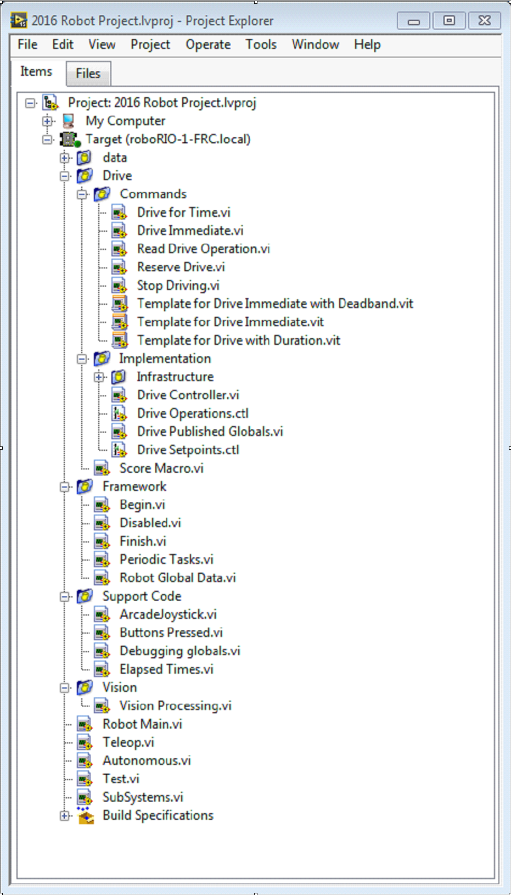

My Computer
  The items that define operation on the computer that the project was loaded on. For a robot project, this is used as a simulation target and is populated with simulation files.

Sim Support Files
  The folder containing 3D CAD models and description files for the simulated robot.

Robot Simulation Readme.html
  Documents the PWM channels and robot info you will need in order to write robot code that matches the wiring of the simulated robot.

Dependencies
  Shows the files used by the simulated robot’s code. This will populate when you designate the code for the simulated robot target.

Build Specifications
  This will contain the files that define how to build and deploy code for the simulated robot target.

Target (roboRIO-TEAM-FRC.local)
  The items that define operation on the roboRIO located at (address).

Drive
  The subsystem implementation and commands for the robot drive base. This serves as a custom replacement for the WPILib RobotDrive VIs.

Framework
  VIs used for robot code that is not part of a subsystem that are not used very often.

  Begin
    Called once when robot code first starts. This is useful for initialization code that doesn’t belong to a particular subsystem.

  Disabled
    Called once for each disabled packet and can be used to debug sensors when you don’t want the robot to move.

  Finish
    During development, this may be called when robot code finishes. Not called on abort or when power is turned off.

  Periodic Tasks
    A good place for ad hoc periodic loops for debugging or monitoring

  Robot Global Data
    Useful for sharing robot information that doesn’t belong to a subsystem.

Support Code
  Debugging and code development aids.

Vision
  Subsystem and commands for the camera and image processing.

Robot Main.vi
  Top level VI that you will run while developing code.

Autonomous.vi
  VI that runs during autonomous period.

Teleop.vi
  VI that is called for each TeleOp packet.

Test.vi
  VI that runs when driver station is in test mode.

SubSystems.vi
  VI that contains and starts all subsystems.

Dependencies
  Shows the files used by the robot code.

Build Specifications
  Used to build and run the code as a startup application once code works correctly.

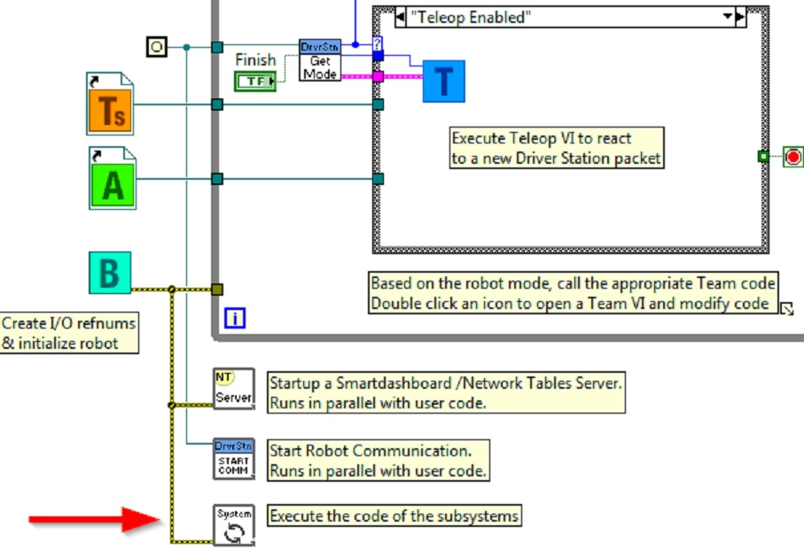

Drive Subsystem Project Explorer
--------------------------------
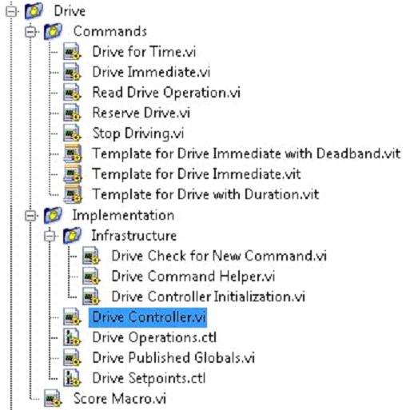

Commands:
  This folder contains the command VIs that request the controller carry out an operation. It also contains templates for creating additional drive commands.

.. note:: After creating a new command, you may need to edit ``Drive Setpoints.ctl`` to add or update fields that controller uses to define the new operation. You also need to go into the Drive Controller.vi and modify the case structure to add a case for every value.

Implementation
^^^^^^^^^^^^^^^

These are the VIs and Controls used to build the subsystem.

Infrastructure VIs
  - Drive Check for New Command: It is called each iteration of the controller loop. It checks for new commands, updates timing data, and upon completion notifies a waiting command.
  - Drive Command Helper.vi: Commands call this VI to notify the controller that a new command has been issued.
  - Drive Controller Initialization.vi: It allocates the notifier and combines the timing, default command, and other information into a single data wire.

- Drive Controller.vi: This VI contains the control/state machine loop. The panel may also contain displays useful for debugging.
- Drive Operation.ctl: This typedef defines the operational modes of the controller. Many commands can share an operation.
- Drive Setpoint.ctl: It contains the data fields used by all operating modes of the Drive subsystem.
- Drive Published Globals.vi: A useful place for publishing global information about the drive subsystem.

Part 2: Initializing the Drive Subsystem
----------------------------------------

There are green comments on the controller’s block diagram that point out key areas that you will want to know how to edit.

The area to the left of the control loop will execute once when the subsystem starts up. This is where you will typically allocate and initialize all I/O and state data. You may publish the I/O refnums, or you may register them for Test Mode Only to keep them private so that other code cannot update motors without using a command.

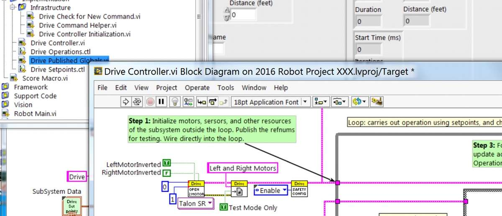

.. note:: Initializing the resources for each subsystem in their respective Controller.vi rather than in Begin.vi improves I/O encapsulation, reducing potential resource conflicts and simplifies debugging.

.. image:: images/command-and-control-tutorial/step-2.jpg

Part of the initialization is to select the default operation and set point values when no other operation is being processed.

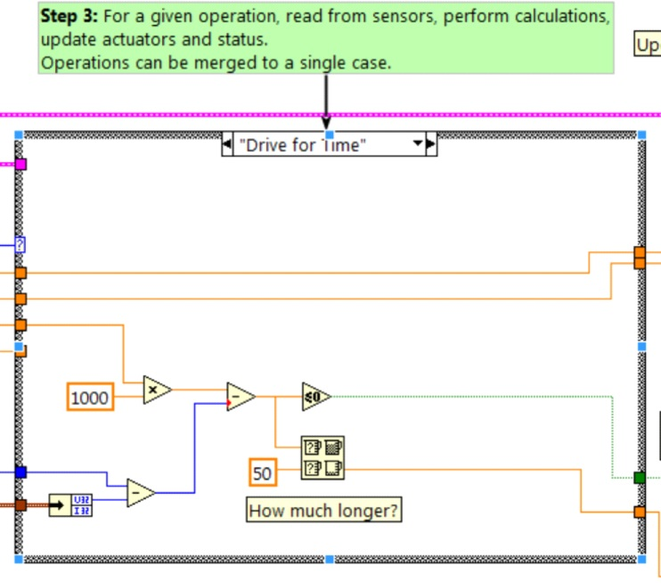

Inside the control loop is a case statement where operations are actually implemented. Set point values, iteration delay, iteration count, and sensors can all have influence on how the subsystem operates.  This case structure has a value for each operation state of the subsystem.

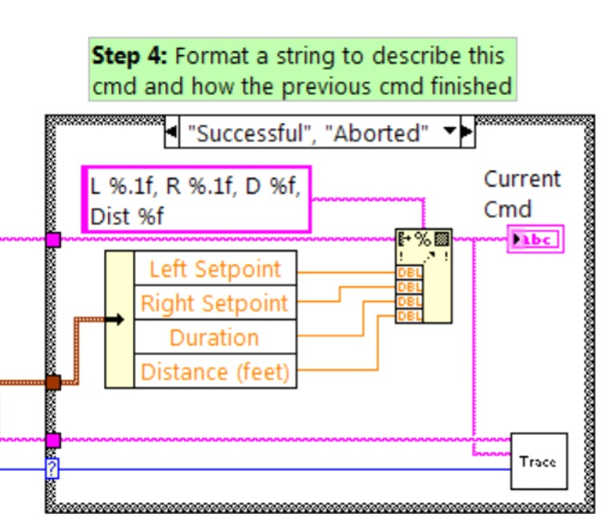

Each iteration of the controller loop will optionally update the Trace VI. The framework already incorporates the subsystem name, operation, and description, and you may find it helpful to format additional set point values into the trace information. Open the Trace VI and click Enable while the robot code is running to current setpoints and commands sent to each subsystem.

The primary goal of the controller is to update actuators for the subsystem. This can occur within the case structure, but many times, it is beneficial to do it downstream of the structure to ensure that values are always updated with the correct value and in only one location in the code.

.. image:: images/command-and-control-tutorial/step-5.jpg

Part 3: Drive Subsystem Shipped Commands
----------------------------------------

There are 3 shipped example commands for each new subsystem:

Drive For Time.vi
^^^^^^^^^^^^^^^^^

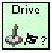

This VI sets the motors to run for a given number of seconds. It optionally synchronizes with the completion of the command.

The Drive for Time case will operate the motors at the set point until the timer elapses or a new command is issued. If the motors have the safety timeout enabled, it is necessary to update the motors at least once every 100ms. This is why the code waits for the smaller of the remaining time and 50ms.

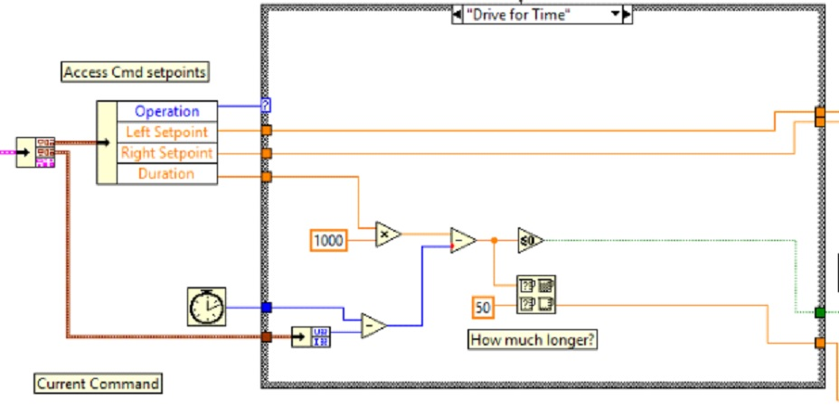

Drive Immediate.vi
^^^^^^^^^^^^^^^^^^

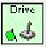

Gets the desired left and right speeds for the motors and will set the motors immediately to those set points.

The Immediate case updates the motors to the set point defined by the command. The command is not considered finished since you want the motors to maintain this value until a new command comes in or until a timeout value. The timeout is useful anytime a command includes a dead band. Small values will not be requested if smaller than the dead band, and will result in growling or creeping unless the command times out.

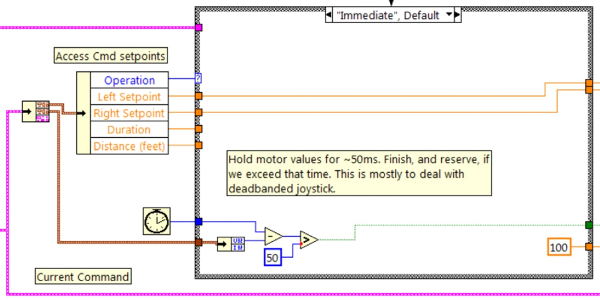

Stop Driving.vi
^^^^^^^^^^^^^^^

.. image:: images/command-and-control-tutorial/stop-driving.jpg

Zero the drive motors, making the robot stationary.

The Reserve command turns off the motors and waits for a new command. When used with a named command sequence, reserve identifies that the drive subsystem is part of a sequence, even if not currently moving the robot. This helps to arbitrate subsystem resource between simultaneously running commands.

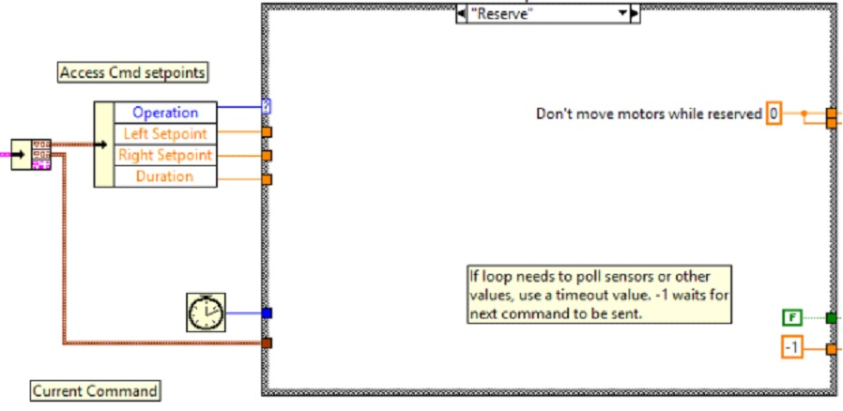

Part 4: Creating New Commands
-----------------------------

The Command and Control framework allows users to easily create new commands for a subsystem. To Create a new command open the subsystem folder/Commands In the project explorer window, choose one of the VI Templates to use as the starting point of your new command, right click, and select New From Template.

- **Immediate**: This VI notifies the subsystem about the new setpoint.
- **Immediate with deadband**: This VI compares the input value to the deadband and optionally notifies the subsystem about the new setpoint. This is very useful when joystick continuous values are being used.
- **With duration**: This VI notifies the subsystem to perform this command for the given duration, and then return to the default state. Synchronization determines whether this VI Starts the operation and returns immediately, or waits for the operation to complete. The first option is commonly used for TeleOp, and the second for Autonomous sequencing.

In this example we will add the new command "Drive for Distance".

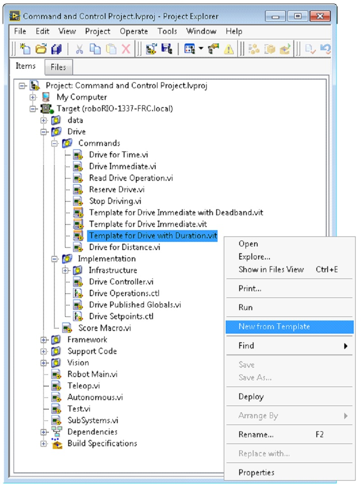

First, save the new VI with a descriptive name such as "Drive for Distance". Next, determine whether the new command needs a new value added the Drive Operations enum typedef. The initial project code already has an enum value of Drive for Distance, but the following image shows how you would add one if needed.

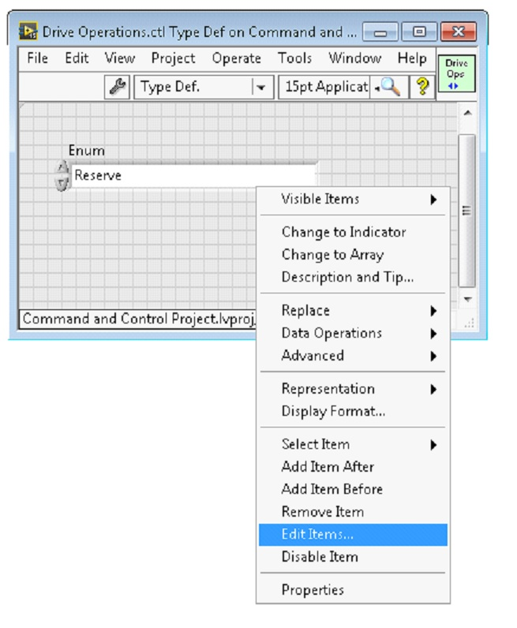

If a command needs additional information to execute, add it to the setpoints control. By default, the Drive subsystem has fields for the Left Setpoint, Right Setpoint, and Duration along with the operation to be executed. The Drive for Distance command could reuse Duration as distance, but let’s go ahead and add a numeric control to the Drive Setpoints.ctl called Distance (feet).

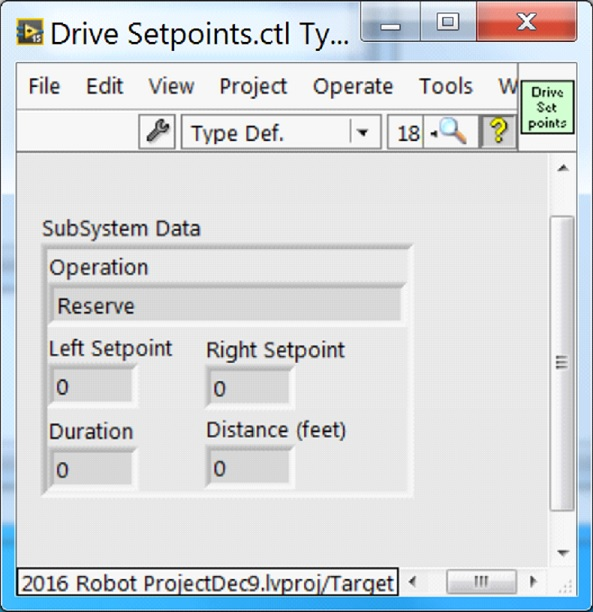

Once that we have all of the fields needed to specify our command, we can modify the newly created Drive for Distance.vi. As shown below, select Drive for Distance from the enum’s drop down menu and add a VI parameters to specify distance, speeds, etc. If the units do not match, the command VI is a great place to map between units.

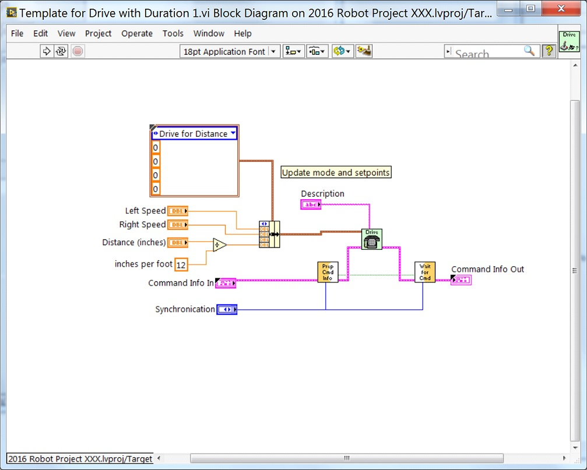

Next, add code to the Drive Controller to define what happens when the Drive for Distance command executes. Right click on the Case Structure and Duplicate or Add Case for Every Value. This will create a new "Drive for Distance" case.

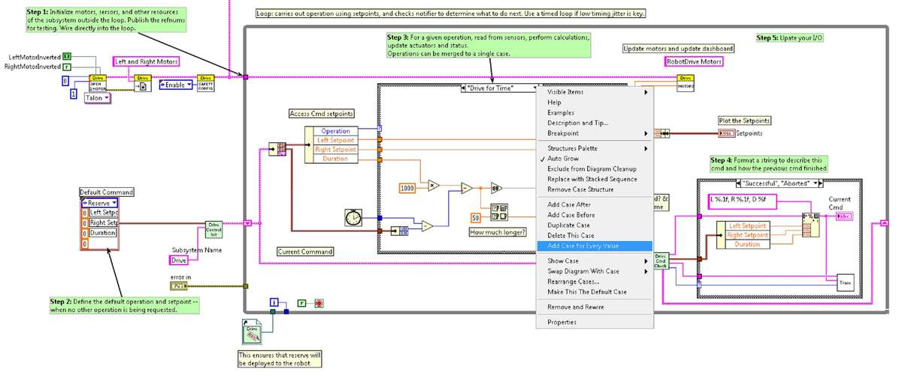

In order to access new setpoint fields, grow the "Access Cmd setpoints" unbundle node. Open your encoder(s) on the outside, to the left of the loop. In the new diagram of the case structure, we added a call to reset the encoder on the first loop iteration and read it otherwise. There is also some simple code that compares encoder values and updates the motor power. If new controls are added to the setpoints cluster, you should also consider adding them to the Trace. The necessary changes are shown in the image below.

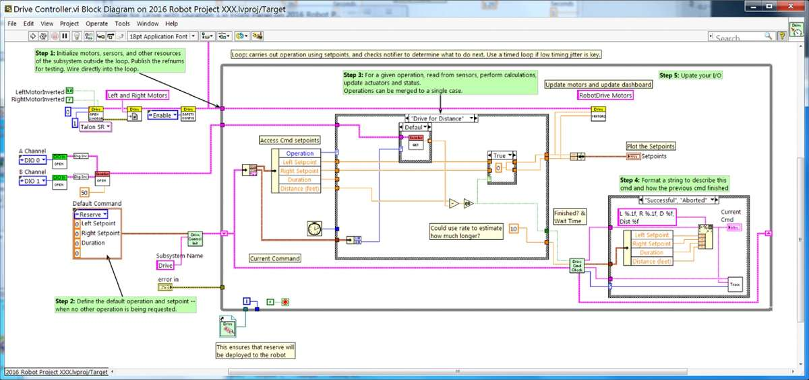

Part 5: Creating a Subsystem
----------------------------

In order to create a new subsystem, right click on the roboRIO target and select New» Subsystem. In the pop up dialog box, enter the name of the subsystem, list the operational modes, and specify the color of the icon.

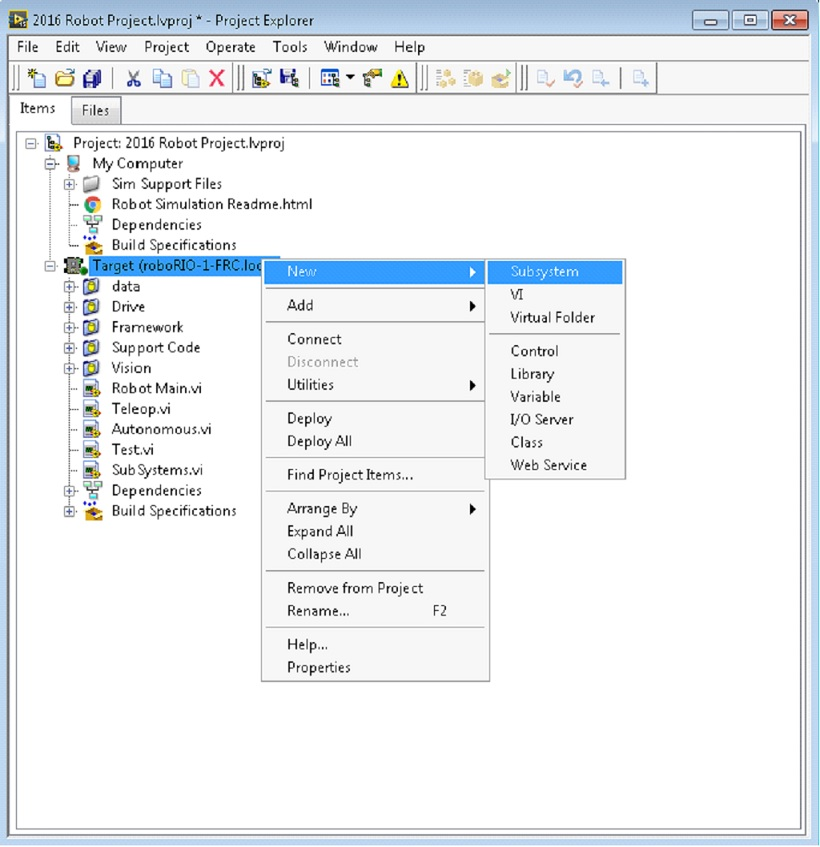

When you click OK, the subsystem folder will be generated and added to the project disk folder and tree. It will contain a base implementation of the VIs and controls that make up a subsystem. A call to the new controller will be inserted into the Subsystems VI. The controller VI will open, ready for you to add I/O and implement state machine or control code. Generated VI icons will use the color and name provided in the dialog. The generated code will use typedefs for set point fields and operations.

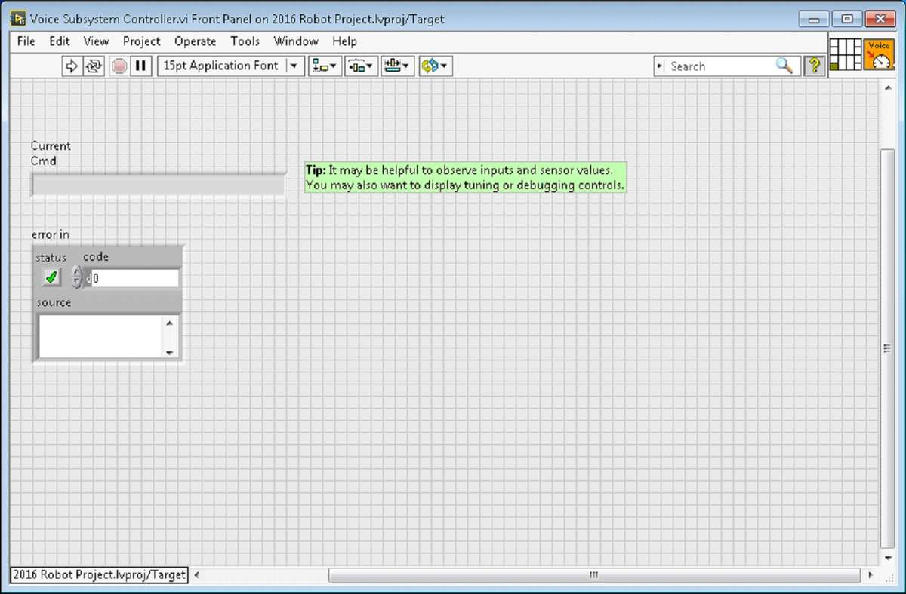

Below is the block diagram of the newly created subsystem. This code will be generated automatically when you create the subsystem.

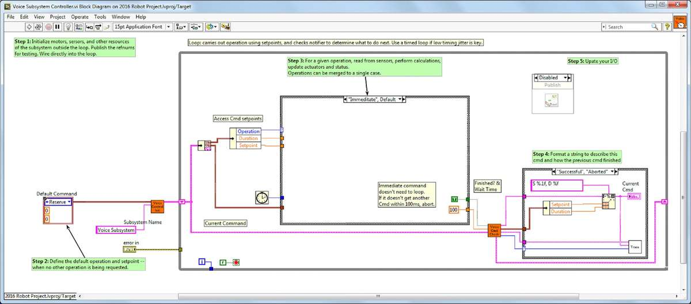
