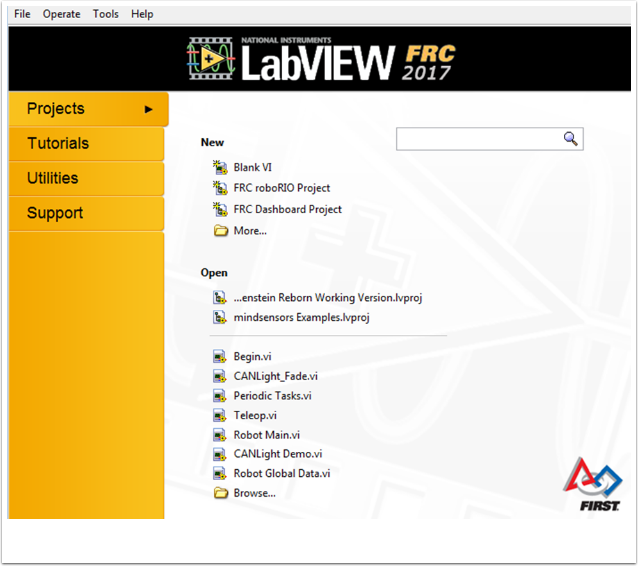
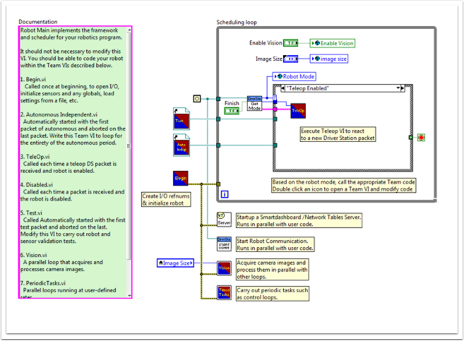
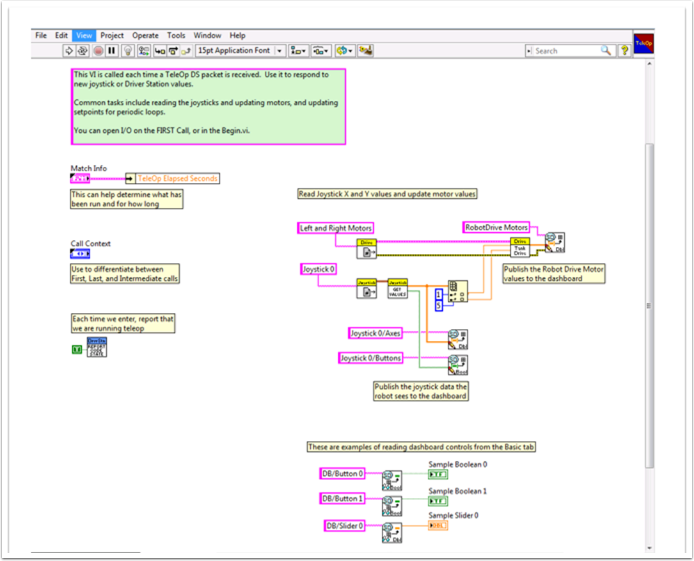
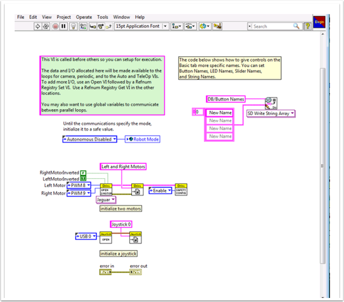

.. include:: <isonum.txt>

Tank Drive Tutorial
===================

**Question:** How do I get my robot to drive with two joysticks using tank drive?

**Solution:** There are four components to consider when setting up tank drive for your robot.  The first thing you will want to do is make sure the tank drive.vi is used instead of the arcade drive.vi or whichever drive VI you were utilizing previously.  The second item to consider is how you want your joysticks to map to the direction you want to drive.  In tank drive, the left joystick is used to control the left motors and the right joystick is used to control the right motors.  For example, if you want to make your robot turn right by pushing up on the left joystick and down on the right joystick you will need to set your joystick’s accordingly in LabVIEW (this is shown in more detail below).  Next, you will want to confirm the PWM lines that you are wired into, are the same ones your joysticks will be controlling.  Lastly, make sure your motor controllers match the motor controllers specified in LabVIEW.  The steps below will discuss these ideas in more detail:

1. Open LabVIEW and double click ``FRC roboRIO Project``.

2. Give your project a name, add your team number, and select ``Arcade Drive Robot roboRIO``.  You can select another option, however, this tutorial will discuss how to setup tank drive for this project.

3. In the Project Explorer window, open up the ``Robot Main.vi``.

4. Push :kbd:`Ctrl+E` to see the block diagram.  It should look like the following image:

5. Double click the "Teleop" vi inside of the Teleop Enabled case structure.  Look at its block diagram.  You will want to make two changes here:

  - Replace Arcade Drive with the tank drive.vi.  This can be found by right clicking on the block diagram >> WPI Robotics Library >> Robot Drive >>  and clicking the Tank Drive VI.

  - Find the Index Array function that is after the Get Values.vi.  You will need to create two numeric constants and wire each into one of the index inputs.  You can determine what the values of each index should be by looking at the USB Devices tab in the FRC\ |reg| Driver Station.  Move the two joysticks to determine which number (index) they are tied to.  You will likely want to use the Y-axis index for each joystick.  This is because it is intuitive to push up on the joystick when you want the motors to go forward, and down when you when them to go in reverse.  If you select the X-axis index for each, then you will have to move the joystick left or right (x-axis directions) to get the robot motors to move.  In my setup, I’ve selected index 1 for my left motors Y-axis control and index 5 as the right motors Y-axis control.  You can see the adjustments in LabVIEW in the following image:

6. Next you will want to go back to your "Robot Main.vi" and double click on the "Begin.vi."

7. The first thing to confirm in this VI is that your left and right motors are connected to the same PWM lines in LabVIEW as they are on your PDP (Power Distribution Panel).

8. The second thing to confirm in this VI is that the "Open 2 Motor.vi" has the correct motor controller selected (Talon, Jaguar, Victor, etc.).

  For example, I am using Jaguar motor controllers and my motors are wired into PWM 8 and 9.  The image below shows the changes I need to make:

9. Save all of the Vis that you have made adjustments to and you are now able to drive a robot with tank drive!
