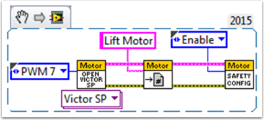
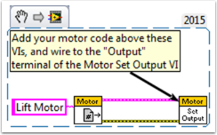
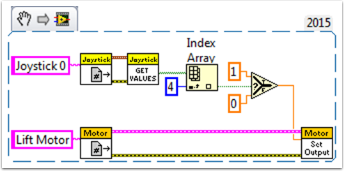
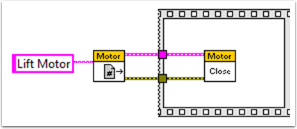

Add an Independent Motor to a Project
======================================

Once your drive that controls the wheels is all set, you might need to add an additional motor to control something completely independent of the wheels, such as an arm. Since this motor will not be part of your tank, arcade, or mecanum drive, you'll definitely want independent control of it.

These VI Snippets show how to set up a single motor in a project that may already contain a multi-motor drive. If you see the HAND>ARROW>LABVIEW symbol, just drag the image into your block diagram, and voila: code! Ok, here's how you do it.

FIRST, create a motor reference in the\ **Begin.vi**, using the \ **Motor Control Open VI** and \ **Motor Control Refnum Registry Set VI**. These can be found by right-clicking in the block diagram and going to **WPI Robotics Library>>RobotDrive>>Motor Control**. Choose your PWM line and name your motor. I named mine "Lift Motor" and connected it to PWM 7. (I also included and enabled the Motor Control Safety Config VI, which automatically turns off the motor if it loses connection.)

Now, reference your motor (the name has to be exact) in the **Teleop.vi** using the **Motor Control Refnum Registry Get VI** and tell it what to do with the **Motor Control Set Output VI**. These are in the same place as the above VIs.

For example, the next snippet tells the Lift Motor to move forward if button 4 is pressed on Joystick 0 and to remain motionless otherwise. For me, button 4 is the left bumper on my Xbox style controller ("Joystick 0"). For much more in-depth joystick button options, check out :ref:`How to Use Joystick Buttons to Control Motors or Solenoids <docs/software/labview/resources/how-to-use-joystick-buttons-to-control-motors-or-solenoids:How to Use Joystick Buttons to Control Motors or Solenoids>`.

Finally, we need to close the references in the **Finish.vi** (just like we do with the drive and joystick), using the **Motor Control Refnum Registry Get VI** and **Motor Control Close VI**. While this picture shows the Close VI in a flat sequence structure by itself, we really want all of the Close VIs in the same frame. You can just put these two VIs below the other Get VIs and Close VIs (for the joystick and drive).

I hope this helps you program the best robot ever! Good luck!
