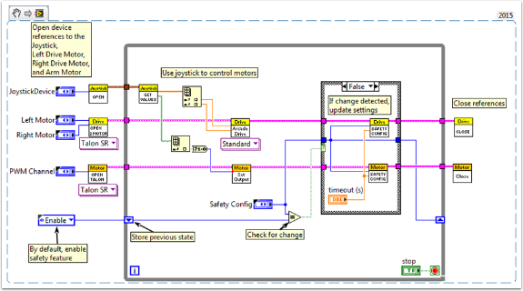

Adding Safety Features to Your Robot Code
=========================================

A common problem with complex projects is making sure that all of your code is executing when you expect it to. Problems can arise when tasks with high priority, long execution times, or frequent calls hog processing power on the roboRIO. This leads to what is known as "starvation" for the tasks that are not able to execute due to the processor being busy. In most cases this will simply slow the reaction time to your input from the joysticks and other devices. However, this can also cause the drive motors of your robot to stay on long after you try to stop them. To avoid any robotic catastrophes from this, you can implement safety features that check for task input starvation and automatically shut down potentially harmful operations.

There are built-in functions for the motors that allow easy implementation of safety checks. These functions are:

- Robot Drive Safety Configuration
- Motor Drive Safety Configuration
- Relay Safety Configuration
- PWM Safety Configuration
- Solenoid Safety Configuration
- Robot Drive Delay and Update Safety

In all of the Safety Configuration functions, you can enable and disable the safety checks while your programming is running and configure what timeout you think is appropriate. The functions keep a cache of all devices that have the safety enabled and will check if any of them have exceeded their time limit. If any has, all devices in the cache will be disabled and the robot will come to an immediate stop or have its relay/PWM/solenoid outputs turned off. The code below demonstrates how to use the Drive Safety Configuration functions to set a maximum time limit that the motors will receive no input before being shut off.

To test the safety shut-off, try adding a Wait function to the loop that is longer than your timeout!

The final function that relates to implementing safety checks--Robot Drive Delay and Update Safety--allows you to put the roboRIO in Autonomous Mode without exceeding the time limit. It will maintain the current motor output without making costly calls to the Drive Output functions, and will also make sure that the safety checks are regularly updated so that the motors will not suddenly stop.

Overall, it is highly recommended that some sort of safety check is implemented in your project to make sure that your robot is not unintentionally left in a dangerous state!
