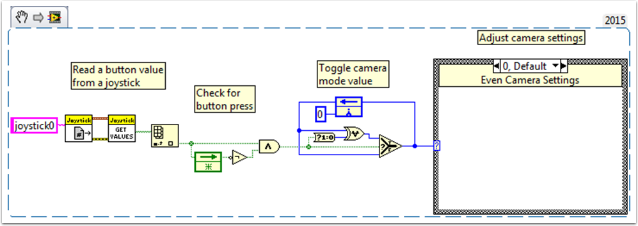

How To Toggle Between Two Camera Modes
======================================

This code shows how to use a button to toggle between two distinct camera modes. The code consists of four stages.

In the first stage, the value of a button on the joystick is read.

Next, the current reading is compared to the previous reading using a **Feedback Node** and some Boolean arithmetic. Together, these ensure that the camera mode is only toggled when the button is initially pressed rather than toggling back and forth multiple times while the button is held down.

After that, the camera mode is toggled by masking the result of the second stage over the current camera mode value. This is called bit masking and by doing it with the **XOR** function the code will toggle the camera mode when the second stage returns true and do nothing otherwise.

Finally, you can insert the code for each camera mode in the case structure at the end. Each time the code is run, this section will run the code for the current camera mode.

