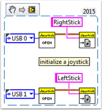
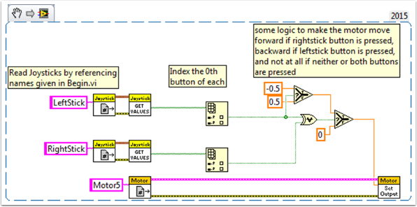
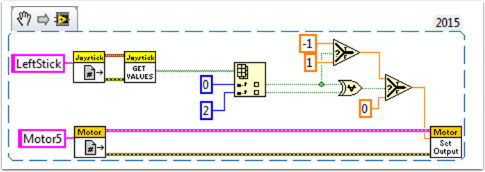
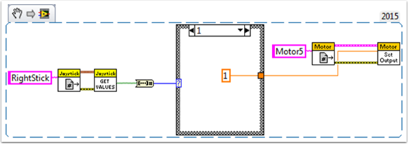
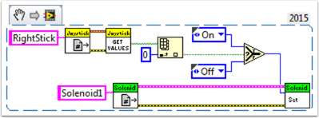

How to Use Joystick Buttons to Control Motors or Solenoids
==========================================================

As we all get our drive systems working, we are moving on to connecting our auxiliary devices such as motors and solenoids.  With this, we will generally use joystick buttons to control these devices.  To get started with this, we'll go through several ways to control devices with joystick buttons.

Did you know that you can click and drag a VI Snippet from a document like this right into your LabVIEW code?  Try it with the snippets in this document.

Setup:
------

No matter what the configuration, you'll need to add one, two, or more (if you're really excited) joysticks to the "Begin.vi".  The first example uses 2 joysticks and the others only use one.  Give each one a unique name so we can use it in other places, like the snippet below.  I named them "LeftStick" and "RightStick" because they are on the left and right sides of my desk.  If your joysticks are already configured, great! You can skip this step.

The rest of the code in this document will be placed in the "Teleop.VI" This is where we will be programming our joystick buttons to control different aspects of our motors or solenoids.

Scenario 1
----------

**"I want a motor to move one way when I press one button and the other way when I press a different button."**

This code uses button 0 on two different joysticks to control the same motor.  If button 0 on LeftStick is pressed, the motor moves backward, and if button 0 on RightStick is pressed, the motor moves forward.  If both buttons are pressed or neither button is pressed, the motor doesn't move.  Here I named my motor reference "Motor5", but you can name your motor whatever you want in the "Begin.vi"

You may want to use multiple buttons from the same joystick for control.  For an example of this, look at the following VI snippet or the VI snippet in Scenario 2.

Here I used joystick buttons 0 and 2, but feel free to use whatever buttons you need.

Scenario 2
----------

**"I want different joystick buttons move at various speeds."**

This example could be helpful if you need to have one motor do different things based on the buttons you press.  For instance, let's say my joystick has a trigger (button 0) and 4 buttons on top (buttons 1 through 4).  In this case, the following buttons should have the following functions:

- button 1 - move backward at half speed
- button 2 - move forward at half speed
- button 3 - move backward at 1/4 speed
- button 4 - move forward at 1/4 speed
- trigger - full speed ahead! (forward at full speed)

We would then take the boolean array from the "JoystickGetValues.vi" and wire it to a "Boolean Array to Number" node (Numeric Palette-Conversion Palette).  This converts the boolean array to a number that we can use.  Wire this numeric to a case structure.

Each case corresponds to a binary representation of the values in the array.  In this example, each case corresponds to a one-button combination.  We added six cases: 0 (all buttons off), 1 (button 0 on), 2 (button 1 on), 4 (button 2 on), 8 (button 3 on), and 16 (button 4 on).  Notice we skipped value 3.  3 would correspond to buttons 0 and 1 pressed at the same time.  We did not define this in our requirements so we'll let the default case handle it.

It might be helpful to review the LabVIEW 2014 Case Structure Help document here:

https://zone.ni.com/reference/en-XX/help/371361L-01/glang/case_structure/

There are also 3 Community Tutorials on case structures here:

https://forums.ni.com/t5/Curriculum-and-Labs-for/Unit-3-Case-Structures-Lesson-1/ta-p/3505945?profile.language=en

https://forums.ni.com/t5/Curriculum-and-Labs-for/Unit-3-Case-Structures-Lesson-2/ta-p/3505933?profile.language=en

https://forums.ni.com/t5/Curriculum-and-Labs-for/Unit-3-Case-Structures-Lesson-3/ta-p/3505979?profile.language=en

Since our requirements were simple, we only need a single constant in each case.  For case 1 (full ahead) we use a 1, for case 2 (half back) we use a -0.5, etc.  We can use any constant value between 1 and -1.  I left case 0 as the default so if multiple buttons are pressed (any undefined state was reached) the motor will stop.  You of course are free to customize these states however you want.

Scenario 3
-----------

**"I want to control a solenoid with my joystick buttons."**

By now, we are familiar with how the joystick outputs the buttons in an array of booleans.  We need to index this array to get the button we are interested in, and wire this boolean to a select node.  Since the "Solenoid Set.vi" requires a Enum as an input, the easiest way to get the enum is to right click the "Value" input of the "Solenoid Set.vi" and select "Create Constant".  Duplicate this constant and wire one copy to the True terminal and one to the False terminal of the select node.  Then wire the output of the select node to the "Value" input of the solenoid VI.

Happy Roboting!
