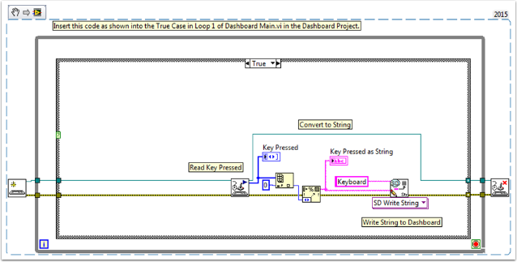

Keyboard Navigation with the roboRIO
====================================

This example provides some suggestions for controlling the robot using keyboard navigation in place of a joystick or other controller.  In this case, we use the A, W, S, and D keys to control two drive motors in a tank drive configuration.

The first VI Snippet is the code that will need to be included in the Dashboard Main VI.  You can insert this code into the True case of Loop 1.  The code opens a connection to the keyboard before the loop begins, and on each iteration it reads the pressed key.  This information is converted to a string, which is then passed to the Teleop VI in the robot project.  When Loop 1 stops running, the connection to the keyboard is closed.

The second VI Snippet is code that should be included in the Teleop VI.  This reads the string value from the Dashboard that indicates which key was pressed.  A Case Structure then determines which values should be written to the left and right motors, depending on the key.  In this case, W is forward, A is left, D is right, and S is reverse.  Each case in this example runs the motors at half speed.  You can keep this the same in your code, change the values, or add additional code to allow the driver to adjust the speed, so you can drive fast or slow as necessary.  Once the motor values are selected, they are written to the drive motors, and motor values are published to the dashboard.
