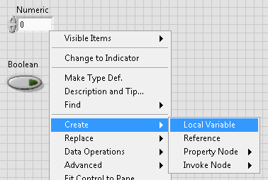
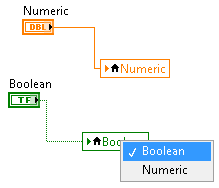
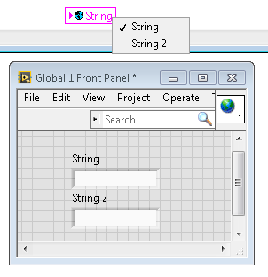
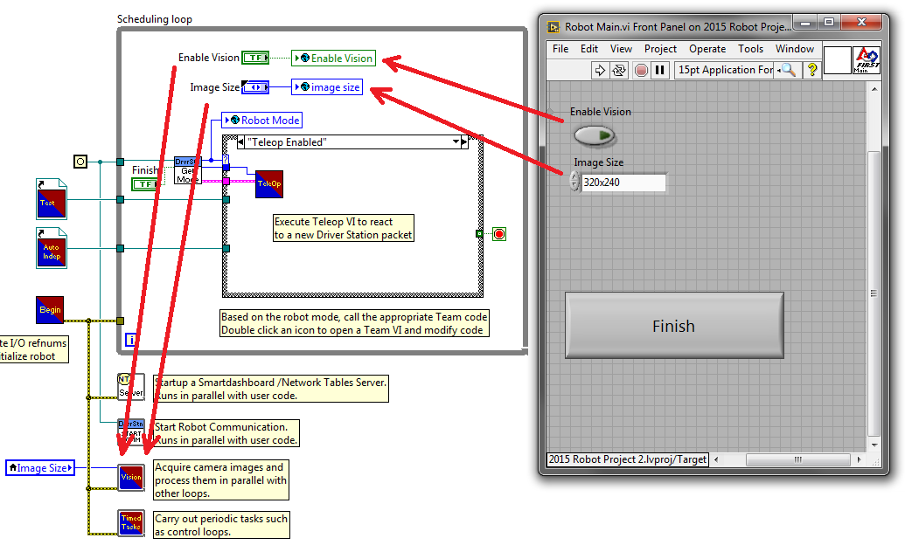
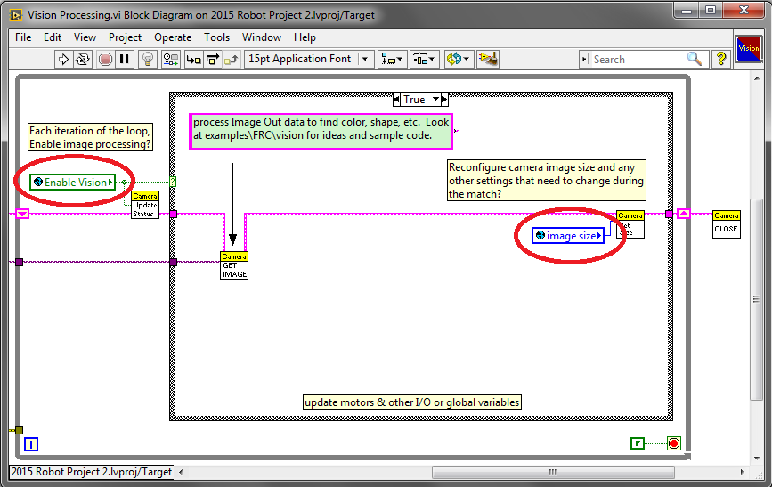
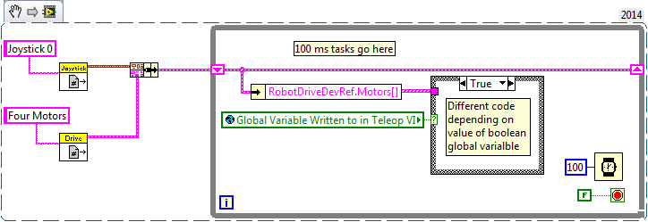

.. include:: <isonum.txt>

Local and Global Variables in LabVIEW for FRC
=============================================

This example serves as an introduction to local and global variables, how they are used in the default LabVIEW for FRC\ |reg| Robot Project, and how you might want to use them in your project.

Local variables and global variables may be used to transfer data between locations within the same VI (local variables) or within different VI’s (global variables), breaking the conventional `Data Flow Paradigm <https://www.ni.com/getting-started/labview-basics/dataflow>`__ for which LabVIEW is famous.  Thus, they may be useful when, for whatever reason, you cannot wire the value directly to the node to another.

Note: One possible reason may be that you need to pass data between consecutive loop iterations; Miro\_T covered this `in this post <https://forums.ni.com/t5/FIRST-Robotics-Competition/Use-of-Shift-Registers-to-Pass-Data-Between-Loop-Iterations/ta-p/3498415?profile.language=en>`__.  It should also be noted that the `feedback node <https://zone.ni.com/reference/en-XX/help/371361L-01/lvconcepts/block_diagram_feedback/>`__ in LabVIEW may be used as an equivalent to the shift register, although that may be a topic for another day!

Introduction to Local and Global Variables
------------------------------------------

Local variables may be used within the same VI.  Create a local variable by right-clicking a control or indicator on your Front Panel:

You may create a local variable from the Structures palette on the block diagram as well.  When you have multiple local variables in one VI, you can left-click to choose which variable it is:

Global variables are created slightly differently.  Add one to the block diagram from the Structures palette, and notice that when you double-click it, it opens a separate front panel.  This front panel does not have a block diagram, but you add as many entities to the front panel as you wish and save it as a \*.vi file:

.. note:: Be very careful to avoid race conditions when using local and global variables!  Essentially, make sure that you are not accidentally writing to the same variable in multiple locations without a way to know to which location it was last written.  For a more thorough explanation, see `this help document <https://zone.ni.com/reference/en-XX/help/371361L-01/lvconcepts/using_local_and_global/>`_

How They are Used in the Default LabVIEW for FRC Robot Project
--------------------------------------------------------------

Global variables for "Enable Vision" and "Image Size" are written to during each iteration of the Robot Main VI…

… And then read in each iteration of the Vision Processing VI:

This allows the user, when deploying to Robot Main VI from the LabVIEW Development Environment, to enable/disable vision and change the image size from Robot Main’s Front Panel.

How Can You Use Them in Your Project?
-------------------------------------

Check out the block diagram for the Periodic Tasks VI.  Perhaps there is some value, such as a boolean, that may be written to a global variable in the Teleop VI, and then read from in the Periodic Tasks VI.  You can then decide what code or values to use in the Periodic Tasks VI, depending on the boolean global variable:

