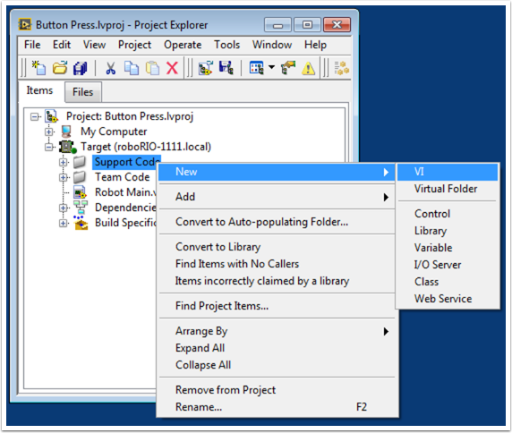
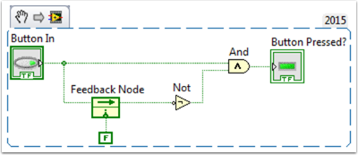
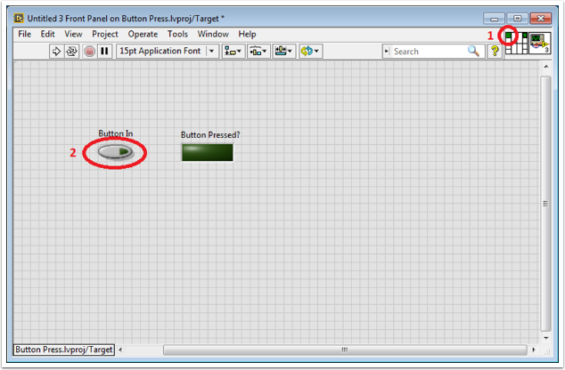
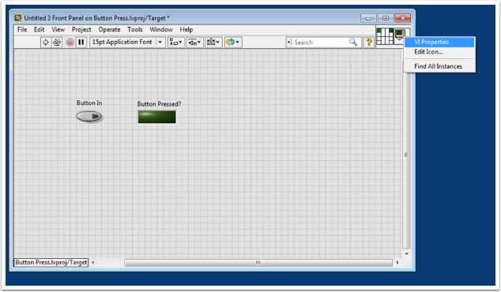
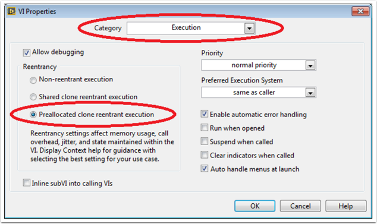
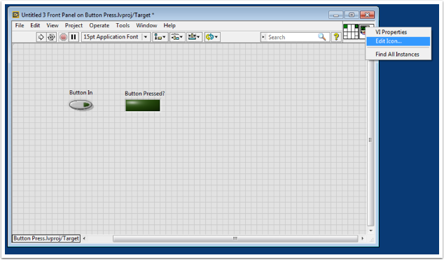
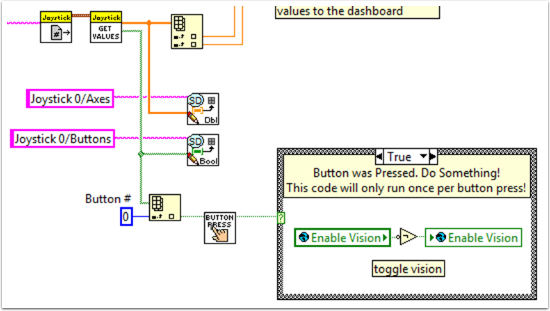

Making a One-Shot Button Press
====================================

When using the Joystick Get Values function, pushing a joystick button will cause the button to read TRUE until the button is released. This means that you will most likely read multiple TRUE values for each press. What if you want to read only one TRUE value each time the button is pressed? This is often called a "One-Shot Button". The following tutorial will show you how to create a subVI that you can drop into your Teleop.vi to do this.

First, create a new VI in the Support Code folder of your project.

Now on the block diagram of the new VI, drop in the following code snippet.

This code uses a function called the Feedback Node. We have wired the current value of the button into the left side of the feedback node. The wire coming out of the arrow of the feedback node represents the previous value of the button. If the arrow on your feedback node is going the opposite direction as shown here, right click to find the option to reverse the direction.

When a button is pressed, the value of the button goes from FALSE to TRUE. We want the output of this VI to be TRUE only when the current value of the button is TRUE, and the previous value of the button is FALSE.

Next we need to connect the boolean control and indicator to the inputs and outputs of the VI. To do this, first click the block on the connector pane, then click the button to connect the two (see the diagram below). Repeat this for the indicator.

Next, we need to change the properties of this VI so that we can use multiples of this VI in our TeleOp.vi. Right click the VI Icon and go to VI Properties. Then select the category "Execution" and select "Preallocated clone reentrant execution".

Lastly, we should change the VI Icon to be more descriptive of the VI's function. Right click the Icon and go to Edit Icon. Create a new Icon.

Finally, save the VI with a descriptive name. You can now drag and drop this VI from the Support Files folder into your TeleOp.vi. Here is a copy of the completed VI: :download:`Button_Press.vi <files/Button_Press.vi>`

Here's an example of how you could use this VI.

