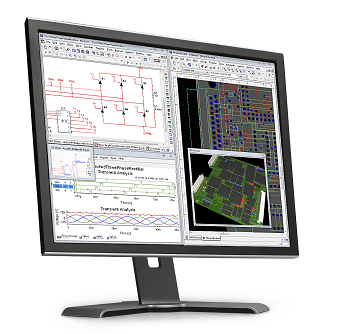
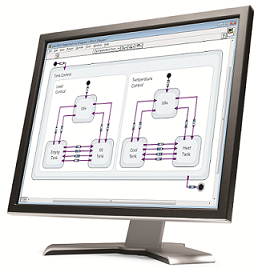

Multisim, Ultiboard, and Statechart Module
==========================================

All FRC teams can use the FRC LabVIEW serial number included in their Kick Off Kit to activate Multisim, Ultiboard, and Statechart Module.  These are all great tools that can help you during build season.  See below to learn more and download.

Use Multisim and Ultiboard to Prototype, Test, and Build Circuit Boards
-----------------------------------------------------------------------

**Multisim** is an industry-standard, best-in-class SPICE simulation environment. It is the cornerstone of the NI circuits teaching solution to build expertise through practical application in designing, prototyping, and testing electrical circuits. `Learn more about Multisim here. <https://www.ni.com/en-us/shop/electronic-test-instrumentation/application-software-for-electronic-test-and-instrumentation-category/what-is-multisim.html>`__

**Ultiboard** enables efficient layout and routing of PCB designs. Integration with NI Multisim allows seamless transfer of schematics to layout. `Learn more about Ultiboard here. <https://www.ni.com/en-us/shop/select/ultiboard>`__

.. admonition:: Download

  `Download Multisim & Ultiboard <https://lumen.ni.com/nicif/US/GB_ACADEMICEVALMULTISIM/content.xhtml>`__

.. tip:: If you'd like to use these tools before FRC kick off, you can download from the link above and use it for a 45 day trial.

Additional Resources
^^^^^^^^^^^^^^^^^^^^

`More technical resources for Multisim and Ultiboard. <https://www.ni.com/tutorial/5579/en/>`__

`Expansion Board Developer Guide for roboRIO <https://forums.ni.com/t5/FIRST-Robotics-Competition/roboRIO-MXP-Developer-s-Guide/ta-p/3532923?profile.language=en>`__

Use LabVIEW Statechart Module to Simplify Code with High Level Abstraction
--------------------------------------------------------------------------

**Statechart Module** is a LabVIEW add-on that provides a high level of abstraction for designing applications using states, transitions, and events.  This helps to keep code organized, scalable, well documented, and easy to read.  You can deploy these applications to roboRIO. Learn more about State Chart Module `here <https://www.ni.com/en-us/support/downloads/software-products/download.labview-statechart-module.html>`__ and the download is available `here. <https://www.ni.com/en-us/support/downloads/software-products.html>`__

.. admonition:: Download

  `Download Statechart <https://www.ni.com/en-us/support/downloads/software-products.html>`__
