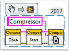
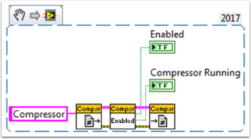
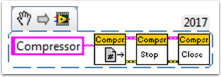

Using the Compressor in LabVIEW
===============================

This snippet shows how to set up your roboRIO project to use the Pneumatic Control Module (PCM).  The PCM automatically starts and stops the compressor when specific pressures are measured in the tank. In your roboRIO program, you will need to add the following VIs.

For more information, check out the following links:

:download:`FRC Pneumatics Manual <files/2015-frc-pneumatics-manual.pdf>`

`PCM User's Guide <https://store.ctr-electronics.com/content/user-manual/PCM%20User%27s%20Guide.pdf>`__

`Pneumatics Step by Step for the roboRIO <http://team358.org/files/pneumatic/Pneumatics-StepByStep-roboRIO.pdf>`__

Begin VI
--------

Place this snippet in the Begin.vi.

Teleop VI
---------

Place this snippet in the Teleop.vi. This portion is only required if you are using the outputs for other processes.

Finish VI
---------

Place this snippet in Close Refs, save data, etc. frame of the Finish.vi.

