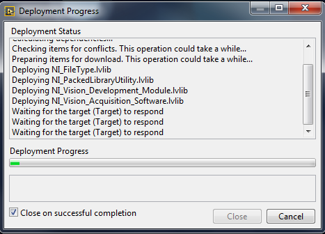
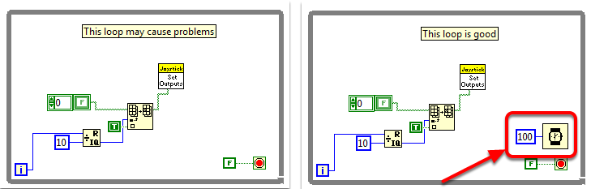
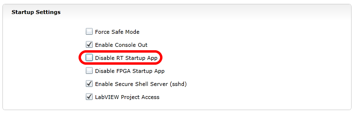

Waiting for Target to Respond - Recovering from bad loops
=========================================================

.. note:: If you download LabVIEW code which contains an unconstrained loop (a loop with no delay) it is possible to get the roboRIO into a state where LabVIEW is unable to connect to download new code. This document explains the process required to load new, fixed, code to recover from this state.

The Symptom
-----------

The primary symptom of this issue is attempts to download new robot code hang at the "Waiting for the target (Target) to respond" step as shown above. Note that there are other possible causes of this symptom (such as switching from a C++\Java program to LabVIEW program) but the steps described here should resolve most or all of them.

Click ``Cancel`` to close the download dialog.

The Problem
-----------

One common source of this issue is unconstrained loops in your LabVIEW code. An unconstrained loop is a loop which does not contain any delay element (such as the one on the left). If you are unsure where to begin looking, Disabled.VI, Periodic Tasks.VI and Vision Processing.VI are the common locations for this type of loop. To fix the issue with the code, add a delay element such as the Wait (ms) VI from the Timing palette, found in the right loop.

Set No App
----------

Using the roboRIO webserver (see the article on the :ref:`roboRIO Web Dashboard Startup Settings <docs/software/roborio-info/roborio-web-dashboard:Startup Settings>` for more details). **Check** the box to "Disable RT Startup App".

Reboot
------

Reboot the roboRIO, either using the Reset button on the device or by click Restart in the top right corner of the webpage.

Clear No App
------------

Using the roboRIO webserver (see the article on the :ref:`roboRIO Web Dashboard Startup Settings <docs/software/roborio-info/roborio-web-dashboard:Startup Settings>` for more details). **Uncheck** the box to "Disable RT Startup App".

Load LabVIEW Code
-----------------

Load LabVIEW code (either using the Run button or Run as Startup). Make sure to set LabVIEW code to Run as Startup before rebooting the roboRIO or you will need to follow the instructions above again.
