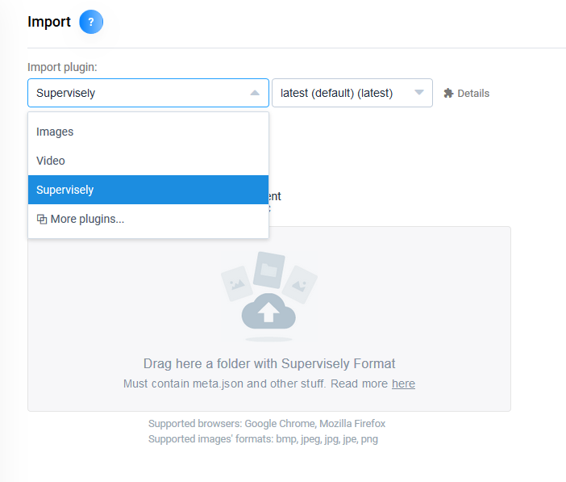
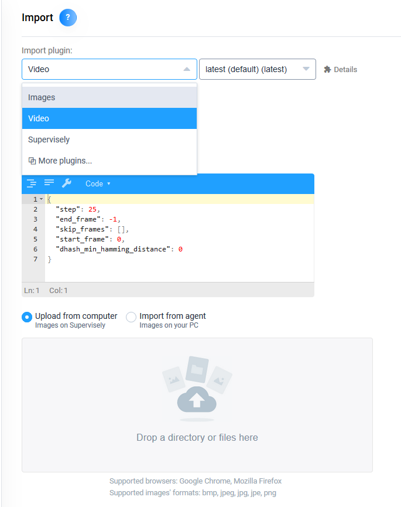
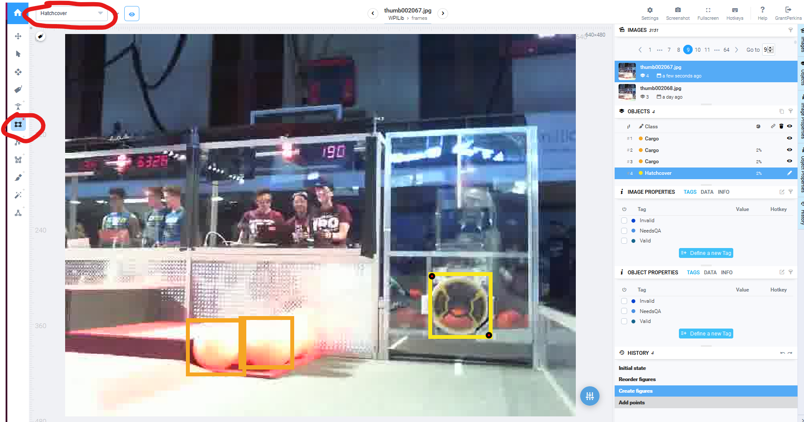
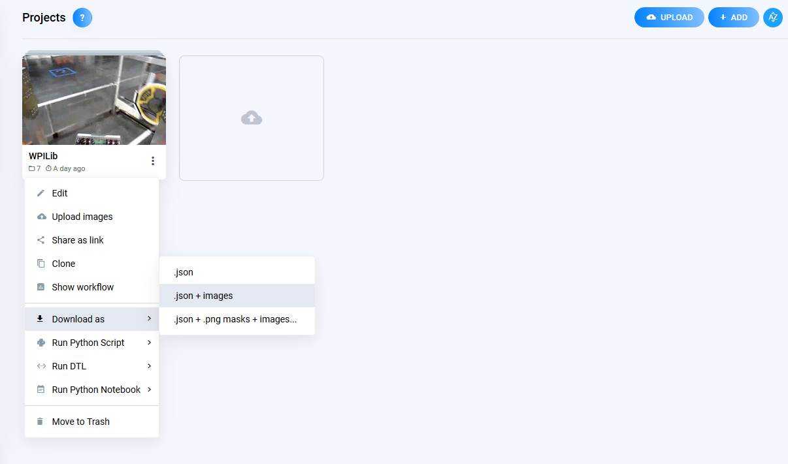
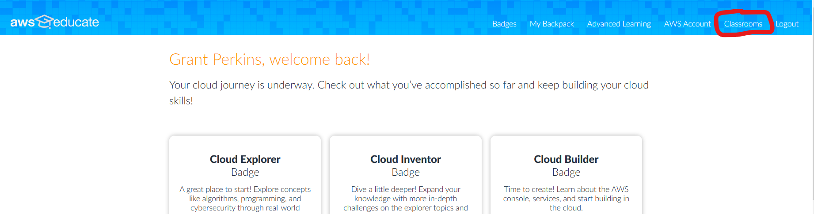
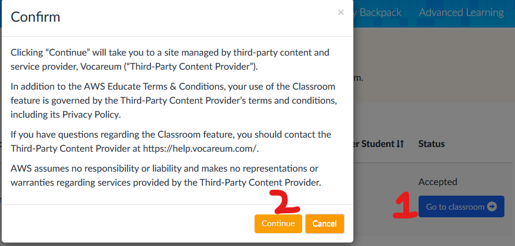
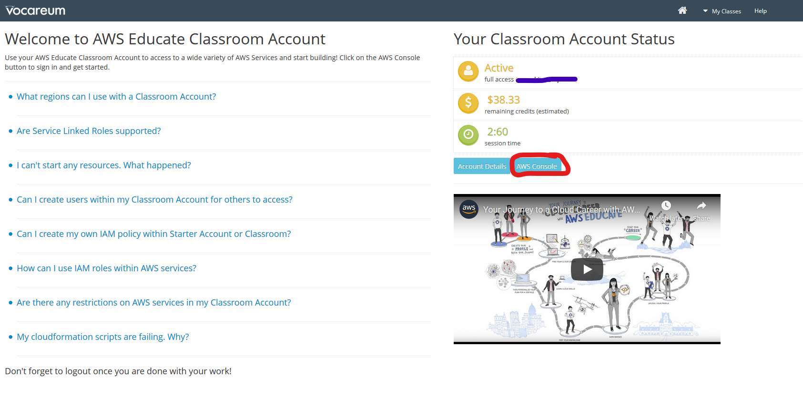
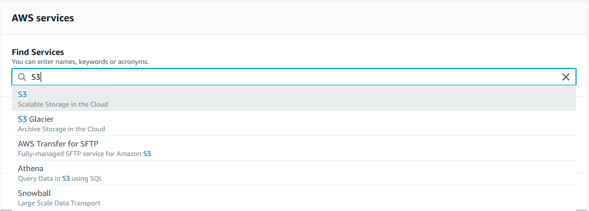
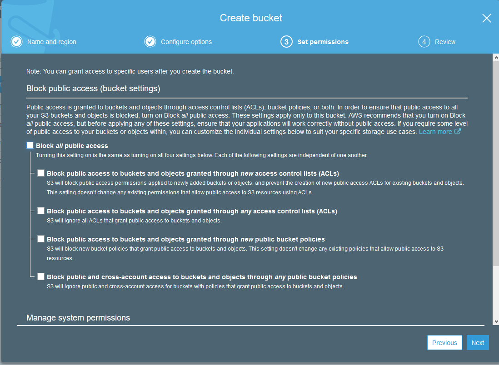

Gathering Data
==============

Machine learning works by "learning" what objects are supposed to look like by looking at thousands of pictures, where important objects have boxes drawn around them. WPILib provides a pre-labeled dataset, however you may wish to supplement this dataset. The below steps describe how to do this. If you do not wish to create your dataset, skip to Training.

.. note:: When you record your video, if you do not use the provided script, make sure your images are small (640x40 works). Large images have too much unnecessary data, and will take up too much memory.

Labeling
--------

1. Prepare to record a video of objects you want your robot to detect. You should get multiple angles of the object, and many locations of the object.
2. Plug a USB Camera into your laptop, point the camera at your chosen object, and run `record_video.py <https://github.com/wpilibsuite/CoralSagemaker/blob/master/utils/record_video.py>`__, which records and MP4.
3. Create a `supervise.ly <https://supervise.ly/>`__ account. This is a very nice tool for labelling data. After going to the `supervise.ly <https://supervise.ly/>`__ website, the Signup box is in the top right corner. Provide the necessary details, then click "CREATE AN ACCOUNT".
4. (Optional) You can add other teammates to your Supervise.ly workspace by clicking ``Members`` on the left and then ``INVITE`` at the top.
5. When first creating an account a workspace will be made for you. Click on the workspace to select it and begin working.
6. Upload the official WPILib labeled data to your workspace. Download the tar here, extract it, then click ``IMPORT DATA`` or ``UPLOAD`` inside of your workspace. Change the import plugin to ``Supervisely``, then drag in the extracted ``FOLDER``. Then, give the project a name, then click ``import``.

.. note:: Importing files to supervise.ly is only supported for Google Chrome and Mozilla Firefox.

.. note:: Some applications create two folders when extracting from a .tar file. If this happens, upload the nested folder.

7. Upload your own video to your workspace. Click ``UPLOAD`` when inside of your workspace, change your import plugin to video, drag in your video, give the project a name, and click ``import``. The default configuration, seen in the picture below, is fine.

8. Click into your newly imported Dataset. Use the rectangle tool to draw appropriate boxes around the objects which you wish to label. Make sure to choose the right class when you are labelling. The class selector is in the top left of your screen.

9. Download your datasets from Supervise.ly. Click on the vertical three dots on the dataset, then "Download as", then select the ``.json + images`` option.

Uploading to AWS S3
-------------------

1. Open AWS Educate. Log in to your account.
2. Open up your Classroom.

3. Accept the Terms and Conditions, if presented.
4. Go to your classroom, and click ``continue``.

5. Open the AWS Console.

6. Search S3 in the "Find Services" field. Open S3.

An S3 bucket is a cloud storage service provided by AWS which you will be using to store your ``.tar`` of labeled images and the trained model after you finish running through this guide.

7. Create a new bucket by giving it a unique name. Hit ``next`` and then hit ``next`` again **without** changing anything on the second page. On the third page, make sure it has public read permissions if multiple accounts will be using this data.

- Once you've made the bucket, go into the bucket, then ``Permissions`` --> ``Access Control List``. Then change the public access to allow ``List objects`` and ``Read bucket`` permissions.

8. Upload the ``.tar`` file that you downloaded (or made with Supervise.ly) into the new S3 bucket. Click ``Add files``, then select the file, click ``Next``, then make sure it also has public read permissions if multiple accounts will be using this data. Keep the file properties ``Standard``, and then click ``Upload``.
