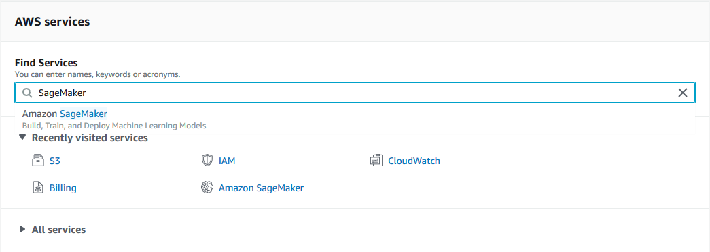
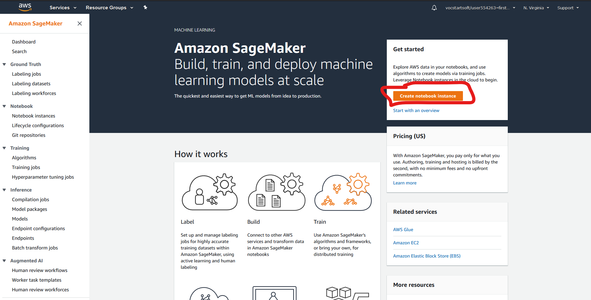

Training
========

Training on AWS with the provided dataset should take about 2 hours and cost roughly $1. If you add more images or add new labeling classes the cost and time will be higher.

Train with AWS
--------------

1. If you are not in the AWS Console main page, click the AWS logo in the top left if you're logged in, or go to the page through your `awseducate.com classroom <https://www.awseducate.com/>`__ if you are not logged in.
2. Search "SageMaker" in the "Find Services" field and create a new SageMaker notebook instance.

.. todo:: Transfer