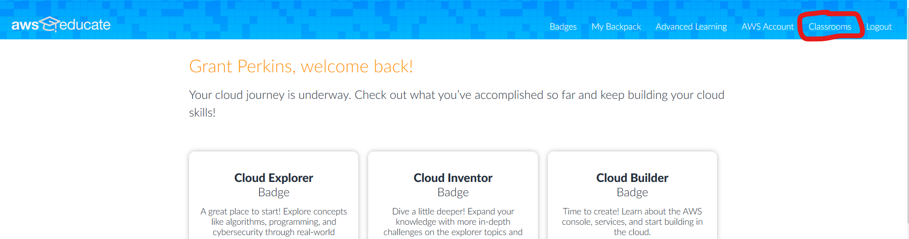
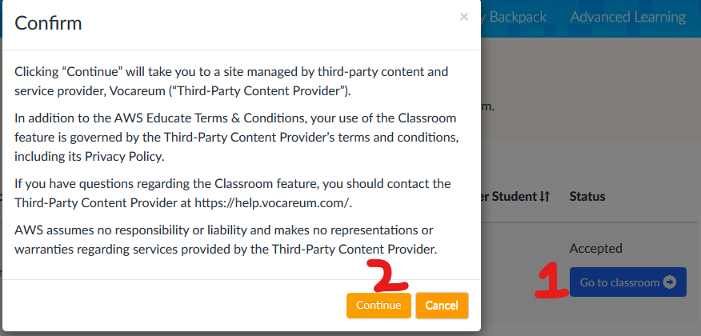
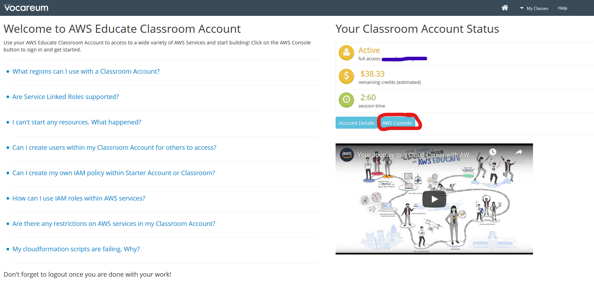

Training
========

.. note:: Training on AWS with the provided dataset should take about 2 hours and cost roughly $1. If you add more images or add new labeling classes the cost and time will be higher.

Opening the AWS Console
-----------------------

1. Open `AWS Educate <https://aws.amazon.com/education/awseducate/>`__. Log in to your account.
2. Open up your Classroom.

3. Accept the Terms and Conditions, if presented.
4. Go to your classroom, and click continue.

5. Open the AWS Console.

Training with AWS
-----------------

1. Search "SageMaker" in the "Find Services" field,

.. image:: images/search-sagemaker.png
   :alt: Searching SageMaker

and create a new notebook instance

.. image:: images/create-notebook.png
   :alt: Create notebook button

The notebook instance should have the following characteristics:
- Notebook instance name: Give your notebook a name
- IAM Role: Click `Create a new role` inside of the dropdown. Let it have access to Any S3 bucket.
- Git repositories: open the panel, then click on where it says ``None``. Click ``Clone a public Git repository to this notebook instance only``, then paste in this link: `<https://github.com/wpilibsuite/CoralSagemaker.git>`__
- Create the instance

.. image:: images/new-notebook.png
   :alt: Notebook characteristics

2. After several minutes, the notebook will be "In Service". Open the notebook using the JupyterLab option.

.. image:: images/open-jupyter.png
   :alt: jupyterlab

3. Open the ``CoralSagemaker`` folder, and then ``coral.ipynb``, found on the left side of the screen. We've noticed that the first time a notebook is opened, it doesn't work correctly. To fix this, follow these steps:
   - Reload the tab. Dismiss the error. When prompted, select the kernel ``conda_amazonei_tensorflow_p36``
   - If the tab does not finish reloading, close the tab, and open the notebook in JupyterLab once again. It will work this time.
4. If you gathered additional data and made your own dataset (see :ref:`docs/software/machine-learning/gathering-data:Gathering Data`) then make the following change. If you have only followed the instructions on this page, please continue to step 5. To use your own data and not WPILib's, replace ``estimator.fit(s3://wpilib)`` with ``estimator.fit(s3://<<your-bucket-name>>)``. As a reminder, there should be only one ``.tar`` in your bucket.
5. Run the code block by clicking the play button at the top of your screen. This block will take roughly 15 minutes or less to train your model.
6. Stop the notebook after you are done running it to stop getting charged. Do this by going back to the SageMaker tab, clicking on ``Notebook instances`` on the far left, selecting the instance that is no longer needed, and selecting ``Actions -> Stop``.

.. image:: images/stop-instance.png
   :alt: stop

7. Open ``Training jobs`` on the far left. Open the most recent job.
8. Once the model is done training (the job says ``Completed``), scroll to the bottom inside the training job. Click on the link in the ``Output`` section, where it says ``S3 model artifact``.
9. Click on ``model.tar.gz``. Click on ``Download``.