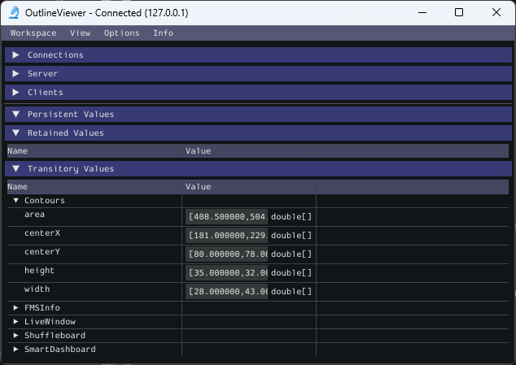
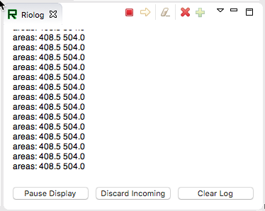

Reading Array Values Published by NetworkTables
===============================================
This article describes how to read values published by :term:`NetworkTables` using a program running on the robot. This is useful when using computer vision where the images are processed on your driver station laptop and the results stored into NetworkTables possibly using a separate vision processor like a raspberry pi, or a tool on the robot like GRIP, or a python program to do the image processing.

Very often the values are for one or more areas of interest such as goals or game pieces and multiple instances are returned. In the example below, several x, y, width, height, and areas are returned by the image processor and the robot program can sort out which of the returned values are interesting through further processing.

Verify the NetworkTables Topics Being Published
-----------------------------------------------

You can verify the names of the NetworkTables topics used for publishing the values by using the Outline Viewer application. It is a C++ program in your user directory in the wpilib/<YEAR>/tools folder. The application is started by selecting the "WPILib" menu in Visual Studio Code then Start Tool then "OutlineViewer". In this example, with the image processing program running (GRIP) you can see the values being put into NetworkTables.

In this case the values are stored in a table called GRIP and a sub-table called myContoursReport. You can see that the values are in brackets and there are 2 values in this case for each topic. The NetworkTables topic names are centerX, centerY, area, height and width.

Both of the following examples are extremely simplified programs that just illustrate the use of NetworkTables. All the code is in the robotInit() method so it's only run when the program starts up. In your programs, you would more likely get the values in code that is evaluating which direction to aim the robot in a command or a control loop during the autonomous or teleop periods.

Writing a Program to Access the Topics
--------------------------------------

.. tabs::

   .. code-tab:: java

      DoubleArraySubscriber areasSub;

      @Override
      public void robotInit() {
        NetworkTable table = NetworkTableInstance.getDefault().getTable("GRIP/mycontoursReport");
        areasSub = table.getDoubleArrayTopic("area").subscribe(new double[] {});
      }

      @Override
      public void teleopPeriodic() {
          double[] areas = areasSub.get();

          System.out.print("areas: " );

          for (double area : areas) {
            System.out.print(area + " ");
          }

          System.out.println();
      }

   .. code-tab:: cpp

      nt::DoubleArraySubscriber areasSub;

      void Robot::RobotInit() override {
        auto table = nt::NetworkTableInstance::GetDefault().GetTable("GRIP/myContoursReport");
        areasSub = table->GetDoubleArrayTopic("area").Subscribe({});
      }

      void Robot::TeleopPeriodic() override {
        std::cout << "Areas: ";

        std::vector<double> arr = areasSub.Get();

        for (double val : arr) {
          std::cout << val << " ";
        }

        std::cout << std::endl;
      }

  .. code-tab:: python

        def robotInit(self):
            table = ntcore.NetworkTableInstance.getDefault().getTable("GRIP/mycontoursReport")
            self.areasSub = table.getDoubleArrayTopic("area").subscribe([])

        def teleopPeriodic(self):
            areas = self.areasSub.get()
            print("Areas:", areas)

The steps to getting the values and, in this program, printing them are:

1.  Declare the table variable that will hold the instance of the subtable that have the values.
2.  Initialize the subtable instance so that it can be used later for retrieving the values.
3.  Read the array of values from NetworkTables. In the case of a communicating programs, it's possible that the program producing the output being read here might not yet be available when the robot program starts up. To avoid issues of the data not being ready, a default array of values is supplied. This default value will be returned if the NetworkTables topic hasn't yet been published. This code will loop over the value of areas every 20ms.

Program Output
--------------

In this case the program is only looking at the array of areas, but in a real example all the values would more likely be used. Using the Riolog in VS Code or the Driver Station log you can see the values as they are retrieved. This program is using a sample static image so they areas don't change, but you can imagine with a camera on your robot, the values would be changing constantly.
