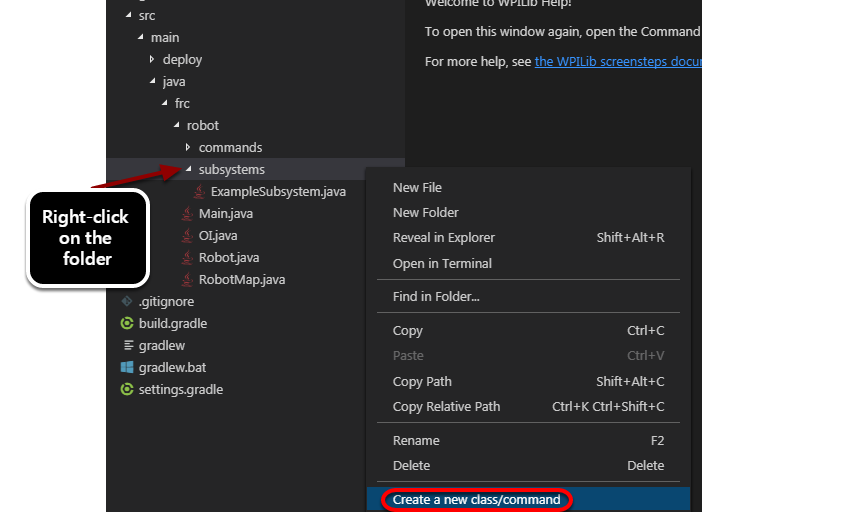
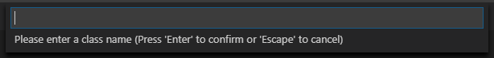
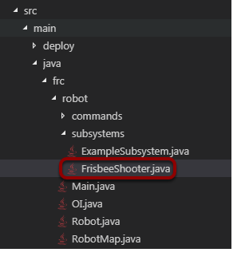
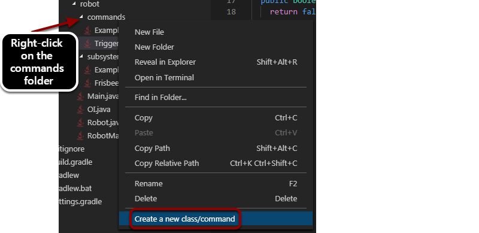
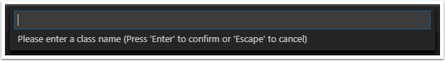
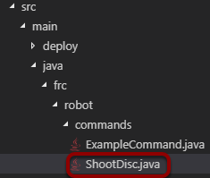

Adding Commands and Subsystems to the Project
=============================================

.. important:: This documentation describes the use of the legacy command-based library. While this documentation has been preserved to help teams that have yet to do so, teams are strongly encouraged to migrate to the :ref:`new command-based library <docs/software/commandbased/index:Command-Based Programming>`.

.. note:: Commands and Subsystems each are created as classes. The plugin has built-in templates for both Commands and Subsystems to make it easier for you to add them to your program.

Adding Subsystems to the Project
--------------------------------

To add a subsystem, right-click on the desired folder and select **Create a new class/command** in the drop down menu. Then select **Subsystem (Old)** or **PID Subsystem (Old)**.

Naming the Subsystem
--------------------

Fill in a name for the subsystem. This will become the resultant class name for the subsystem so the name has to be a valid class name for your language.

Subsystem Created in Project
----------------------------

You can see the new subsystem created in the Subsystems folder in the project. To learn more about creating subsystems, see the :doc:`Simple Subsystems <../subsystems/simple-subsystems>` article.

Adding a Command to the Project
-------------------------------

A command can be created for the project using steps similar to creating a subsystem. First right-click on the folder name in the project, then select **Create a new class/command** in the drop down menu. Then select **Command (Old)**, **Instant Command (Old)**, **TimedCommand (Old)**, **Command Group (Old)**:

- **Command** -  A basic command that operates on a subsystem
- **Instant Command** - A command that runs and completes instantly
- **Timed Command** - A command that runs for a specified time duration
- **Command Group** - A command that is runs other commands

Set the Command Name
--------------------

Enter the Command name into the dialog box. This will be the class name for the Command so it must be a valid class name for your language.

Command Created in the Project
------------------------------

You can see that the Command has been created in the Commands folder in the project in the Project Explorer window. To learn more about creating commands, see the :doc:`Creating Simple Commands article<../commands/creating-simple-commands>`.
