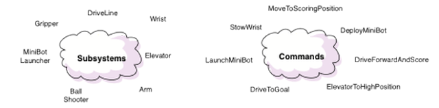
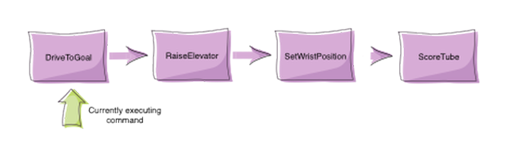
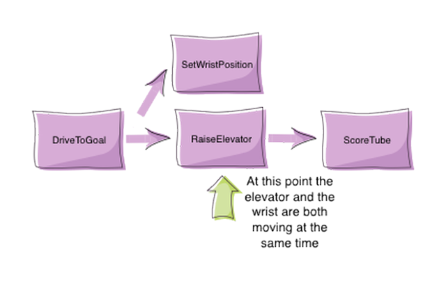
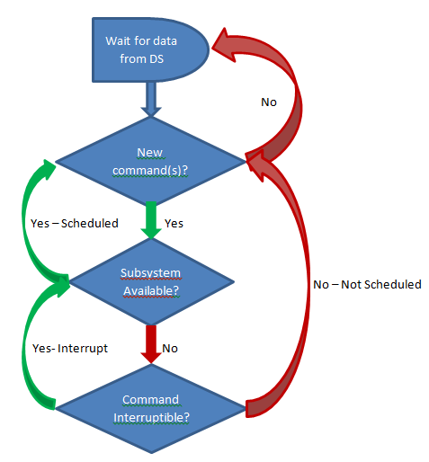

What is Command-Based Programming?
==================================

.. important:: This documentation describes the use of the legacy command-based library. While this documentation has been preserved to help teams that have yet to do so, teams are strongly encouraged to migrate to the :ref:`new command-based library <docs/software/commandbased/index:Command-Based Programming>`.

WPILib supports a method of writing programs called "Command-based programming". Command-based programming is a design pattern to help you organize your robot programs. Some of the characteristics of robot programs that might be different from other desktop programs are:

- Activities happen over time, for example a sequence of steps to shoot a Frisbee or raise an elevator and place a tube on a goal.
- These activities occur concurrently, that is it might be desirable for an elevator, wrist and gripper to all be moving into a pickup position at the same time to increase robot performance.
- It is desirable to test the robot mechanisms and activities each individually to help debug your robot.
- Often the program needs to be augmented with additional autonomous programs at the last minute, perhaps at competitions, so easily extendable code is important.

Command-based programming supports all these goals easily to make the robot program much simpler than using some less structured technique.

Commands and Subsystems
-----------------------

Programs based on the WPILib Command Template are organized around two fundamental concepts: **Subsystems** and **Commands**.

**Subsystems** - define the capabilities of each part of the robot and are subclasses of Subsystem.

**Commands** - define the operation of the robot incorporating the capabilities defined in the subsystems. Commands are subclasses of Command or CommandGroup. Commands run when scheduled or in response to buttons being pressed or virtual buttons from the SmartDashboard.

How Commands Work
-----------------

Commands let you break up the tasks of operating the robot into small chunks. Each command has an execute() method that does some work and an isFinished() method that tells if it is done. This happens on every update from the driver station or about every 20ms. Commands can be grouped together and executed sequentially, starting the next one in the group as the previous one finishes.

Concurrency
-----------

Sometimes it is desirable to have several operations happening concurrently. In the previous example you might want to set the wrist position while the elevator is moving up. In this case, a command group can start a parallel command (or command group) running.

How It Works - Scheduling Commands
----------------------------------

There are three main ways commands are scheduled:

1. Manually, by calling the ``start()`` method on the command (:doc:`used for autonomous <../commands/running-commands-autonomous>`)
2. Automatically by the scheduler based on :doc:`button/trigger actions <../commands/running-commands-joystick-input>` specified in the code (typically defined in the OI class but checked by the Scheduler).
3. Automatically when a previous command completes (:doc:`default commands <../commands/default-commands>` and :doc:`command groups  <../commands/creating-groups-commands>`).

Each time the driver station gets new data, the periodic method of your robot program is called. It runs a Scheduler that checks the trigger conditions to see if any commands need to be scheduled or cancelled.

When a command is scheduled, the Scheduler checks to make sure that no other commands are using the same subsystems that the new command requires. If one or more of the subsystems is currently in use, and the current command is interruptible, it will be interrupted and the new command will be scheduled. If the current command is not interruptible, the new command will fail to be scheduled.

How It Works - Running Commands
-------------------------------

After checking for new commands, the scheduler proceeds through the list of active commands and calls the ``execute()`` and ``isFinished()`` methods on each command. Notice that the apparent concurrent execution is done without the use of threads or tasks which would add complexity to the program. Each command simply has some code to execute (execute method) to move it further along towards its goal and a method (isFinished) that determines if the command has reached the goal. The execute and isFinished methods are just called repeatedly.

Command Groups
--------------

More complex commands can be built up from simpler commands. For example, shooting a disc may be a long sequence of commands that are executed one after another. Maybe some of these commands in the sequence can be executed concurrently. Command groups are commands, but instead of having an isFinished and execute method, they have a list of other commands to execute. This allows more complex operations to be built up out of simpler operations, a basic principle in programming. Each of the individual smaller commands can be easily tested first, then the group can be tested. More information on command groups can be found in the :doc:`Creating groups of commands article <../commands/creating-groups-commands>`.
