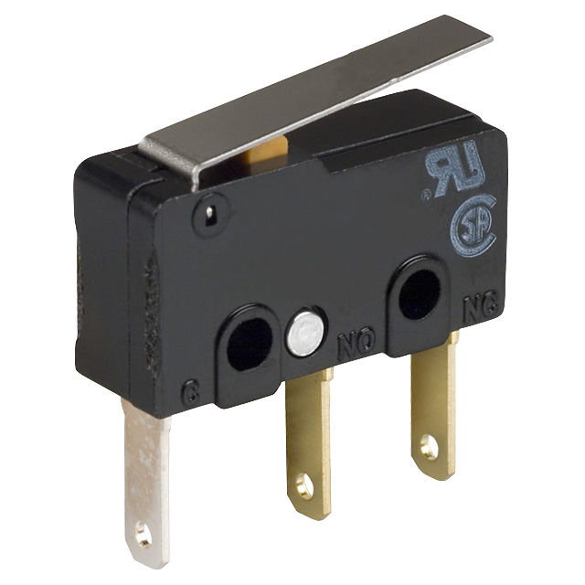

Using Limit Switches to Control Behavior
========================================

.. important:: This documentation describes the use of the legacy command-based library. While this documentation has been preserved to help teams that have yet to do so, teams are strongly encouraged to migrate to the :ref:`new command-based library <docs/software/commandbased/index:Command-Based Programming>`.

Limit switches are often used to control mechanisms on robots. While limit switches are simple to use, they only can sense a single position of a moving part. This makes them ideal for ensuring that movement doesn't exceed some limit but not so good at controlling the speed of the movement as it approaches the limit. For example, a rotational shoulder joint on a robot arm would best be controlled using a potentiometer or an absolute encoder, the limit switch could make sure that if the potentiometer ever failed, the limit switch would stop the robot from going to far and causing damage.

Values Provided
---------------

Limit switches can have "normally opened" or "normally closed" outputs. The usual way of wiring the switch is between a digital input signal connection and ground. The digital input has pull-up resistors that will make the input be high (1 value) when the switch is open, but when the switch closes the value goes to 0 since the input is now connected to ground. The switch shown here has both normally open and normally closed outputs.

Polling - Waiting for a Switch to Close
---------------------------------------

.. tabs::

   .. code-tab:: java

      import edu.wpi.first.wpilibj.DigitalInput;
      import edu.wpi.first.wpilibj.SampleRobot;
      import edu.wpi.first.wpilibj.Timer;

      public class RobotTemplate extends SampleRobot {

         DigitalInput limitSwitch;

         public void robotInit() {
            limitSwitch = new DigitalInput(1);
         }

         public void operatorControl() {
            // more code here
            while (limitSwitch.get()) {
               Timer.delay(10);
            }
         }
      }

   .. code-tab:: cpp

      #include "RobotTemplate.h"
      #include "frc/DigitalInput.h"

      RobotTemplate::RobotTemplate()
      {
           DigitalInput* limitSwitch;
      }

      void RobotTemplate::RobotInit()
      {
           limitSwitch = new DigitalInput(1);
      }

      void RobotTemplate::operatorControl()
      {
           while(limitSwitch->Get())
           {
                Wait(10);
           }
      }

You can write a very simple piece of code that just reads the limit switch over and over again waiting until it detects that its value transitions from 1 (opened) to 0 (closed). While this works, it's usually impractical for the program to be able to just wait for the switch to operate and not be doing anything else, like responding to joystick input. This example shows the fundamental use of the switch, but while the program is waiting, nothing else is happening.

Operating until Limit Closed
----------------------------

.. tabs::

   .. code-tab:: java

      package edu.wpi.first.wpilibj.templates.commands;

      public class ArmUp extends CommandBase {
          public ArmUp() {
          }

          protected void initialize() {
              arm.armUp();
          }

          protected void execute() {
          }

          protected boolean isFinished() {
              return arm.isSwitchSet();
          }

          protected void end() {
              arm.armStop();
          }

          protected void interrupted() {
              end();
          }
      }

   .. code-tab:: cpp

      #include "ArmUp.h"

      ArmUp::ArmUp()
      {

      }

      void ArmUp::Initialize()
      {
           arm.ArmUp();
      }

      void ArmUp::Execute()
      {
      }

      void ArmUp::IsFinished()
      {
           return arm.isSwitchSet();
      }

      void ArmUp::End()
      {
           arm.ArmStop();
      }

      void ArmUp::Interrupted()
      {
           End();
      }

Commands call their ``execute()`` and ``isFinished()`` methods about 50 times per second, or at a rate of every 20ms. A command that will operate a motor until the limit switch is closed can read the digital input value in the ``isFinished()`` method and return true when the switch changes to the correct state. Then the command can stop the motor.

.. important:: Remember, the mechanism (an Arm in this case) has some inertia and won't stop immediately so it's important to make sure things don't break while the arm is slowing.

Counter to detect Switch Close
------------------------------

.. tabs::

   .. code-tab:: java

      package edu.wpi.first.wpilibj.templates.subsystems;
      import edu.wpi.first.wpilibj.Counter;
      import edu.wpi.first.wpilibj.DigitalInput;
      import edu.wpi.first.wpilibj.SpeedController;
      import edu.wpi.first.wpilibj.Victor;
      import edu.wpi.first.wpilibj.command.Subsystem;
      public class Arm extends Subsystem {

          DigitalInput limitSwitch = new DigitalInput(1);
          SpeedController armMotor = new Victor(1);
          Counter counter = new Counter(limitSwitch);

          public boolean isSwitchSet() {
              return counter.get() > 0;
          }

          public void initializeCounter() {
              counter.reset();
          }

          public void armUp() {
              armMotor.set(0.5);
          }

          public void armDown() {
              armMotor.set(-0.5);
          }

          public void armStop() {
              armMotor.set(0.0);
          }
          protected void initDefaultCommand() {
          }
      }

   .. code-tab:: cpp

      #include "Arm.h"
      #include "frc/Counter.h"
      #include "frc/DigitalInput.h"
      #include "frc/SpeedController.h"
      #include "frc/Victor.h"

      DigitalInput* limitSwitch;
      SpeedController* armMotor;
      Counter* counter;

      Arm::Arm()
      {
           limitSwitch = new DigitalInput(1);
           armMotor = new Victor(1);
           counter = new Counter(limitSwitch);
      }

      bool Arm::IsSwitchSet()
      {
           return counter->Get() >0;
      }

      void Arm::InitializeCounter()
      {
           counter->Reset();
      }

      void Arm::ArmUp()
      {
           armMotor->Set(.5);
      }

      void Arm::ArmDown()
      {
           armMotor->Set(-0.5);
      }

      void Arm::ArmStop()
      {
           armMotor->Set(0);
      }

      void InitDefaultCommand()
      {
      }

It's possible that a limit switch might close then open again as a mechanism moves past the switch. If the closure is fast enough the program might not notice that the switch closed. An alternative method of catching the switch closing is use a Counter object. Since counters are implemented in hardware, it will be able to capture the closing of the fastest switches and increment it's count. Then the program can simply notice that the count has increased and take whatever steps are needed to do the operation.

Above is a subsystem that uses a counter to watch the limit switch and wait for the value to change. When it does, the counter will increment and that can be watched in a command.

Using a Command with a Counter to detect Limit Switch Close
-----------------------------------------------------------

.. tabs::

   .. code-tab:: java

      package edu.wpi.first.wpilibj.templates.commands;

      public class ArmUp extends CommandBase {

          public ArmUp() {
          }

          protected void initialize() {
              arm.initializeCounter();
              arm.armUp();
          }

          protected void execute() {
          }

          protected boolean isFinished() {
              return arm.isSwitchSet();
          }

          protected void end() {
              arm.armStop();
          }

          protected void interrupted() {
              end();
          }
      }

   .. code-tab:: cpp

      #include "ArmUp.h"

      ArmUp::ArmUp()
      {
      }

      void ArmUp::Initialize()
      {
           arm.InitializeCounter();
           arm.ArmUp();
      }

      void ArmUp::Execute()
      {
      }

      bool ArmUp::IsFinished()
      {
           return arm->IsSwitchSet();
      }

      void ArmUp::End()
      {
           arm->ArmStop();
      }

      void ArmUp::Interrupted()
      {
           End();
      }

This command initializes the counter in the above subsystem then starts the motor moving. It then tests the counter value in the isFinished() method waiting for it to count the limit switch changing. When it does, the arm is stopped. By using a hardware counter, a switch that might close then open very quickly can still be caught by the program.
