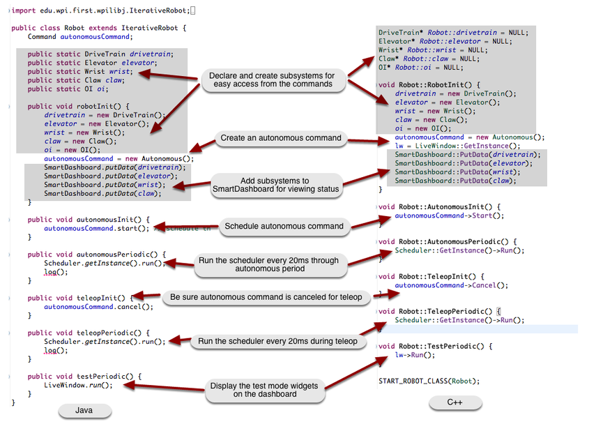
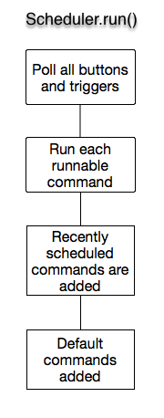
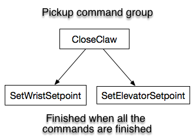
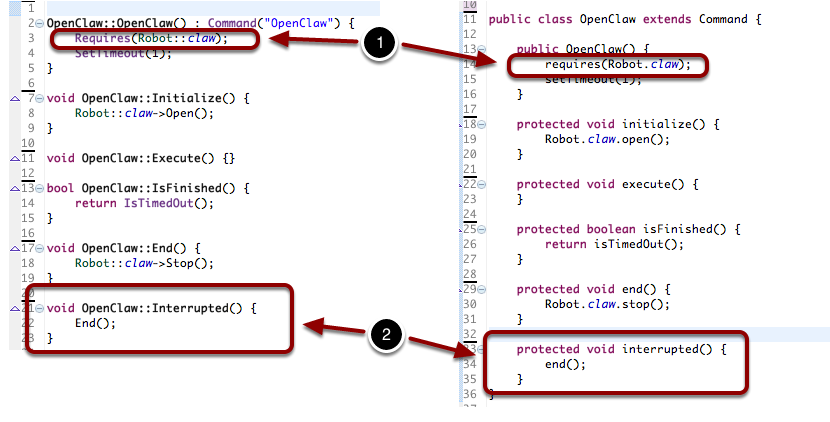

Scheduling Commands
===================

.. important:: This documentation describes the use of the legacy command-based library. While this documentation has been preserved to help teams that have yet to do so, teams are strongly encouraged to migrate to the :ref:`new command-based library <docs/software/commandbased/index:Command-Based Programming>`.

Commands are scheduled to run based on a number of factors such as triggers, default commands when no other running commands require a subsystem, a prior command in a group finishes, button presses, autonomous period starting, etc. Although many commands may be running virtually at the same time, there is only a single thread (the main robot thread). This is to reduce the complexity of synchronization between threads. There are threads that run in the system for systems like PID loops, communications, etc. but those are all self contained with very little interaction requiring complex synchronization. This makes the system much more robust and predictable.

This is accomplished by a class called Scheduler. It has a ``run()`` method that is called periodically (typically every 20ms in response to a driver station update) that tries to make progress on every command that is currently running. This is done by calling the ``execute()`` method on the command followed by the ``isFinished()`` method. If ``isFinished()`` returns true, the command is marked to be removed from execution  on the next pass through the scheduler. So if there are a number of commands all scheduled to run at the same time, then every time the ``Scheduler.run()`` method is called, each of the active commands execute() and ``isFinished()`` methods are called. This has the same effect as using multiple threads.

Command-Based Program Anatomy
-----------------------------

This shows a typical command-based Robot program and all the code needed to ensure that commands are scheduled correctly. The ``Scheduler.run`` method causes one pass through the scheduler which will let each currently active command run through its ``execute()`` and ``isFinished()`` methods. Ignore the ``log()`` methods in the Java example.

Command Life Cycle
------------------

The work in command-based programs occurs whenever the ``Scheduler.Run`` (C++) or ``Scheduler.run`` (Java) method is called. This is typically called on each driver station update which occurs every 20 ms or 50 times per second. The pseudo code illustrates what happens on each call to the run method.

1. Buttons and triggers are polled to see if the associated commands should be scheduled. If the trigger is true, the command is added to a list of commands that should be scheduled.
2. Loop through the list of all the commands that are currently runnable and call their execute and isFinished methods. Commands where the isFinished method returns true are removed from the list of currently running commands.
3. Loop through all the commands that have been scheduled to run in the previous steps. Those commands are added to the list of running commands.
4. Default commands are added for each subsystem that currently has no commands running that require that subsystem.

Optimizing Command Groups
-------------------------

.. tabs::

   .. code-tab:: java

      public class Pickup extends CommandGroup {
          public  Pickup() {
             addSequential(new CloseClaw());
             addParallel(new SetWristSetpoint(-45));
             addSequential(new SetElevatorSetpoint(0.25));
          }
      }

   .. code-tab:: cpp

      Pickup::Pickup() : CommandGroup("Pickup") {
          AddSequential(new CloseClaw());
          AddParallel(new SetWristSetpoint(-45));
          AddSequential(new SetElevatorSetpoint(0.25));
      }

Once you have working commands that operate the mechanisms on your robot you can combine those commands into groups to make more complex actions. Commands can be added to command groups to execute sequentially or in parallel. Sequential commands wait until they are finished (isFinished method returns true) before running the next command in the group. Parallel commands start running, then immediately schedule the next command in the group.

It is important to notice that the commands are added to the group in the constructor. The command group is simply a list of command instances that run when scheduled and any parameters that are passed to the commands are evaluated during the constructor for the group.

Imagine that in a robot design, there is a claw, attached to a wrist joint and all of those on an elevator. When picking up something, the claw needs to close first before either the elevator or wrist can move otherwise the object may slip out of the claw. In the example shown above the ``CloseClaw`` command will be scheduled first. After it is finished (the claw is closed), the wrist will move to it's setpoint and in parallel, the elevator will move. This gets both the elevator and wrist moving simultaneously optimizing the time required to complete the task.

When do command groups finish?
------------------------------

A command group finishes when all the commands started in that group finish. This is true regardless of the type of commands that are added to the group. For example, if a number of commands are added in parallel and sequentially, the group is finished when all the commands added to the group are finished. As each command is added to a command group, it is put on a list. As those child commands finish, they are taken off the list. The command group is finished when the list of child commands is empty.

In the Pickup command shown in the example above, the command is finished when ``CloseClaw``, ``SetWristSetpoint``, and ``SetElevatorSetpoint`` all finish. It doesn't matter that some of the commands are sequential and some parallel.

Schedule a Command within a Running Command
-------------------------------------------

Commands can be scheduled by calling the ``start()`` method (Java) or ``Start()`` method (C++) on a command instance. This will cause the command to be added to the currently running set of commands in the scheduler. This is often useful when a program needs to conditionally schedule one command or another. The newly scheduled command will be added to a list of new commands on this pass through the run method of the scheduler and actually will run the first time on the next pass through the run method. Newly created commands are never executed in the same call to the scheduler run method, always queued for the next call which usually occurs 20ms later.

Removing all Commands from the Scheduler
----------------------------------------

.. tabs::

   .. code-tab:: java

      Scheduler.getInstance().removeAll();

   .. code-tab:: cpp

      Scheduler::RemoveAll();

It is occasionally useful to make sure that there are no running commands in the scheduler. To remove all running commands use the ``Scheduler.removeAll()`` method (Java) or ``Scheduler::RemoveAll()`` method (C++). This will cause all currently running to have their ``interrupted()`` method (Java) or ``Interrupted()`` method (C++) called. Commands that have not yet started will have their ``end()`` method (Java) or ``End()`` method (C++) called.

The "requires" method
---------------------

If you have multiple commands that use the same subsystem it makes sense that they don't run at the same time. For example, if there is a Claw subsystem with OpenClaw and CloseClaw commands, they can't both run at the same time. Each command that uses the Claw subsystem declares that by 1 calling the ``requires()`` method (Java) or ``Requires()`` method (C++). When one of the commands is running, say from a joystick button press, and you try to run another command that also requires the Claw, the second one preempts the first one. Suppose that OpenClaw was running, and you press the button to run the CloseClaw command. The OpenClaw command is interrupted - 2 it's interrupted method is called on the next run cycle and the CloseClaw command is scheduled. If you think about it, this is almost always the desired behavior. If you pressed a button to start opening the claw and you change your mind and want to close it, it makes sense for the OpenClaw command to be stopped and the CloseClaw to be started.

A command may require many subsystems, for example a complex autonomous sequence might use a number of subsystems to complete its task.

Command groups automatically require all the subsystems for each of the commands in the group. There is no need to call the requires method for a group.

How are the requirements of a group evaluated?
----------------------------------------------

The subsystems that a command group requires is the union of the set of subsystems that are required for all of the child commands. If a 4 commands are added to a group, then the group will require all of the subsystems required by each of the 4 commands in the group. For example, if are three commands scheduled in a group - the first requires subsystem A, the second requires subsystem B, and the third requires subsystems C and D. The group will require subsystems A, B, C, and D. If another command is started, say from a joystick button, that requires either A, B, C, or D it will interrupt the entire group including any parallel or sequential commands that might be running from that group.
