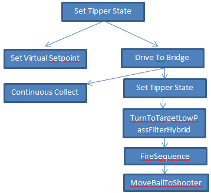
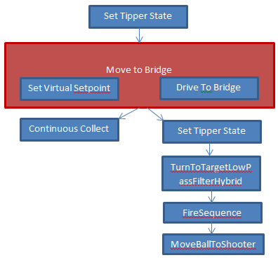

Synchronizing Two Commands
==========================

.. important:: This documentation describes the use of the legacy command-based library. While this documentation has been preserved to help teams that have yet to do so, teams are strongly encouraged to migrate to the :ref:`new command-based library <docs/software/commandbased/index:Command-Based Programming>`.

Commands can be nested inside of command groups to create more complex commands. The simpler commands can be added to the command groups to either run sequentially (each command finishing before the next starts) or in parallel (the command is scheduled, and the next command is immediately scheduled also). Occasionally there are times where you want to make sure that two parallel command complete before moving onto the next command. This article describes how to do that.

CommandGroup with Sequential and Parallel Commands
--------------------------------------------------

.. tabs::

   .. code-tab:: java

      public class CoopBridgeAutonomous extends CommandGroup {

          public  CoopBridgeAutonomous() {
             //SmartDashboard.putDouble("Camera Time", 5.0);
             addSequential(new SetTipperState(BridgeTipper.READY_STATE)); // 1
             addParallel(new SetVirtualSetpoint(SetVirtualSetpoint.HYBRID_LOCATION)); // 2
             addSequential(new DriveToBridge()); // 3
             addParallel(new ContinuousCollect());
             addSequential(new SetTipperState(BridgeTipper.DOWN_STATE));

             // addParallel(new WaitThenShoot());

             addSequential(new TurnToTargetLowPassFilterHybrid(4.0));
             addSequential(new FireSequence());
             addSequential(new MoveBallToShooter(true));
          }
      }

   .. code-tab:: cpp

      #include "CoopBridgeAutonomous.h"

      CoopBridgeAutonomous::CoopBridgeAutonomous()
      {
           // SmartDashboard->PutDouble("Camera Time", 5.0);
           AddSequential(new SetTipperState(READY_STATE);
           AddParallel(new SetVirtualSetpoint(HYBRID_LOCATION);
           AddSequential(new DriveToBridge());
           AddParallel(new ContinuousCollect());
           AddSequential(new SetTipperState(DOWN_STATE));

           // addParallel(new WaitThenShoot());

           AddSequential(new TurnToTargetLowPassFilterHybrid(4.0));
           AddSequential(new FireSequence());
           AddSequential(new MoveBallToShooter(true));
      }

In this example some commands are added in parallel and others are added sequentially to the CommandGroup CoopBridgeAutonomous (1). The first command "SetTipperState" is added and completes before the SetVirtualSetpoint command starts (2). Before SetVirtualSetpoint command completes, the DriveToBridge command is immediately scheduled because of the SetVirtualSetpoint is added in parallel (3). This example might give you an idea of how commands are scheduled.

Example Flowchart
-----------------

.. note:: There is no dependency coming from the commands scheduled using "Add Parallel" either or both of these commands could still be running when the MoveBallToShooter command is reached.

Here is the code shown above represented as a flowchart.  Any command in the main sequence (the sequence on the right here) that requires a subsystem in use by a parallel command will cause the parallel command to be canceled. For example, if the ``FireSequence`` required a subsystem in use by ``SetVirtualSetpoint``, the ``SetVirtualSetpoint`` command will be canceled when ``FireSequence`` is scheduled.

Waiting for a Command
---------------------

If there are two commands that need to complete before the following commands are scheduled, they can be put into a command group by themselves, adding both in parallel. Then that command group can be scheduled sequentially from an enclosing command group. When a command group is scheduled sequentially, the commands inside it will all finish before the next outer command is scheduled. In this way you can be sure that an action consisting of multiple parallel commands has completed before going on to the next command.

In this example you can see that the addition of a command group "Move to Bridge" containing the **Set Virtual Setpoint** and **Drive to Bridge** commands forces both to complete before the next commands are scheduled.
