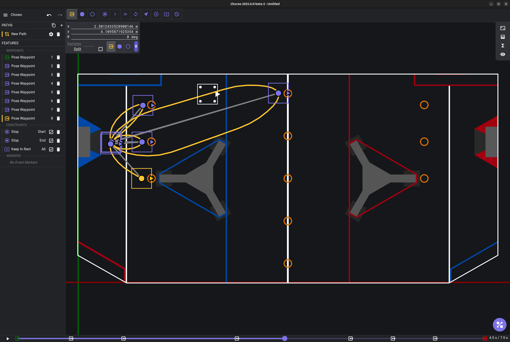

# Choreo

Choreo is a tool for calculating time optimal autonomous trajectories. This allows simple and efficient creation of autonomous routines.

.. note:: Detailed documentation for Choreo can be found [here](https://choreo.autos/).

The capabilities of Choreo include

- creating trajectories with a variety of different constraints
- scheduling commands at different events on your path
- support for different drivebases, including swerve and tank
