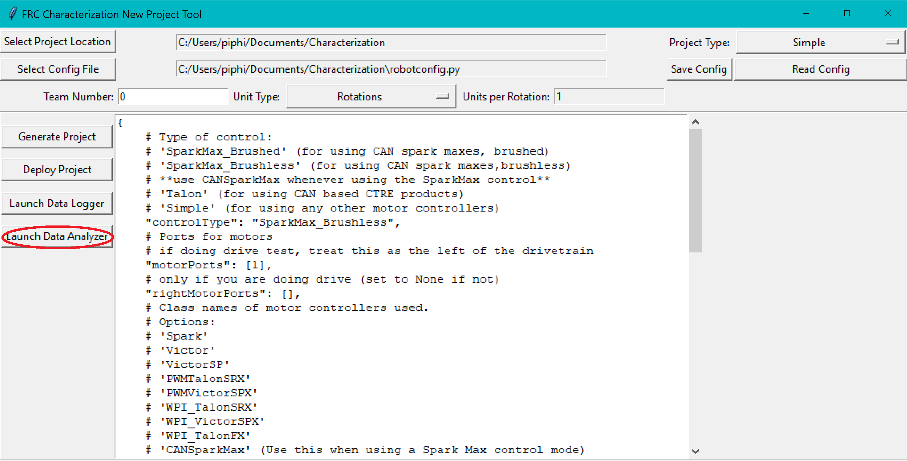
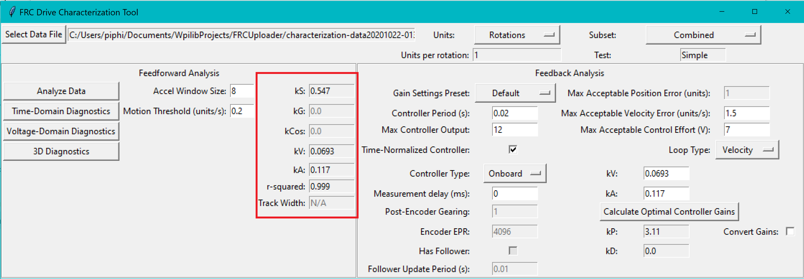

Analyzing Data
==============

.. important:: WPILib standarizes on SI units, so its recommended that the :guilabel:`Units` option is set to **Meters**.

Once we have data from a characterization run, we can analyze it. To launch the data analyzer, click on the :guilabel:`Launch Data Analyzer` button.

Loading your Data File
----------------------

Now it's time to load the data file we saved from the logger tool. Click on :guilabel:`Select Data File`.

.. image:: images/selecting-data-file.png
   :alt: Selecting the existing data file

In the resulting file dialog, select the JSON file you want to analyze. If the file appears to be malformed, an error will be shown.

Running Feedforward Analysis
----------------------------

Once a data file has been selected, the :guilabel:`Analyze Data` button, :guilabel:`Units` entry, and :guilabel:`Units per rotation` entry become available in the :guilabel:`Feedforward Analysis` frame. We can now set the units of the analysis to match the units that our program will be using.

Now click the :guilabel:`Analyze Data` button.

.. note:: If you would like to change units, you will have to press the :guilabel:`Analyze Data` and the :guilabel:`Calculate Optimal Controller Gains` (if you've pressed it) buttons.

.. image:: images/analyzing-data.png
   :alt: Analyzing data for feedforward

By default, the analysis will be run by combining all the data in the test. For a finer-grained analysis, the analysis may be limited to a specific subset of data using the subset dropdown menu.

.. image:: images/limiting-analysis-data.png
   :alt: Limiting analysis data by using the subset dropdown

The computed coefficients of the mechanism characterization will then be filled in, along with a goodness-of-fit measure (r-squared).

