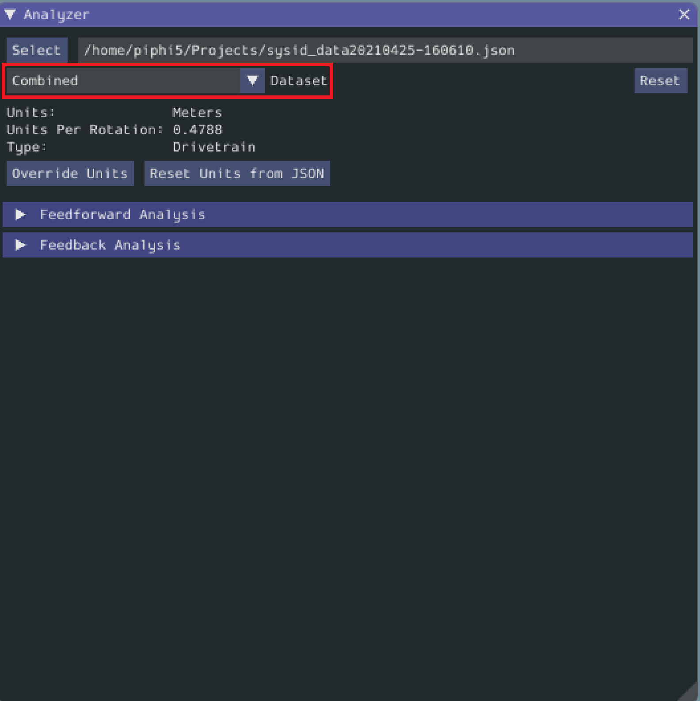

Analyzing Data
==============

.. important:: WPILib standarizes on SI units, so its recommended that the :guilabel:`Units` option is set to **Meters**.

Once we have data from a characterization run, we can analyze it using the :guilabel:`Analyzer` and :guilabel:`Diagnostic Plots` widgets.

Loading your Data File
----------------------

Now it's time to load the data file we saved from the logger tool. Click on :guilabel:`Select`.

In the resulting file dialog, select the JSON file you want to analyze. If the file appears to be malformed, an error will be shown.

Running Feedforward Analysis
----------------------------

Click the dropdown arrow on the :guilabel:`Feedforward` Section.

.. note:: If you would like to change units, you will have to press the :guilabel:`Override Units` button and fill out the information on the popup.

By default, the analysis will be run by combining all the data in the test. For a finer-grained analysis, the analysis may be limited to a specific subset of data using the subset dropdown menu.

The computed coefficients of the mechanism characterization will then be displayed.

There are also two accuracy metrics that are computed with this tool: r-squared and RMSE. The `r-squared <https://en.wikipedia.org/wiki/Coefficient_of_determination>`__ metric refers to the goodness of fit of the tool's `OLS (Ordinary Least Squares) fit <https://en.wikipedia.org/wiki/Ordinary_least_squares>`__. The `RMSE (Root Mean Squared Error) <https://en.wikipedia.org/wiki/Root-mean-square_deviation>`__ is the error (in the measured units) between the collected velocities and the predicted velocities from a simulation based on the feedforward gains.   

