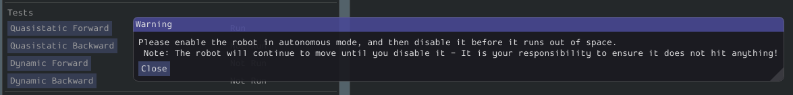
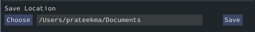

Running the Characterization Routine
====================================

Once the characterization code has been deployed, we can now run the characterization routine, and record the resulting data for analysis.

.. note:: Ensure you have sufficient space around the robot before running any characterization routine! The drive characterization requires at least 10' of space, ideally closer to 20'. The robot drive can not be accurately characterized while on blocks.

Connect to the Robot
--------------------

Next, we must connect to the robot. Select "Client" at the top of the Logger window and enter your team number. To characterize a simulated robot program, you can type in ``localhost``. Finally, press the :guilabel:`Apply` button. The NetworkTables connection indicator will be visible next to the :guilabel:`Apply` button.

.. image:: images/connecting-to-robot.png
   :alt: Connecting to the robot

If the tool does not seem to be successfully connecting, try rebooting the robot. Eventually, the status should change to :guilabel:`NT Connected`, indicating the tool is successfully communicating with the robot.

.. image:: images/connected-to-robot.png
   :alt: Connected to the robot

Running Tests
-------------

A standard motor characterization routine consists of two types of tests:

- **Quasistatic:** In this test, the mechanism is gradually sped-up such that the voltage corresponding to acceleration is negligible (hence, "as if static").
- **Dynamic:** In this test, a constant 'step voltage' is given to the mechanism, so that the behavior while accelerating can be determined.

Each test type is run both forwards and backwards, for four tests in total, corresponding to the four buttons.

The tests can be run in any order, but running a "backwards" test directly after a "forwards" test is generally advisable (as it will more or less reset the mechanism to its original position).

Follow the instructions in the pop-up windows after pressing each test button.

.. image:: images/running-the-test.png
   :alt: Running the various tests

Track Width
^^^^^^^^^^^

You can determine the track width of the robot by selecting the :guilabel:`Drivetrain (Angular)` test. This will also provide angular Kv and Ka parameters.

This test will spin your robot to determine an empirical trackwidth. It compares how far the wheel encoders drove against the reported rotation from the gyroscope.  To get the best results your wheels should maintain contact with the ground.

.. note:: For high-friction wheels (like pneumatic tires), the empirical trackwidth calculated by sysid may be significantly different from the real trackwidth (e.g., off by a factor of 2). The empirical value should be preferred over the real one in robot code.

The entire routine should look something like this:

.. raw:: html

  
 <iframe src="https://www.youtube-nocookie.com/embed/FN2xqoB1sfU" frameborder="0" allowfullscreen style="position: absolute; top: 0; left: 0; width: 100%; height: 100%;"></iframe> 

After all four tests have been completed, you can select the folder location for the save file and click :guilabel:`Save`.

This will save the data as a JSON file with the specified location/name. A timestamp (``%Y%m%d-%H%M``) will be appended to the chosen filename. Additionally, the name of the file saved will be shown in the :guilabel:`Program Log`.

.. note:: The number of samples collected for each test will be displayed in the Program Log.
