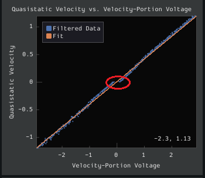
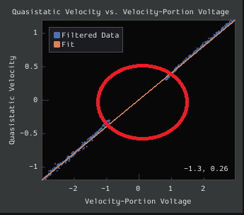
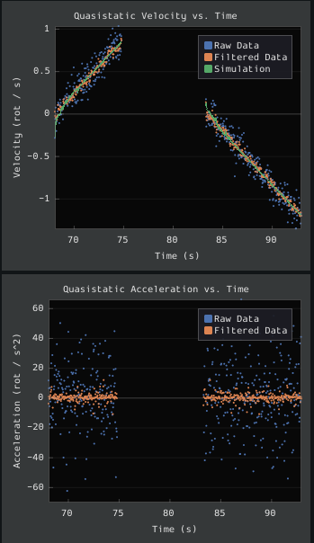
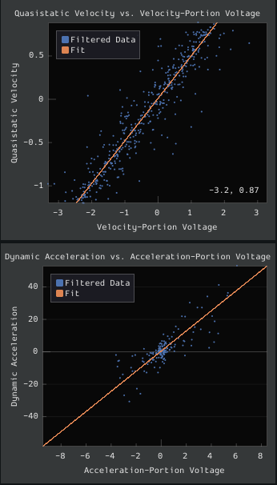

Viewing Diagnostics
===================

The first diagnostic to look at is the r-squared - it should be somewhere north of ~.9. If it is significantly lower than this, there is likely a problem with your characterization data.

The next diagnostic to look at is the RMSE to make sure that the error is reasonable and within your desired constraints.

To investigate further, you can look at several diagnostic plots on the side.

Time-Domain Diagnostics
-----------------------

The Time-Domain Diagnostics plots display velocity and acceleration versus time over the course of the analyzed tests. These should look something like this (other mechanisms will be highly similar):

.. note:: There may be mirroring across the x axis for the drivetrain test. That is normal and is simply the result of the left- and right-side encoders having different signs - this does not cause any trouble for the characterization tool.

The velocity time domain plots contain three sets of data: Raw Data, Filtered Data, and Simulation. The Raw Data is the recorded data from your robot, the Filtered Data is the data after a median filter has been applied to the data, and the Simulation represents the velocity predictions of a model based off of the feedforward gains from the tool. The acceleration graphs only contain the Raw Data and Filtered Data.

The quasistatic test ought to have nearly linear velocity, and nearly-zero acceleration (hense "quasistatic"). The dynamic test ought to have velocity that asymptotically approaches a steady-state speed (the shape of the curve should be exponential, in fact), and acceleration that, accordingly, rapidly falls to zero (also exponentially, as the derivative of an exponential function is also an exponential function).

Deviation from this behavior is a sign of an :ref:`error <docs/software/pathplanning/robot-characterization/viewing-diagnostics:Common Failure Modes>`, either in your robot setup, analysis settings, or your test procedure.

Voltage-Domain Diagnostics
--------------------------

The Voltage-Domain Diagnostics plots velocity and acceleration versus voltage. Velocity is ploted for the quasistatic test, and acceleration is plotted for the dynamic test. For a typical drive characterization, the plots should resemble this (again, other mechanisms will be similar)

.. image:: images/voltagedomain-plots.png
   :alt: Voltage domain plots picture

Both plots should be linear, however the dynamic plot will almost certainly have substantially-more noise. The noise on the dynamic plot may be reduced by increasing the :guilabel:`Window Size` setting.

However, if your robot or mechanism has low mass compared to the motor power, this may "eat" what little meaningful acceleration data you have (however, in these cases ``kA`` will tend towards zero and can usually be ignored, anyway).

.. note:: The x-axis corresponds to ``velocity-portion voltage`` and ``acceleration-portion voltage``, respectively - as the governing voltage-balance equations are multi-dimensional, plots against raw voltage are not as useful as one might expect.

Common Failure Modes
^^^^^^^^^^^^^^^^^^^^

When something has gone wrong with the characterization, diagnostic plots and console output provide crucial clues as to *what* has gone wrong.  This section describes some common failures encountered while running the characterization tool, the identifying features of their diagnostic plots, and the steps that can be taken to fix them.

Improperly Set Motion Threshold
^^^^^^^^^^^^^^^^^^^^^^^^^^^^^^^

One of the most-common errors is an inappropriate value for the motion threshold.

Motion Threshold Too Low
~~~~~~~~~~~~~~~~~~~~~~~~

The presence of a "leading tail" (emphasized by added red circle) on the voltage-domain plots indicates that the :guilabel:`Motion Threshold` setting is too low, and thus data points from before the robot begins to move are being included.

To solve this, increase the setting and re-analyze the data.

Motion Threshold Too High
~~~~~~~~~~~~~~~~~~~~~~~~~

While not nearly as problematic as a too-low threshold, a motion threshold that is too high will result in a large "gap" in the voltage domain quasistatic plot.

To solve this, decrease the setting and re-analyze the data.

Too Long of a Dynamic Test
^^^^^^^^^^^^^^^^^^^^^^^^^^

If the dynamic test is run too long, it tends to accumulate data that will only skew the kA fit. This is noticeable with a large concentration of points towards the middle of the Voltage Domain Acceleration plot. This issue can be assisted by decreasing the :guilabel:`Test Duration` slider.

Magnetic Encoders Velocity Noise
^^^^^^^^^^^^^^^^^^^^^^^^^^^^^^^^

Magnetic encoders such as the `CTRE Mag Encoder <http://www.ctr-electronics.com/srx-magnetic-encoder.html>`__ and the `AndyMark magnetic encoder <https://www.andymark.com/products/am-mag-encoder>`__ are extremely popular in FRC.  However, a particular noise pattern has been observed when these encoders are used on robot drives, whose particular cause is not yet known.  This noise pattern is uniquely distinguished by significant velocity noise proportional to motor velocity, and is particularly common on the kit-of-parts `toughbox mini <https://www.andymark.com/products/toughbox-mini-options>`__ gearboxes.

Characterization constants can sometimes be accurately determined even from data polluted this noise by increasing the window size setting.  However, this sort of encoder noise is problematic for robot code much the same way it is problematic for the characterization tool.  As the root cause of the noise is not known, it is recommended to try a different encoder setup if this is observed, either by moving the encoders to a different shaft, replacing them with a different type of encoder, or increasing the sample per average in project generation (adds an additional layer of filtering).

